## rxjs란?

RxJS is a library for composing asynchronous and event-based programs by using observable sequences.

<small>출처: http://reactivex.io/rxjs/manual/overview.html</small>

-----

### 실습 Playground

/part2/01.rxjs/example.html

-----

### 비동기 예제


```js
const { fromEvent } = rxjs;
const { map } = rxjs.operators;
// 1. observable 생성
const currentTarget$ = fromEvent(document, "click");

// 2. pipe 연결
.pipe( 
  map(event => event.currentTarget) // 3. operator 적용
);

// 4. observer 생성
const observer = currentTarget => {
  console.log(currentTarget);
};
currentTarget$.subscribe(observer); // 5. Observable subscribe 하기
```

<small>pipe: <a href="http://reactivex.io/rxjs/class/es6/Observable.js~Observable.html#instance-method-pipe" target="_blank">V5.x</a>, <a href="https://rxjs-dev.firebaseapp.com/api/index/pipe" target="_blank">V6.x</a>,</small>
<small>map: <a href="http://reactivex.io/rxjs/class/es6/Observable.js~Observable.html#instance-method-map" target="_blank">V5.x</a>, <a href="https://rxjs-dev.firebaseapp.com/api/operators/map" target="_blank">V6.x</a>, <a href="http://rxmarbles.com/#map" target="_blank">rxmarble</a></small>
<small>pluck: <a href="http://reactivex.io/rxjs/class/es6/Observable.js~Observable.html#instance-method-pluck" target="_blank">V5.x</a>, <a href="https://rxjs-dev.firebaseapp.com/api/operators/pluck" target="_blank">V6.x</a>, <a href="http://rxmarbles.com/#pluck" target="_blank">rxmarble</a></small>

-----

### 동기 예제

```js
const { from } = rxjs;
const { filter } = rxjs.operators;
// 1. observable 생성
const users$ = from(users);

// 2. pipe 연결
.pipe(
  filter(user => user.nationality === "촉") // 3. operator 적용
);

// 4. observer 생성
const observer = user => {
  console.log(user);
};
users$.subscribe(observer); // 5. Observable subscribe 하기
```

<small>filter: <a href="http://reactivex.io/rxjs/class/es6/Observable.js~Observable.html#static-method-filter" target="_blank">V5.x</a>, <a href="https://rxjs-dev.firebaseapp.com/api/index/filter" target="_blank">V6.x</a>, <a href="http://rxmarbles.com/#filter" target="_blank">rxmarble</a></small>

-----

### 합치는 예제

```js
const { fromEvent, from, merge } = rxjs;
const { map, filter } = rxjs.operators;

// ...
const observer = merged => {
  console.log(merged);
};

// Observable 조합
merge(users$, currentTarget$).subscribe(observer);
```
<small>merge: <a href="http://reactivex.io/rxjs/class/es6/Observable.js~Observable.html#static-method-merge" target="_blank">V5.x</a>, <a href="https://rxjs-dev.firebaseapp.com/api/index/merge" target="_blank">V6.x</a>, <a href="http://rxmarbles.com/#merge" target="_blank">rxmarble</a></small>

-----

### RxJS 4대 천왕
RxJS에서는 다루는 중요 개념은 다음과 같다.

- Observable
- Operator
- Observer
- Subscription
- <strong class="grey">Subject</strong>
- <strong class="grey">Scheduler</strong>

<p class="fragment">하지만 <strong class="bigsize yellow">4대 천왕</strong> 알면 기본과정  
6대 천왕은 <strong>심화과정</stong>
</p>

-----

### 1. <a href="https://rxjs-dev.firebaseapp.com/api/index/Observable" target="_blank">Observable</a>
시간을 축으로 연속적인 데이터를 저장하는 컬렉션 <strong class="yellow">Stream</strong>

- pipe, subscribe method가 존재

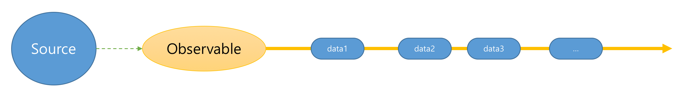

```js
const users$ = from(users);
const currentTarget$ = fromEvent(document, "click");
merge(user$, currentTarget$);
```

-----

### 2. Operator

- Observable Composition (생성, 연결, 분리, 합침, 등)
- Immutable Observable 인스턴스를 반환
- RxJS의 어휘

```js
pipe( 
  map(event => event.currentTarget),
  filter(user => user.nationality === "촉")
);

merge(user$, currentTarget$);
```

-----

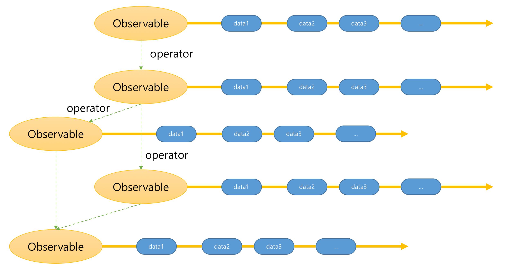

-----

### 3. Observer
Observable에 의해 전달된 데이터를 소비하는 주체

```js
const observer = {
 next: x => {
   console.log("Observer가 Observable로부터 받은 데이터: " + x)
 },
 error: err => {
   console.error("Observer가 Observable로부터 받은 에러 데이터: " + err)
 },
 complete: () => {
   console.log("Observer가 Observable로부터 종료 되었다는 알림을 받은 경우")
 },
};
```

-----

### 4. Subscription
Observable.prototype.subscribe의 반환값 
- Subscription 객체는 자원의 해제를 담당

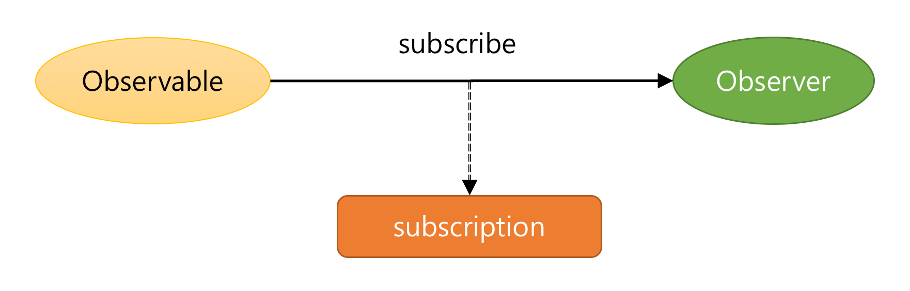

```js
const sub1 = currentTarget$.subscribe(observer);
const sub2 = users$.subscribe(observer);

sub1.unsubscribe();
sub2.unsubscribe();
```

-----

### RxJs 개발 플로우
- 요구사항 파악시 흐름을 이해한다.
- 데이터 소스를 Observable로 변경한다.
- operator를 통해 데이터를 변경하거나 추출한다. 또는 Observable composition
- 원하는 데이터를 받아 처리하는 Observer를 만든다.
- Observable의 subscribe를 통해 Observer를 등록한다.
- Observable 구독을 정지하고 자원을 해지한다.

-----

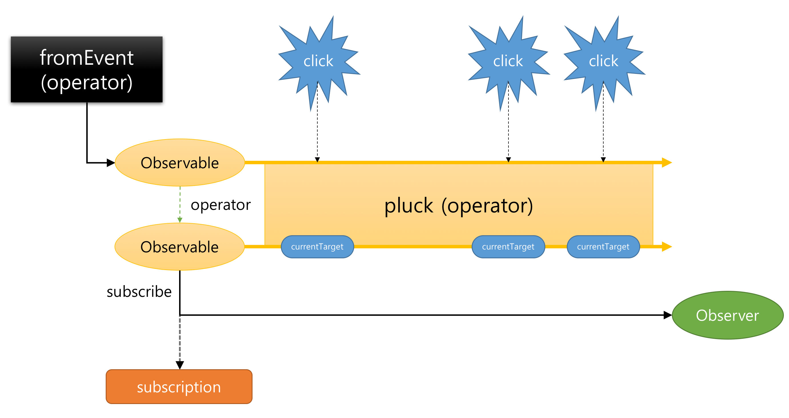

-----

## Observable 자세히 살펴보기

-----

### Observable 만들기 <<실습>>
<strong>new Observable</strong> === Observable.create

```js
const { Observable } = rxjs;
const numbers$ = new Observable(function subscribe(observer) {
  observer.next(1);
  observer.next(2);
  observer.next(3);    
});
numbers$.subscribe(v => console.log(v));
```
<small>/part2/02.create/create-1.html</small>

-----

### Observable 만들기 - 에러 처리 <<실습>>
```js
const { Observable } = rxjs;
const numbers$ = new Observable(function subscribe(observer) {
  try {
    observer.next(1);
    observer.next(2);
    // 에러가 발생한다면? 
    throw new Error("데이터 전달 도중 에러가 발생했습니다");
    observer.next(3);    
  } catch(e) {
    observer.error(e);
  }
});
numbers$.subscribe({
  next: v => console.log(v),
  error: e => console.error(e)
});
```
<small>/part2/02.create/create-2.html</small>

-----

### Observable 만들기 - 완료 처리 <<실습>>
```js
const { Observable } = rxjs;
const numbers$ = new Observable(function subscribe(observer) {
  try {
    observer.next(1);
    observer.next(2);
    observer.next(3);    
    observer.complete();
  } catch(e) {
    observer.error(e);
  }
});
numbers$.subscribe({
  next: v => console.log(v),
  error: e => console.error(e),
  complete: () => console.log("데이터 전달 완료")
});
```

<small>/part2/02.create/create-3.html</small>

-----

### Observable 만들기 - 구독해지 처리 <<실습>>
```js
const { Observable } = rxjs;
const interval$ = new Observable(function subscribe(observer) {
  const id = setInterval(function () {
    observer.next(new Date().toString());
  }, 1000);
  return function() { // 자원을 해제하는 함수
    console.log("interval 제거");    
    clearInterval(id);
  };
});
const subscription = interval$.subscribe(v => console.log(v));

// 5초 후 구독을 해제한다.
setTimeout(function () {
  subscription.unsubscribe();  
}, 5000);
```

<small>/part2/02.create/create-4.html</small>

-----

<a href="https://rxjs-dev.firebaseapp.com/api/index" target="_blank">rxjs 네임스페이스에 유틸성 생성 함수</a> 제공

- of
- range
- interval
- from
- fromEvent
- empty
- throwError
- never
- ...

<small>가급적 Observable을 생성할 때는 rxjs 네임스페이스에서 제공하는 생성 함수를 이용하여 사용하자.</small>

-----

## 함수 VS Observable

-----

### 함수의 특징

정의 후 사용한다.
함수의 정의부가 매번 호출하여 동일한 값을 얻는다.

```js
// 정의
function foo(value) {
  console.log(`I'am function ${value}`);
  return value + 1;
}

// 사용
foo(100); // I'am function 100
foo(100); // I'am function 100
```

-----

데이터가 올 때까지 기다렸다가 호출할 수 있다 (Lazy)

<pre><code data-trim data-noescape>
const xhr = new XMLHttpRequest();
xhr.onload = function(e) {
  afterAjaxResult = JSON.parse(xhr.responseText);

  const result = <mark>foo(afterAjaxResult);</mark>
  console.log(result);
}
</code></pre>

-----

### Obseravable의 특징 <<실습>>

Observable 생성 후 구독(subscribe)한다.
Lazy 하다.

```js
const { interval } = rxjs;
// 정의
const numbers$ = interval(1000);

// 사용: subscribe가 호출되는 순간부터 데이터가 전달된다.
numbers$.subscribe(value => console.log(value));
```

-----

함수의 정의부가 매번 호출하여 동일한 값을 얻는다.

<pre><code data-trim data-noescape>
const { interval } = rxjs;
// 정의
const numbers$ = interval(1000);

// 사용: subscribe가 호출되는 순간부터 데이터가 전달된다.
numbers$.subscribe(value => console.log(value));

<mark>setTimeout(() => {
  // 또 사용
  numbers$.subscribe(value => console.log(`두번째 ${value}`)));
}, 2000);</mark>
</code></pre>

-----

### 차이점은?
- 함수는 단건 결과. Observable은 다건 결과
- 함수: 호출 할때 데이터가 전달 <strong>Pull 방식</strong>
- Observable: Observable이 전달 <strong>Push 방식</strong>

-----

## Pull VS Push


- Pull: 수동. 데이터는 있을수도 없을 수도
- Push: 자동. 데이터는 항상 있다. 거부권

-----

## Promise VS Observable

-----

### Promise의 특징

Promise 생성 후 구독(then)한다.  
Push 방식으로 데이터가 전달된다.

```js
// 정의
const promise = new Promise((resolve, reject) => {
  try {
    resolve(1);
  } catch(e) {
    reject("error promise");
  }
});

// 사용
promise.then(
  value => console.log(`promise ${value}`),
  error => console.error(`promise ${error}`)
);
```

-----

### 차이점은?

#### Lazy 한것 처럼 보이지만... 아니다.
정의부가 딱 1번 호출된다.

- Promise /part2/03.observable/04.promise-lazy.html
- Observable /part2/03.observable/05.observable-lazy.html

-----

#### Cancellation
Promise는 취소에 대한 인터페이스가 없다.

- Promise /part2/03.observable/06.promise-cancel.html
- Observable /part2/03.observable/07.observable-cancel.html

-----

## 함수 VS Observable VS Promise

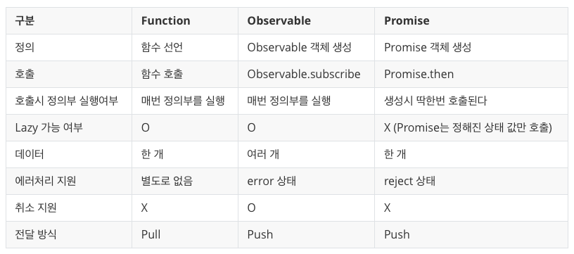

-----

## Marble Diagram
데이터의 흐름을 표현하는 다이어그램

-----

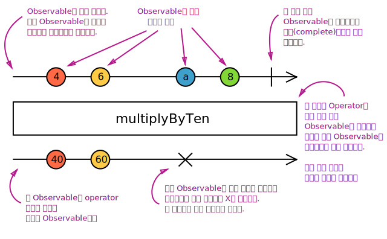</img>

-----

# 자동완성 만들기
<따라하는 실습>

-----

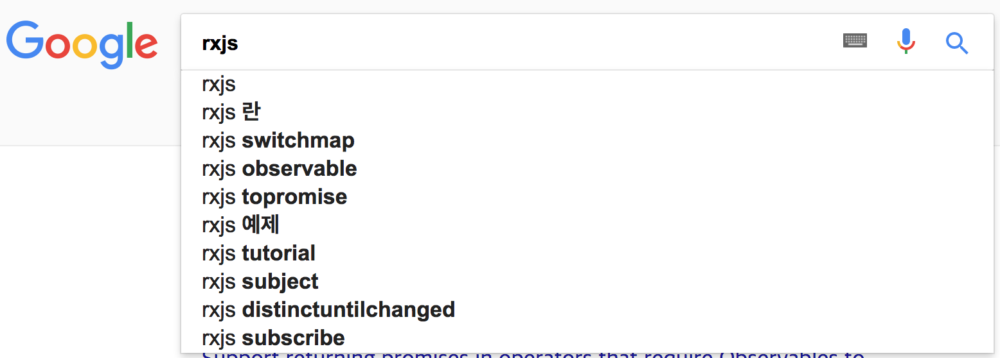

-----

### 입력 창
```html
<input id="search" type="input" 
  placeholder="검색하고 싶은 사용자 아이디를 입력해주세요">
</input>
```

- keyup$: 사용자의 키입력 처리 (keyup 이벤트)
- 전달되는 값을 바꾸고 싶어요: event => event.target.value

-----

### 사용자 데이터 받기 (from 서버)

- request$: fetch => from => rxjs.ajax.ajax.getJSON

<small>URL: https://api.github.com/search/users?q=사용자명</small>

-----

### keyup$과 request$ 합치기

- user$: keyup$ => request$

-----

### Observable of Observables

배열의 배열 꼴

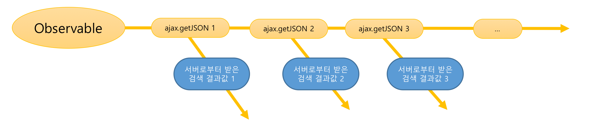

-----

### Flatten

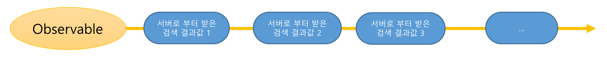

<small>mergeAll: <a href="http://reactivex.io/rxjs/class/es6/Observable.js~Observable.html#instance-method-mergeAll" target="_blank">V5.x</a>, <a href="https://rxjs-dev.firebaseapp.com/api/operators/mergeAll" target="_blank">V6.x</a>,</small>
<small>merge: <a href="http://reactivex.io/rxjs/class/es6/Observable.js~Observable.html#static-method-merge" target="_blank">V5.x</a>, <a href="https://rxjs-dev.firebaseapp.com/api/index/merge" target="_blank">V6.x</a>, <a href="http://rxmarbles.com/#merge" target="_blank">rxmarble</a></small>
<small>mergeMap: <a href="http://reactivex.io/rxjs/class/es6/Observable.js~Observable.html#instance-method-mergeMap" target="_blank">V5.x</a>, <a href="https://rxjs-dev.firebaseapp.com/api/operators/mergeMap" target="_blank">V6.x</a>, <a href="http://rxmarbles.com/#mergeMap" target="_blank">rxmarble</a></small>
<small>flatMap: <a href="https://rxjs-dev.firebaseapp.com/api/operators/flatMap" target="_blank">V6.x</a></small>

-----

### 403 Forbidden 에러 처리: 빈번한 요청은 안 돼요

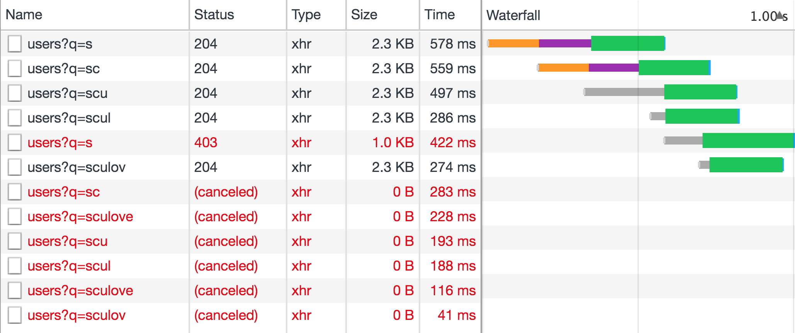

-----

키입력 이후에 debounceTime (map 앞에)

- debounce: 마지막 요청만 한번
- throttle: 설정 시간내 딱 한번

<small>debounceTime: <a href="http://reactivex.io/rxjs/class/es6/Observable.js~Observable.html#instance-method-debounceTime" target="_blank">V5.x</a>, <a href="https://rxjs-dev.firebaseapp.com/api/operators/debounceTime" target="_blank">V6.x</a>, <a href="http://rxmarbles.com/#debounceTime">rxmarble</a></small>

-----

### 빈 검색어, 특수키가 입력되는 경우에는요?
- filter 적용 (value.trim().length > 0)
- filter 앞에서 distinctUntilChanged 적용

<small>distinctUnilChanged: <a href="http://reactivex.io/rxjs/class/es6/Observable.js~Observable.html#instance-method-distinctUntilChanged" target="_blank">V5.x</a>, <a href="https://rxjs-dev.firebaseapp.com/api/operators/distinctUntilChanged" target="_blank">V6.x</a>, <a href="http://rxmarbles.com/#distinctUntilChanged">rxmarble</a></small>

-----

### 검색결과 표현하기

- drawLayer(items);

-----

### 로딩바 띄우기

- ajax 요청하기 전에 로딩바 띄우기, 후에 로딩바 닫기

<small>tap : <a href="http://reactivex.io/rxjs/function/index.html#static-function-tap" target="_blank">V5.x (do)</a>, <a href="https://rxjs-dev.firebaseapp.com/api/operators/tap" target="_blank">V6.x</a></small>

-----

### 검색결과가 지워졌을 경우
- filter(value => value.length > 0) 부분 reset$으로 분리하기
- reset$에서 검색결과 초기화하기 ($layer.innerHTML = "")

<small>partition : <a href="http://reactivex.io/rxjs/class/es6/Observable.js~Observable.html#instance-method-partition" target="_blank">V5.x</a>, <a href="https://rxjs-dev.firebaseapp.com/api/operators/partition" target="_blank">V6.x</a></small>

-----

### 얼라리... 검색결과가 지워져도 초기화가 안된다.

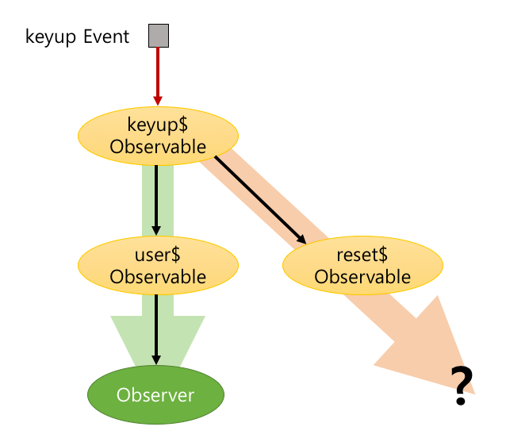


-----

### 열악한 네트워크 환경

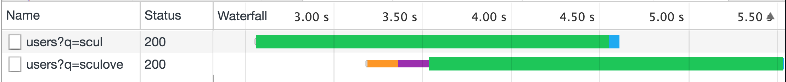

- map + mergeAll => map + swithAll 
- mergeMap => switchMap

<small>switchAll : <a href="http://reactivex.io/rxjs/class/es6/Observable.js~Observable.html#instance-method-switch" target="_blank">V5.x (switch)</a>, <a href="https://rxjs-dev.firebaseapp.com/api/operators/switchAll" target="_blank">V6.x</a>, </small>
<small>switchMap: <a href="http://reactivex.io/rxjs/class/es6/Observable.js~Observable.html#instance-method-switchMap" target="_blank">V5.x</a>, <a href="https://rxjs-dev.firebaseapp.com/api/operators/switchMap" target="_blank">V6.x</a>, <a href="http://rxmarbles.com/#switchMap" target="_blank">rxmarble</a></small>


-----

### 서버 에러시 에러처리 (네트워크 중단)

- offline시 error 확인
- error시 error후 complete 처리됨. catchError((e, org) => org)
- retry(1)
- finalize시 로딩바 닫기 (종료나 에러시에만 호출)

<small>catchError : <a href="http://reactivex.io/rxjs/class/es6/Observable.js~Observable.html#instance-method-catch" target="_blank">V5.x (catch)</a>, <a href="https://rxjs-dev.firebaseapp.com/api/operators/catchError" target="_blank">V6.x</a>, </small>
<small>retry : <a href="http://reactivex.io/rxjs/class/es6/Observable.js~Observable.html#instance-method-retry" target="_blank">V5.x</a>, <a href="https://rxjs-dev.firebaseapp.com/api/operators/retry" target="_blank">V6.x</a>, </small>
<small>finalize : <a href="http://reactivex.io/rxjs/class/es6/Observable.js~Observable.html#instance-method-finalize" target="_blank">V5.x (finally)</a>, <a href="https://rxjs-dev.firebaseapp.com/api/operators/retry" target="_blank">V6.x</a> </small>

-----

### 사소한 문제점. 중복호출
마지막에서 tap으로 데이터 확인하기. keyup이 두번?

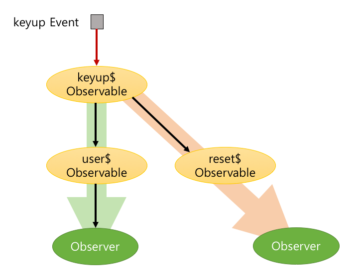

-----

### Cold Observable과 Hot Observable

-----

#### Cold Observable
Observable <strong>내부</strong>에서 socket 생성

<pre><code data-trim data-noescape>
const { Observable } = rxjs;
const coldWebsocket$ = new Observable(function subscribe(observer) {
  // Observable 내부에서 생성
  <mark>const socket = new WebSocket("ws://someurl");</mark>
  const handler = (e) => observer.next(e);
    socket.addEventListener("message", handler);
    return () => socket.close();
  }
);
</code></pre>

-----

#### Hot Observable
Observable <strong>외부</strong>에서 socket 생성

<pre><code data-trim data-noescape>
const { Observable } = rxjs;
// Observable 외부에서 생성
<mar>const socket = new WebSocket("ws://someurl");</mark>

const hotWebsocket$ = new Observable(function subscribe(observer) {
  const handler = (e) => observer.next(e);
  socket.addEventListener("message", handler);
    return socket.removeEventListener("messge", handler);
  }
);
</code></pre>

-----

## 데이터 제공자가 
Observable 내부에서 만들어졌으면 Cold  
외부에서 만들어 졌으면 Hot

- 내부: subscribe시 매번 새로 만듦. Observer가 독립적
- 외부: 한번만 만듦. Observer들과 공유

-----

## Cold와 Hot Observable 비교

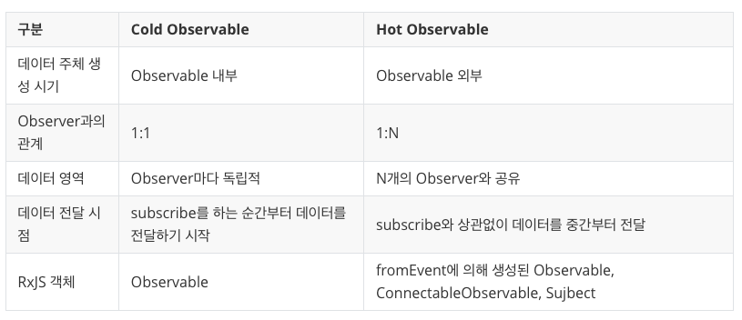

-----

## <a href="https://rxjs-dev.firebaseapp.com/api/index/Subject" target="_blank">Subject</a>
- Subject는 읽기 쓰기(write-read)가 가능한 Observable
- 기능면에서 Observer pattern과 완전 동일.

/part2/04.autocomplete/subject.html

```js
const { Subject } = rxjs;
const subject = new Subject();

// observerA를 등록
subject.subscribe({
  next: (v) => console.log(`observerA: ${v}`)
});
// 데이터 1을 전달
subject.next(1);

// observerB를 등록
subject.subscribe({
  next: (v) => console.log(`observerB: ${v}`)
});
// 데이터 2를 전달
subject.next(2);
```

-----

### Event Bus

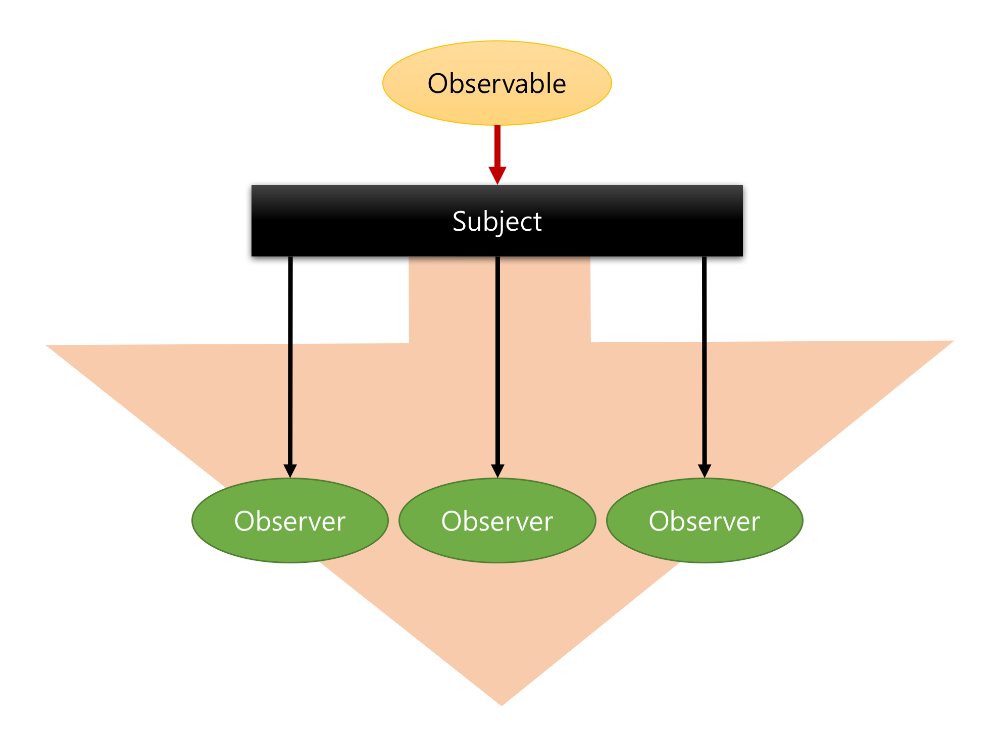

-----

### 자 그럼 우리는 어떻게 만들까?
subject에서 user$와 reset$ 생성 후
```js
keyup$.subscribe(subject);
```

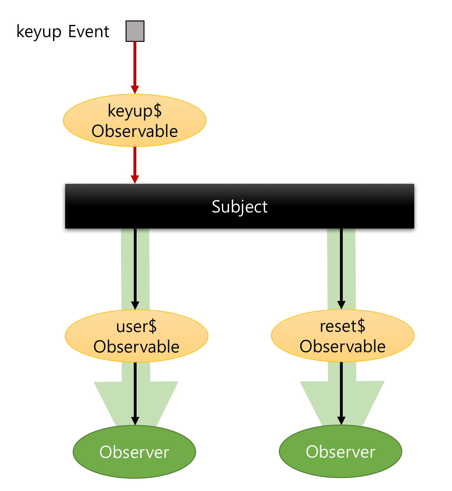

-----

### 데이터 공유가 까다롭네?
사전에 공유할 Observable과 observer들을 연결해야함.


-----

### ConnectableObservable
- multicat로 conectableObservable을 만들 수 있다.
- connect 메소드를 통해 데이터 전달 시점을 제어할 수 있다.

<small>multicast : <a href="http://reactivex.io/rxjs/class/es6/Observable.js~Observable.html#instance-method-multicast" target="_blank">V5.x</a>, <a href="https://rxjs-dev.firebaseapp.com/api/operators/multicast" target="_blank">V6.x</a>, </small>
<small>publish : <a href="http://reactivex.io/rxjs/class/es6/Observable.js~Observable.html#instance-method-publish" target="_blank">V5.x</a>, <a href="https://rxjs-dev.firebaseapp.com/api/operators/publish" target="_blank">V6.x</a> </small>

-----

### connectableObservable 자원해제
observer가 다 구독해제되면 connectableObservable도 subscribe 해야한다.

/part2/04.autocomplete/connetableObservable-unsubscribe.html

-----

#### refCount
- 첫번째 구독시 자동 connect
- 마지막 구독이 unsubscribe되면 자동으로 ConnectableObservable도 unsubscribe 한다.
- 반환값 Observable

<small>refCount : <a href="https://rxjs-dev.firebaseapp.com/api/operators/refCount" target="_blank">V6.x</a>, </small>
<small>share : <a href="http://reactivex.io/rxjs/class/es6/Observable.js~Observable.html#instance-method-share" target="_blank">V5.x</a>, <a href="https://rxjs-dev.firebaseapp.com/api/operators/share" target="_blank">V6.x</a> </small>

-----

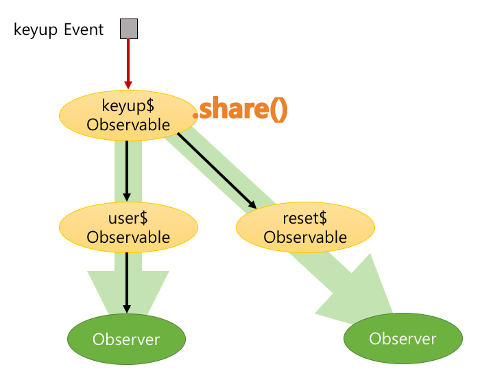

-----

# 애니메이션 만들기
<따라하는 실습>

-----

## Advance 과정이 있다면...

- 플리킹 만들기
  - https://github.com/sculove/rxjs-book/tree/master/part2/05.carousel
- 버스노선 서비스 만들기
  - https://github.com/sculove/rxjs-book-example
- RxJS와 프레임워크
- RxJS 테스팅과 디버깅
- Observable를 이용한 OOP와 FP 설계

-----

## RxJS 관련 좋은 사이트
- <a href="http://reactive.how/rxjs/explorer" targe="_blank">RxJS Explorer: 버전별 비교</a>
- <a href="http://reactivex.io/rxjs/manual/overview.html#choose-an-operator" targe="_blank">원하는 operator 고르기</a>
- <a href="http://reactive.how/">그림으로 배우는 operator</a>
- <a href="https://rxviz.com/">Animated playground for Rx Observables
</a>
