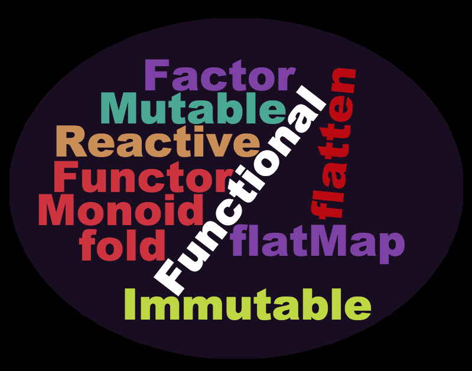
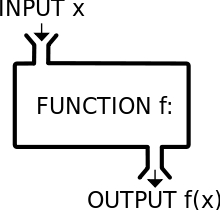
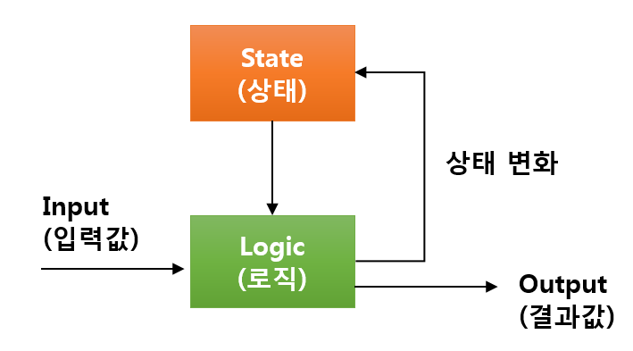
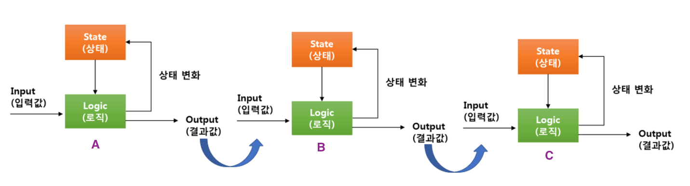
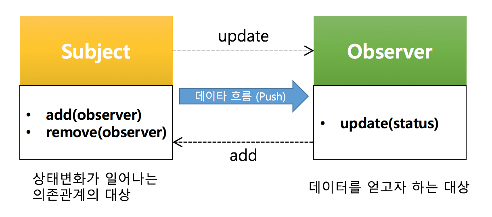
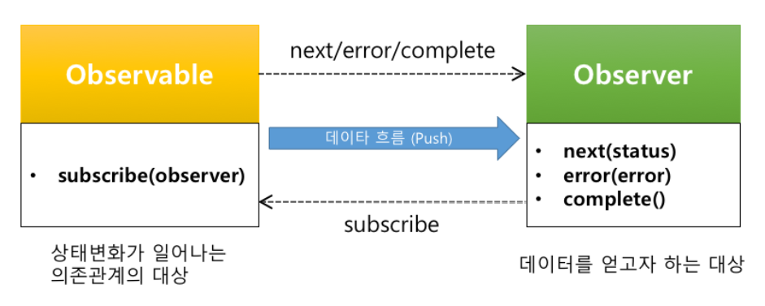
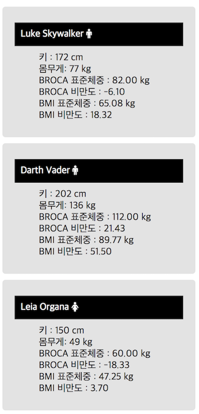
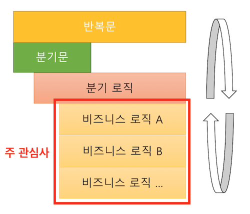
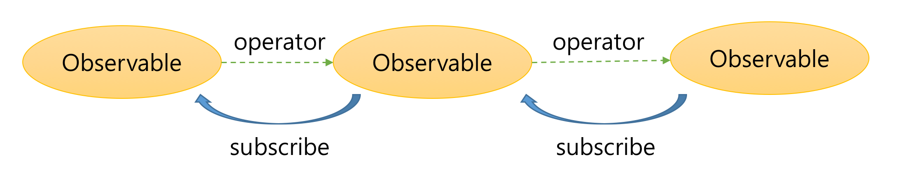

## rxjs?

역사
트랜드....

한번도 안쓴 사람은 있어서 써본사람은 계속써.


-----

rxjs란 무엇인가?

RxJS is~~~

하지만 필자는 이렇게 이야기하고 싶다.
"범용적 데이터 솔루션"

-----

왜?
웹프로그램 절라 복잡해졌다.
따라서 웹애플리케이션은 "상태머신"이다.

-----

상태머신은 이러하단. 입력, 상태 변경, 출력

상태머신 동작 방식 vs 레이어 토글링 기능 예제

-----

근데 언제 오류가 나느냐?

블라블라

-----

입력오류
상태오류 (의존관계, 호출 순서 관계)
로직오류
 - for문, 분기문, 변수(누군가에 의해 변경될수 있다)

-----

rxjs는 이런거야...
rxjs를 제대로 쓰려면 함수형 프로그래밍, 반응형 프로그래밍에 대한 이해가 필요하다.
단, 필요한 것만. 깊게보면 헤어나질 못합니다.

-----

## 입력오류
입력 데이터의 사례 줄줄줄

- 아 동기와 비동기가 절라 섞여있네 (입력 데이터의 전달 시점이 다양하네)
- 왜이런데... 동기는 순차적이라 작업이 단순해 근데 느려
- 비동기는 이벤트나 콜백으로 받아야해. 속도 빨라 근데 아 복잡해
- 내 코드 분만아니라, 브라우저에서 비동기로 주는것도 있고 동기로 주는 경우도 있네 결국같이 해야하내.

-----

## 입력 오류 - RxJS는 어케했니?

- 와 대박 동기든 비동기는 시간을 축으로 갖는 데이터 컬렉션이라고 봤네.
- 그래서 동일객체인 Observable을 맹글었어. 와우~!

-----

## 상태오류
System -> User
- User 변경에 대한 영향도가 크다. (인터페이스)
- User 상태를 확인하기 위해서는 User의 상태 메소드를 정하고 뭘해야해
- User 가 변경될때 System 들에게 User의 변경상태를 어케 알려주지?

-----

## 아하
Observer 패턴
- loosly coupling
- 자동상태 전파 (push 방식): Subject가 변경될때 관찰하는 다수의 Observer에게 상태를 알려준다.
- 인터페이스 단일화

-----

<< 실습1 - Observer 패턴 만들기. 또는 활용하기>>

-----

## 상태 오류 - RxJS는 어케했니?

- 기존 Observer 패턴을 개선
  - 상태 종료 (complete)
  - 에러 나면 어쩔껴 (error)
  - Observer가 Subject의 상태를 변경하는 경우에는? (read-only, 단방향 데이터 흐름)

-----

##  Obsevable은 리액티브하다
반응형 프로그래밍이야기를 해보자.

## 반응형 프로그래밍
https://www.reactivemanifesto.org
- 뭐래? 왜케 어려워?

데이터 흐름과 자동전파

엑셀의예.

------

## 로직오류

 - for문, 분기문, 변수(누군가에 의해 변경될수 있다)

-----

## rxjs는 함수형 프로그래밍 패러다임을 지향한다.
  - operator는 순수함수를 전달 받는 고차함수
  - Observable은 불변객체 

-----

## 함수형 프로그래밍

함수형 프로그래밍 책을 보면... 
forEach, map, filter, ...이런 함수들 이야기를 한다.

-----

> 함수형 프로그래밍은 자료 처리를 수학적 함수의 계산으로 취급하고 상태 변경과 가변 데이터를 피하려는 프로그래밍 패러다임의 하나이다. 
In computer science, functional programming is a programming paradigm—a style of building the structure and elements of computer programs—that treats computation as the evaluation of mathematical functions and avoids changing-state and mutable data. 

<small>출처: https://en.wikipedia.org/wiki/Functional_programming</small>

-----

- <strong>수학적</strong> 함수의 계산
- 상태 변경과 가변 데이터를 피하려는

-----

### 1. 수학적 함수의 계산

- 복잡한 문제를 푸는 것에 대한 관심.
- 대표적인 것 high order function 

-----

#### High Order Function 

- HOF: 일반적인 문제를 쉽게 해결하는 함수의 방식

-----

### 2. 상태 변경과 가변 데이터를 피하려는 방법

-----

```js
function getCurrentValue(value) {
  return (2 * value) + new Date().getTime();
}
```

- 입력값은 value?  
- 또 다른 입력값 `new Date().getTime()` => 부작용이 존재하는 경우

-----

#### a. 부원인과 부작용

- 부원인(side cause): 함수에 드러나지 않는 입력값과 출력값.
- 부작용(side effect): 부원인에 의해 발생한 결과 부작용.

-----

출력값이 부정확한 경우 => 부작용이 존재하는 경우

```js
const param = {
  value1: [10, 20, 30],
  value2: 20
};

function refFunction(value, param) {
  param.value1 = [1, 2];
  param.value2 = 40;

  return value * 2;
}

// 결과도 얻고, param도 바꾸고...
const result = refFunction(2, param);
```

-----

함수형 프로그램에서는 부원인과 부작용을 지양한다.

-----

#### b. MUTABLE vs IMMUTABLE

##### 가변 객체(MUTABLE Object)
생성 후에 상태를 변경할 수 있는 객체
Array, Object


##### 불변객체(IMMUTABLE Object)
생성 후 그 상태를 바꿀수 없는 객체
그 외 number, boolean, string

-----

### Array의 예

-----

#### 가변객체로 처리하기

Array.prototype.splice
```js
const animals = ['ant', 'bison', 'camel', 'duck', 'elephant'];

console.log(animals.splice(2));
// ["camel", "duck", "elephant"]
// animals => ["ant", "bison"]
```

-----


#### 불변객체로 처리하기

Array.prototype.slice
```js
const animals = ['ant', 'bison', 'camel', 'duck', 'elephant'];

console.log(animals.slice(2));
// ["camel", "duck", "elephant"]
// animals => ['ant', 'bison', 'camel', 'duck', 'elephant'];
```

-----

함수형 프로그램에서는 불변객체(IMMUTABLE)을 지향한다.

Why? 상태 변화에 영향을 받지 않기 위해서.
불변객체 === 생성 후 그 상태를 바꿀수 없는 객체
=== 만약 상태가 바뀌었다면 reference가 바뀌었다. 
=== referenece가 바뀌었다면 상태가 바뀌었다.

-----

### 함수형 프로그래밍의 지향점.

- 부작용을 발생시키지 않는다.
- 외부의 가변 데이터에 의존하지 않는다.
- 같은 입력이 주어지면 항상 같은 출력을 하는 <strong>순수함수</strong>를 지향

-----

### 함수형 프로그래밍의 장점은?

### 상태 변경과 가변 데이터를 피하려는
- 외부의 영향을 받지 않는 것에 대한 관심
- 순수함수이기 때문에... 즉, 외부의 상태에 영향을 받지 않고 오직 입력값에 따라 결정된다.
  - 테스트가 용이하다.
  - 상태가 없기 때문에 동시성 처리가 좋다.

----


——————————————————————
rxjs 시작하기 
- 비동기 예제 (fromEvent, interval)
- 동기 예제 (of, range )
- 합치는 예제

- 6대 개념
<Observable>
<Oberver>
<Operator>
<Subscription>
------------
<Subject>
<Scheduler>

<<실습 2번>>

RxJs 개발 플로우
- 0. 요구사항 파악시 흐름을 이해한다.
- 첫째. 데이터 소스를 Observable로 변경한다.
- 둘째. operator를 통해 데이터를 변경하거나 추출한다. 또는 여러 개의 Observable을 하나의 Observable로 합치거나 하나의 Observable을 여러 개의 Observable로 만든다.
- 셋째. 원하는 데이터를 받아 처리하는 Observer를 만든다.
- 넷째. Observable의 subscribe를 통해 Observer를 등록한다.
- 다섯째. Observable 구독을 정지하고 자원을 해지한다.

——————————————————————
Observable의 특징
 - 함수 vs Promise vs Observable

<< 실습 3번 >>
——————————————————————
Marble Digram 설명

——————————————————————
자동완성 만들기 <따라하는 실습>
플리킹 만들기 <따라하는 실습>
——————————————————————


## RxJS?


<!-- .slide:data-background="#000000" -->
앵귤러...
React ,

-----


-----

### 비동기 처리. RxJS말고 다른거 많자너
- Callback  
- Promise 
- Generator
- Async/Await <!-- .element: class="fragment yellow" --> 

<br>
<h2 class="fragment">심지어 <strong>표준</strong>인데</h2>
<h4 class="fragment">물론. RxJS도 <strong class="grey">표준...</strong><span class="fragment">에 제안 중</span></h4>

-----

<!-- .slide: data-background="#000000" -->
어려운 용어도 많아서 쓰기도 어려운데.


-----

# 왜? RxJS를 써야하나?

-----

## Reactive


<br>


-----

## Functional



-----


<div><strong class="bigsize">본질</strong>은 그게 아니다.</div>

-----

### RxJS가 담당하는 영역

## 비동기 처리 <!-- .element: class="yellow" -->
## 데이터 전파 <!-- .element: class="fragment yellow" -->
## 데이터 처리 <!-- .element: class="fragment yellow" -->


-----

# RxJS는 
<h2 class="fragment"><strong class="yellow">일관된 방식</strong>으로</h1>
<h2 class="fragment"><strong class="green">안전</strong>하게</h1>
<h2 class="fragment"><strong>데이터 흐름</strong>을</h1>
<h2 class="fragment"><strong class="blue">처리</strong>하는</h1>
## 라이브러리 이다.

-----

## 이게 무슨말이냐면?


-----

#### 모든 어플리케이션은 
## 궁극적으로 __상태머신__이다.




-----

#### 개발자가 처리하는 
## <strong>입력값(Input)</strong>은 어떤 것들이 있는가?  
<p class="fragment">
  <strong class="green ">배열 데이터</strong>도 입력값으로  
  <strong class="green ">함수 반환값 </strong>도 입력값으로
</p>
<p class="fragment">
  <strong class="yellow ">키보드를 누르는 것</strong>도 입력값으로  
  <strong class="yellow ">마우스를 움직이는 것</strong>도 입력값으로
</p>
<p class="fragment">
  <strong class="blue ">원격지의 데이터</strong>도 입력값으로  
  <strong class="blue ">DB 데이터</strong>도 입력값으로
</p>
<p class="fragment">...</p>

-----

## 개발자의 고민 중 하나

어떤 것은 <strong class="yellow">동기 (Synchronous)</strong>  
어떤 것은 <strong>비동기 (Asynchronous)</strong>

<p class="fragment">
어떤 것은 <strong class="yellow">함수 호출(Call)</strong>  
어떤 것은 <strong >이벤트(Event)</strong>  
어떤 것은 <strong class="grey">Callback</strong>  
어떤 것은 <strong class="green">Promise</strong>
</p>

<h3 class="fragment blue">각각에 따라 처리해야한다.</h3>

-----

<div class="data-container">
  <div style="float:left; margin-right:100px">배열 데이터를 처리하는 경우</div>
  <div class="data back-yellow fragment">arr[0]</div>
  <div class="data back-yellow fragment">arr[1]</div>
  <div class="data back-yellow fragment">arr[2]</div>
</div>
<br>
<div class="data-container">
  <div style="float:left; margin-right:100px">함수를 호출한 경우</div>
  <div class="data back-grey fragment">call</div>
  <div class="data back-grey fragment">call</div>
  <div class="data back-grey fragment">call</div>
</div>
<br>
<div class="data-container">
  <div style="float:left; margin-right:100px">마우스를 클릭하는 경우</div>
  <div class="data fragment" style="margin-right:50px">click</div>
  <div class="data fragment" style="margin-right:100px">click</div>
  <div class="data fragment">click</div>
</div>
<br>
<div class="data-container">
  <div style="float:left; margin-right:100px">Ajax를 호출한 경우</div>
  <div class="data back-blue fragment" style="width:150px;margin-right:100px">request</div>
  <div class="data back-blue fragment" style="width:150px">response</div>
</div>

-----


<div class="data-container">
  <div style="float:left; margin-right:100px">배열 데이터를 처리하는 경우</div>
  
  <div class="yellow" style="float:left">[</div>
  <div class="data back-yellow">arr[0]</div>
  <div class="yellow" style="float:left">,</div>
  <div class="data back-yellow">arr[1]</div>
  <div class="yellow" style="float:left">,</div>
  <div class="data back-yellow">arr[2]</div>
  <div class="yellow" style="float:left">]</div>
</div>
<br>
<div class="data-container">
  <div style="float:left; margin-right:100px">함수를 호출한 경우</div>
  <div class="grey" style="float:left">[</div>
  <div class="data back-grey ">call</div>
  <div class="grey" style="float:left">,</div>
  <div class="data back-grey ">call</div>
  <div class="grey" style="float:left">,</div>
  <div class="data back-grey ">call</div>
  <div class="grey" style="float:left">]</div>
</div>
<br>
<div class="data-container">
  <div style="float:left; margin-right:100px">마우스를 클릭하는 경우</div>
  <div style="color:red; float:left">[</div>
  <div class="data " style="margin-right:50px">click</div>
  <div style="color:red; float:left">,</div>
  <div class="data " style="margin-right:100px">click</div>
  <div style="color:red; float:left">,</div>
  <div class="data ">click</div>
  <div style="color:red; float:left">]</div>
</div>
<br>
<div class="data-container">
  <div style="float:left; margin-right:100px">Ajax를 호출한 경우</div>
  <div class="blue" style="float:left">[</div>
  <div class="data back-blue " style="width:150px;margin-right:100px">request</div>
  <div class="blue" style="float:left">,</div>
  <div class="data back-blue " style="width:150px">response</div>
  <div class="blue" style="float:left">]</div>
</div>
<br><br>
<div>
  <div class="arrow"></div>
  <strong class="bigsize">TIME</strong>
</div>
<br>
<h3 class="fragment"> 시간축 관점에서 결국 <strong class="bigsize yellow">동기 === 비동기</strong></h3>


-----


## 하나의 방식으로 처리하자. 
## <strong class="yellow">인터페이스의 단일화</strong>

-----

## Observable

시간을 인덱스로 둔 컬렉션

<div class="data-container">
  <div style="color:blue; float:left">[&nbsp;</div>
  <div class="data back-blue " style="margin-right:10px">data</div>
  <div style="color:blue; float:left">,</div>
  <div class="data back-blue " style="margin-right:10px">data</div>
  <div style="color:blue; float:left">,</div>
  <div class="data back-blue " style="margin-right:10px">data</div>
  <div style="color:blue; float:left">,</div>
  <div class="data back-blue " style="margin-right:10px">data</div>
  <div style="color:blue; float:left">,</div>
  <div class="data back-blue  " style="margin-right:10px">data</div>
  <div style="color:blue; float:left">,</div>
  <div class="data back-blue  " style="margin-right:10px">data</div>
  <div style="color:blue; float:left">,</div>
  <div class="data back-blue ">data</div>
  <div style="color:blue; float:left">&nbsp;]</div>
</div>
<br><br>
<div>
  <div class="arrow"></div>
  <strong class="bigsize">TIME</strong>
</div>

-----

## 개발자의 고민 중 하나

<p style="text-decoration:line-through">
어떤 것은 <strong class="yellow">동기 (Synchronous)</strong>  
어떤 것은 <strong>비동기 (Asynchronous)</strong>  
어떤 것은 <strong class="yellow">함수 호출(Call)</strong>  
어떤 것은 <strong >이벤트(Event)</strong>  
어떤 것은 <strong class="grey">Callback</strong>  
어떤 것은 <strong class="green">Promise</strong>
</p>

<h3 class="fragment blue">모두 Observable로 처리한다</h3>

-----


#### 모든 어플리케이션은 
<h2 class="fragment red">궁극적으로 __상태머신__이다.</h2>
<div class="fragment">
<h2>궁극적으로 __상태머신의 집합__이다.</h2>


</div>

-----


## 개발자의 고민 중 하나
<strong class="yellow bigsize">의존관계가 있는 상태머신</strong>에게  
변경된 상태 정보를 <strong class="bigsize">어떻게 전달하지?</strong>

-----

## Reactive Programming

데이터 흐름과 상태 변화 전파에 중점을 둔 프로그램 패러다임이다.  사용되는 프로그래밍 언어에서 데이터 흐름을 쉽게 표현할 수 있어야하며 기본 실행 모델이 변경 사항을 <strong class="yellow bigsize">데이터 흐름</strong>을 통해 <strong class="bigsize">자동으로 전파한다</strong>는 것을 의미한다.

<small>출처 : <a href="https://en.wikipedia.org/wiki/Reactive_programming">https://en.wikipedia.org/wiki/Reactive_programming</a></small>

-----

## 이미 우리는 알고 있었다.
Observer pattern


-----

## Observer Pattern



Subject의 <strong class="blue">변경사항</strong>이 생기면 <strong>자동</strong>으로  
<strong  class="yellow">Observer의 update를 호출한다.</strong> <strong class="yellow">(Loosely Coupling)</strong>

-----


## Observer Pattern을 적용하자
### <strong class="yellow">상태 자동전파</strong>
### <strong class="yellow">Loosely Coupling</strong>


-----

## 개선된 Observer Pattern 



<strong class="blue">next, error, complete</strong>의 3가지 상태를 전달받음

-----

## 데이터를 받은 후에는 뭐하니?
<p class="fragment">데이터를 받은 후에 받은 데이터를 <strong class="bigsize">가공</strong>한다.</p>

-----



-----

#### 1. Ajax로 데이터를 받음.

<pre><code data-trim data-noescape>
const xhr = new XMLHttpRequest();
xhr.onreadystatechange = function() {
    if(xhr.readyState == 4 && xhr.status == 200) {
	const jsonData = JSON.parse(xhr.responseText);
        document.getElementById("users").innerHTML = 
          <mark>process(jsonData);</mark>
    }
};
xhr.open("GET", "https://swapi.co/api/people/?format=json");
xhr.send();
</code></pre>

-----

#### 2. 데이터를 가공함
process 함수

```js
// 데이터를 처리하는 함수
function process(people) {
    const html = [];
    for (const user of people.results) {
        if (/male|female/.test(user.gender)) {
	    let broca;
	    let bmi;
            if (user.gender == "male") {
		broca = (user.height - 100 * 0.9).toFixed(2);
		bmi = (user.height / 100 * user.height / 100 * 22).toFixed(2);
	    } else {
		broca = (user.height - 100 * 0.9).toFixed(2);
		bmi = (user.height / 100 * user.height / 100 * 21).toFixed(2);
	    }
	    const obesityUsingBroca = ((user.mass - broca) / broca * 100).toFixed(2);
	    const obesityUsingBmi = ((user.mass - bmi) / bmi * 100).toFixed(2);
			
	    html.push(`<li class='card'>
			  <dl>
			      <dt>${user.name} <i class="fa fa-${user.gender}"></i></dt>
			      <dd><span>키 : </span><span>${user.height} cm</span></dd>
			      <dd><span>몸무게: </span><span>${user.mass} kg</span></dd>
			      <dd><span>BROCA 표준체중 : </span><span>${broca} kg</span></dd>
			      <dd><span>BROCA 비만도 : ${obesityUsingBroca}</span></dd>
			      <dd><span>BMI 표준체중 : </span><span>${bmi} kg</span></dd>
			      <dd><span>BMI 비만도 : ${obesityUsingBmi}</span></dd>
			  </dl>
		      </li>`);
        }
    }
    return html.join("");
}
```

-----

## 개발자의 고민 중 하나

조건문, 반복문 덩어리로 구성됨

```js
if (A) {
  // 이럴 경우에는..
  for(let i = 0; i <len; i++) {
    // 실제 로직A는 여기서...
  }
} else {
  // 저럴 경우에는
  for(let i = 0; i <len; i++) {
    // 실제 로직B는 여기서...
    // 여기도 if문이...
    if (B) {
      // ...
    }
  }
  // ...
}
```

-----

<strong class="yellow bigsize">조건문</strong>은 <strong>코드의 흐름</strong>을 분리하고  
<strong class="yellow bigsize">반복문</strong>은 <strong>코드의 가독성</strong>을 떨어뜨림.  
주관심사인 비즈니스 로직은 <strong class="yellow bigsize">코드에 파묻힘</strong>



-----


### <strong>고차함수</strong>를 제공한다.

-----

### 고차함수 (High Order Function)

다른 함수를 인자로 받거나 그 결과로 함수를 반환하는 함수. 

> 
고차 함수는 변경되는 주요 부분을 함수로 제공함으로서  
<strong class="yellow bigsize">동일한 패턴 내에 존재하는 문제</strong>를 손쉽게 해결할 수 있는 고급 프로그래밍 기법이다.

<small>출처: <a href="https://en.wikipedia.org/wiki/Higher-order_function">https://en.wikipedia.org/wiki/Higher-order_function</a></small>


-----

filter, map, reduce, ... 와 같은 고차함수의 operator를 제공

<pre><code data-trim data-noescape>
Rx.Observable
  .ajax("https://swapi.co/api/people/?format=json")
	.filter(user => /male|female/.test(user.gender))
	.map(user => Object.assign(
			user,
			<mark>logic(user.height, user.mass, user.gender)</mark>
	))
	.reduce((acc, user) => {
			acc.push(makeHtml(user));
			return acc;
	}, [])
	.subscribe(v => {
			document.getElementById("users").innerHTML = v;
  });
</code></pre>

-----

## 개발자의 고민 중 하나

내가 실행한 로직이 <strong class="yellow bigsize">나의 의도와 상관없게</strong>  
외부에 <strong>영향을 미친다면?</strong>

<p class="blue">Side Effect</p>

-----


## Side effect

> 함수에 드러나지 않은 입력값을 <strong class="yellow">부원인(Side Cause)</strong>라고 하고 이로 인해 발생한 결과를 <strong>부작용(Side Effect)</strong>

<pre><code data-trim data-noescape>
function getCurrentValue(value) {
    return processAt(value, <mark>new Date()</mark>);
}
</code></pre>

<pre><code data-trim data-noescape>
function get(objectValue) {
    <mark>objectValue.newProp = "바꿨지롱 모르겠지?";</mark>
    // bla bla
    return objectValue;
}
</code></pre>

## <strong class="blue">호출 할때마다 달라</strong>

-----

모든 입력값을 명시적으로 나타낸다.

```js 
function getCurrentValue(value, time) {
    return processAt(value, time);
}
```

Immutable 데이터를 사용한다.
```js 
function get(objectValue) {
    const obj = Object.assign({}, objectValue);
    obj.newProp = "바꿨으면 데이터 객체의 레퍼런스를 바꾸야지";
    return obj;
}
```


-----


## Funtional Programming

함수형 프로그래밍은 자료 처리를 수학적 함수의 계산으로 취급하고 <strong class="yellow bigsize">상태 변경과 가변 데이터를 피하려는</strong> 프로그래밍 패러다임의 하나이다.

<small>출처 : <a href="https://en.wikipedia.org/wiki/Functional_programming">https://en.wikipedia.org/wiki/Functional_programming</a></small>

-----

Functional Programming은 
<strong class="bigsize">순수함수</strong>를 지향한다.
 - <strong class="bigsize yellow">같은 입력</strong>이 주어지면, 항상 <strong class="bigsize yellow">같은 출력</strong>을 반환한다.
 - 부작용(side-effect)을 발생시키지 않는다.
 - 외부의 Mutable한 데이터에 의존하지 않는다.

-----


### 함수형 프로그래밍의 <strong>순수함수</strong>를 지향 한다.

-----

Observable 자체가 Immutable.



-----

<!-- .slide:data-background="#e7ad52" -->
# 맛만 보자


-----

RxJS에서는 다루는 중요 개념은 다음과 같다.

- Observable
- Operator
- Observer
- Subscription
- <strong class="grey">Subject</strong>
- <strong class="grey">Scheduler</strong>

<p class="fragment">하지만 <strong class="bigsize yellow">4대 천왕</strong>만 알면 된다.  
다른거는 <strong>심화과정</stong>
</p>

-----

### RxJS 개발 방법

#### 1. 데이터 소스를 Observable로 생성


-----

#### 2. Observable의 operator를 사용
데이터를 <strong class="bigsize yellow">변경. 추출. 합침. 분리</strong>


-----

#### 3. 원하는 데이터를 받아 처리하는 Observer를 만든다.

```js
const observer = {
 next: x => console.log("Observer가 Observable로부터 받은 데이터: " + x),
 error: err => console.error("Observer가 Observable로부터 받은 에러 데이터: " + err),
 complete: () => console.log("Observer가 Observable로부터 종료 되었다는 알림을 받은 경우"),
};
```

-----

#### 4. Observable의 subscribe를 통해 Observer를 등록한다.


-----

#### 5. <strong class="grey">Observable 구독을 정지하고 자원을 해지한다.</strong>

```js
subscription.unsubscribe();
```


-----


-----

# RxJS는 
<h2 class="fragment"><strong class="yellow">일관된 방식</strong>으로</h1>
<h2 class="fragment"><strong class="green">안전</strong>하게</h1>
<h2 class="fragment"><strong>데이터 흐름</strong>을</h1>
<h2 class="fragment"><strong class="blue">처리</strong>하는</h1>
## 라이브러리 이다.

-----

## 다시 질문드립니다.

## <strong class="yellow">RxJS 써야겠어요? 안써야겠어요?</strong>

-----

## 코딩 잘하면 안써도 되요 

하지만, 

-----

## 철학을 이해하고 쓰면  
## 많은 것을 도와줍니다.

-----

여기에서 이야기한 자세한 설명은  
다음 사이트에서 보실수 있습니다.


<a href="https://github.com/sculove/rxjs-book">https://github.com/sculove/rxjs-book</a>
<a href="https://sculove.github.com">https://sculove.github.com</a>

