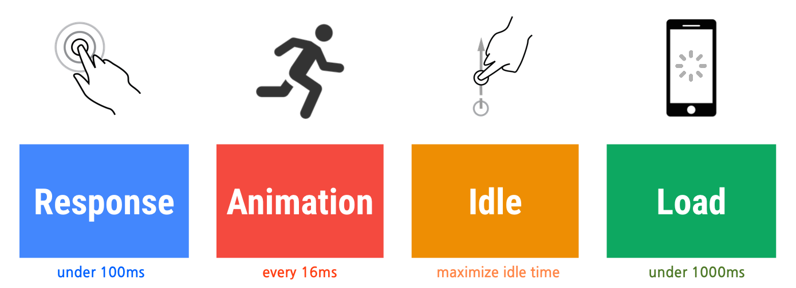
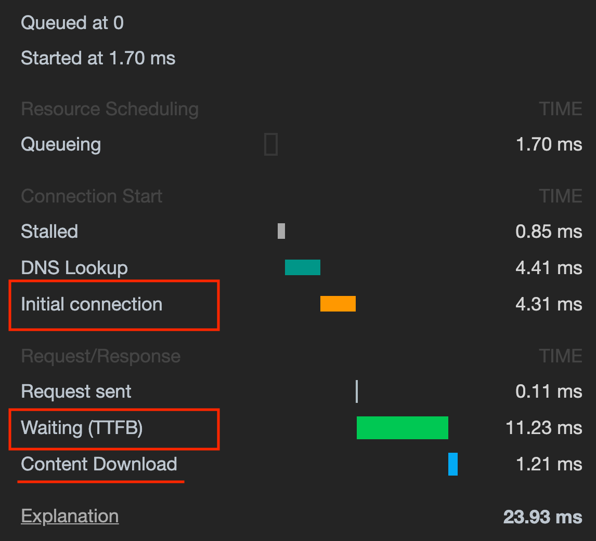
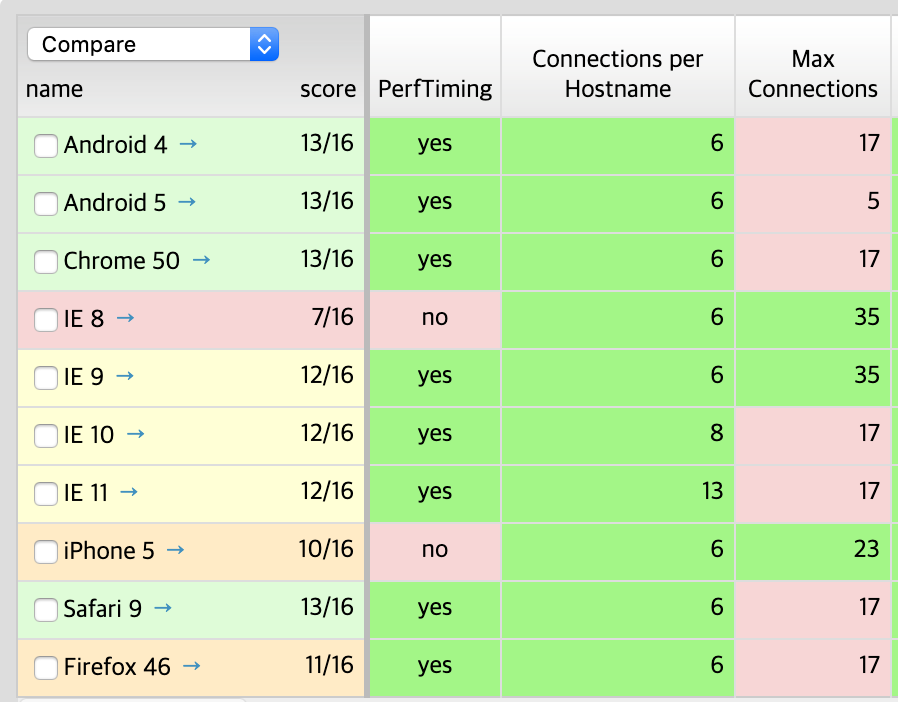
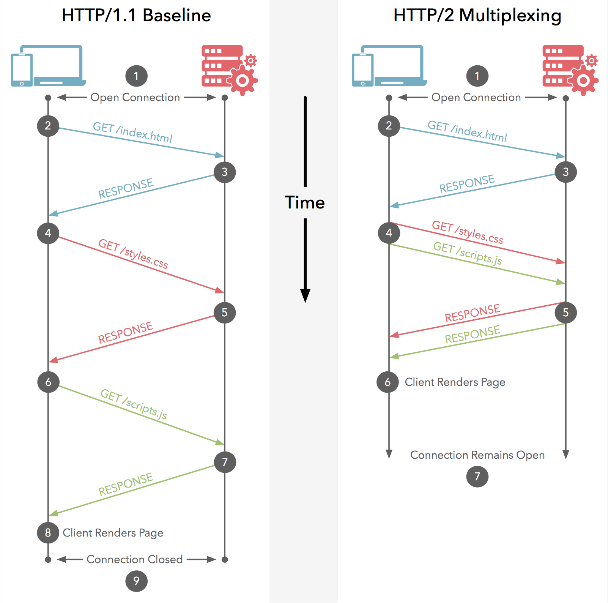
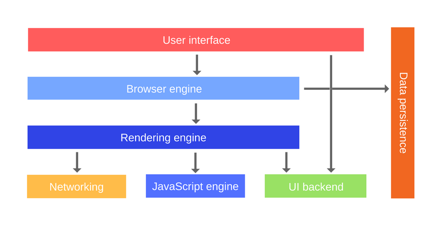

## 내 소개

발표의 <strong>신뢰도</strong>를 높이기 위해서 내 소개

- <!-- .element: class="fragment" --> 네이버 <strong class="yellow">모바일 메인</strong> FE성능 개선 작업 
- <!-- .element: class="fragment" --> 네이버 <strong class="yellow">모바일 날씨</strong> FE성능 개선 작업 
- <!-- .element: class="fragment" --> 네이버 <strong class="yellow">쇼핑</strong> FE성능 개선 작업 
- <!-- .element: class="fragment" --> 네이버 <strong class="yellow">스토어팜</strong> FE성능 개선 작업 
- <!-- .element: class="fragment" --> 네이버 <strong class="yellow">블로그</strong> FE성능 개선 작업
- <!-- .element: class="fragment" --> 네이버 <strong class="yellow">modoo</strong> FE성능 개선 작업
- <!-- .element: class="fragment" --> 네이버 <strong class="yellow">Pay</strong> FE성능 개선 작업
- ... <!-- .element: class="fragment" -->

-----

<!-- .slide:data-background="#e7ad52" -->
## 우리가 알고 있는 성능에 대한 상식

-----

- 성능 개선은 빠르면 빠를 수록 좋다. 
- <!-- .element: class="fragment" --> 로딩속도는 수치적으로 빠르면 빠를 수록 좋다. 
- <!-- .element: class="fragment" --> 특정 부분의 성능을 개선하면 개선한 만큼 성능 향상이 된다.
- <!-- .element: class="fragment" --> 서비스 성능이슈는 개발자의 무지에서 나온다. 
- <!-- .element: class="fragment" --> 성능 전문가는 서비스의 성능개선 포인트를 찾고 개선할 수 있다. 
- <!-- .element: class="fragment" --> 서비스 성능 개선은 전문성을 갖춘 영역이기 아무나 할 수 없다. 

-----

<!-- .slide:data-background="#e7ad52" -->

## 성능 분석가의 관심사 (GOAL)

-----

### 서버 성능분석가의 관심사는?

서버가 얼마나 <strong>많은 요청을 처리</strong>할 수 있니?

<h3><strong class="fragment yellow">TPS (Transition Per Seconds)</strong></h3>

-----

### FE 성능분석가의 관심사는?

사용자 입력에 얼마나 <strong>빠르게 반응</strong> 할 수 있니?

<h3 class="fragment"><strong class="yellow">LAI (Loading And Interaction)</strong></h3>
<h2 class="fragment blue">에라이</h2>

-----

### LAI (Loading And Interaction) 

<ol>
  <li class="fragment">
    초기 로딩 속도 (Loading)
    
얼마나 빨리 페이지를 볼 수 있는가?

  </li>
  <li class="fragment">
    인터렉션 속도 (Interaction)
    
스크롤이 버벅 거려요

    
키보드를 입력하는데 버벅 거려요.

    
얼마나 매끄럽게 애니메이션이 동작하는가?

  </li>
</ol>

-----

<!-- .slide:data-background="#e7ad52" -->
## 성능 개선 작업 어떻게 할 것인가? (PLAN)

-----

<!-- .slide:data-background="./image/forest.jpg" -->
### 1. 대상 선정하기

가장 중요한 것. <strong>숲을 보기</strong>

- <!-- .element: class="fragment" --> 서비스에서 가장 <strong class="yellow">많이 사용하는</strong> 화면이 무엇인가?
- <!-- .element: class="fragment" --> 서비스에서 사용자에게 <strong class="yellow">가치 있는 화면</strong>이 무엇인가?

-----

### 2. 개선 프로세스

테스트에 <strong class="red">Red</strong>-<strong class="green">Green</strong>-<strong class="grey">Refactory</strong> 프로세스가 있다면...

<strong>성능 개선</strong>에서는

- <!-- .element: class="fragment" --> 측정 (Measure)
- <!-- .element: class="fragment" --> 분석 (Analytic)
- <!-- .element: class="fragment" --> 최적화 (Optimize)

<blockquote class="fragment yellow"> 측정 - 분석 - 최적화 - 측정 - 분석 - 최적화 - ...  </blockquote>

-----

### 3. 언제까지? 

<!-- .element: class="fragment" --> <strong class="yellow">목표</strong>에 도달할 때 까지.

<!-- .element: class="fragment" --> 그럼 목표는?

<!-- .element: class="fragment" --> 초기 로딩 속도 <strong class="blue">3초(?)</strong>

-----

성격 급한 한국인이 많이 쓰는...
### 네이버는?

초기 로딩 속도

<ul class="fragment">
  <li>모바일: 1.5초</li>
  <li>PC: 2초</li>
</ul>

-----

### 구글은? 
						

  
  <small>developers.google.com <a href="http://goo.gl/axNG6r">http://goo.gl/axNG6r</a></small>

-----

<!-- .slide:data-background="#e7ad52" -->
## 성능 개선 작업 시작하기 Part 1.

초기 로딩속도 개선하기 (NETWORK 탭)

-----

### 페이지 로딩 과정

<video src="./loadingprocess.mov" controls />

-----

### 로딩 속도 측정/분석 하기
핵심은 Waterfall 차트 

-----

### 로딩 속도 개선하기
높이를 줄이고,
폭을 줄이고,
간격을 줄인다.

-----

#### 1. Reqeust 수 줄이기

- 오래전 방식이지만 그래도 효과적인 것
  - 자원 머지(CSS Sprite, DataURI Scheme) 
  - Why? 브라우저 커넥션수가 제한적이라서.
- 여전히 효과적인 방법: 필요없는 자원 뒤로 (Lazy)
  - 초기에 필요 없는 자원은 나중에
  - 뷰 포트 바깥에 있는 이미지는 나중에

-----

#### 2. Request 폭 줄이기

 <!-- .element: style="height:500px" -->

-----

#### DNS Lookup

-----

#### How to?
Dns Prefetch

-----

#### Initial Connection 줄이기

브라우저는 호스트당 <strong class="yellow">동시에 연결 할 수 있는 개수</strong>가 정해져 있다.
 <!-- .element: style="height:500px" -->

-----

HTTP 프로토콜 마다 Connection 활용 방법이 다르다.

 <!-- .element: style="height:500px" -->

-----

#### Time to First Byte (TTFB)

TTFB가 오래 걸린다면 <strong>서버 비즈니스 로직이 느린 것</strong>이다.

-----

#### Content Download 줄이기

Content Download가 오래 걸린다면 
- <strong class="yellow">네트워크 속도</strong>가 낮거나
- <strong class="yellow">컨텐츠의 크기</strong>가 큰 경우이다.

-----

#### How To
  - minify, obfuscation, gzip
  - 큰 이미지 줄이기, 이미지 메타정보 날리기

-----

#### How to
- 헤묵어서 별소용없는 방법:
  - Domain Sharing. HTTP2니깐 이럴 필요 없어 
- 효과적인 새로운 방법: preconnect
- 새롭지만 현실에서는 별로 필요 없는 방법
  - srcset, pictures. Why? 레티나 아닌게 어딨어?
  - 까리. Link Prefetching, Prerendering

-----

**Request 계단 간격 줄이기**

-----

### 성능관점에서 알아야 할 로딩 과정
1. <!-- .element: class="fragment" --> Browser에서 주소 입력 (Request)
2. <!-- .element: class="fragment" --> 서버로 부터 <strong class="yellow">HTML 문자열</strong>을 <strong>Stream</strong>으로 받음
3. <!-- .element: class="fragment" --> `<head>` 태그에 포함된 자원을 <strong>병렬</strong>로 다운로드
4. <!-- .element: class="fragment" --> `<head>` 태그에 포함된 자원을 <strong>모두 실행한 후</strong>에 
5. <!-- .element: class="fragment" --> `<body>` 태그부터 <strong>화면을 그리기 시작</strong>
6. <!-- .element: class="fragment" --> `<body>` 태그가 닫히고 DOM 구성이 완료되면 <strong class="yellow">DOMContentLoaded</strong> 이벤트 발생
7. <!-- .element: class="fragment" --> `<body>` 태그 내부의 자원(이미지, CSS, js)이 <strong class="blue">모두 로딩 완료</strong>되면 <strong class="yellow">load</strong> 이벤트 발생

-----

#### How to?
- 여전히 효과적인 방법: 자원의 위치에 따른 랜더링 방식 알아보기.
 script를 body아래로….Async, defer, First Paint Time.

- 효과적인 새로운 방법: preload, HTTP2 Server Push

-----

### 서비스에 의미 있게 개선하기: 핵심은 FrameView

-----

#### 상세 로딩과정

- First Paint (FP): none block으로 만들어라! 사용자의 체감속도를 높인다.
- First Meaningful Paint (FMP):  Hero 엘리먼트가 노출된 상태. Hero엘리먼트를 가급적 빨리 노출시켜라! (Lazy노)
- Time to Interactive (TTI) : 비주얼적으로 완료되고 인터렉션이 가능한 상태
- Fully Loaded

-----

#### 서비스 개발자 또는 오너가 정해야할 것들

- Hero 엘리먼트는 무엇인가?
- Lazy 하게 처리해서는 안되는 요소들

-----

<!-- .slide:data-background="#e7ad52" -->
## 성능 개선 작업 시작하기 Part 2.

인터렉션 속도 개선하기

-----

### Rendering Pipeline 이해하기

JS로 DOM을 건드리게 경우. 한번은 괜춤. 하지만. 연속적인 경우에는 헬!

대표적인것 **애니메이션**을 사용하는 경우

**Scripting => recalculate style => layout => Paint => Composite Layer**

- js처리
- 각 DOM 노드의 최종 스타일을 계산하는 과정
- 배치 계산
- 그리기
- 레이어 조합하기

결론! 브라우저는 초당 60fps로 그림. 즉, 16.66ms 내에 랜더링 파이프라인이 완료되어야한다.

-----

### 성능 개선 하기

1. Layout/Paint 비용 감소

   1. Layout 발생하지 않게 하기. 비용도 비용이지만 그 이후에 paint가 발생하기에.

      1. transform, opacity 사용하지 않기
      2. Width, offsetHeight와 같은 속성 얻지 않기

   2. Layout 범위 줄이기/불필요한 레이어 제거하기

       : 레이어로 구성하기

2. CPU가 아닌 GPU를 사용하기 (will-change, translate3d)

   : H/W 가속(GPU)을 사용하면 빠른데… 무분별하면 안됨 (하드웨어 가속 레이어는 CPU에 의해 생성되기 때문에 생성 비용이 크고 추가 메모리가 든다)

3. 60ms 를 보장하는 Scheduler 사용하기 (ReqeustAnimationFrame: 60ms 보장)

4. JS 코드 속도를 16.66ms 내외로 구성하기

   : 서비스의 비즈니스 로직과 직결되기 때문에 대다수 서비스 개발의 Biz 로직에 직결되어있다.

-----

<!-- .slide:data-background="#e7ad52" -->
## 미신에 대한 회고

- 성능 개선은 빠르면 빠를 수록 좋다. (X. 목표를 정해야한다)

- 로딩속도는 수치적으로 빠르면 빠를 수록 좋다. (X. 수치가 높은 것보다는 사용자에게 보여줄 핵심 컨텐츠를 빠르게 보여주는게 더 좋다)

- 특정 부분의 성능을 개선하면 개선한 만큼 성능 향상이 된다. (X. 전체 관점에서 가장 많이 사용하는 페이지를 살펴보아야한다. 워터풀 차트의 경우 전체 폭이 줄어줄수 있도록 필요한 부분을 개선해야한다.)

- 서비스 성능이슈는 개발자의 무지에서 나온다. (X. 사실 바빠서 신경을 못써서 나온다. 무지는 다른이야기이다.)

- 성능 전문가는 서비스의 성능개선 포인트를 찾고 개선할 수 있다. (X. 성능개선사항을 누구 보다 잘아는 사람은 서비스를 개발한 담당자이다. 성능 전문가는 찾을수는 있지만 개선할수는 없다. 일례로 js코드의 biz 소스는 전문가도 못한다.)

- 서비스 성능 개선은 전문성을 갖춘 영역이기 아무나 할수 없다.  (X. 오늘 강의만으로도 여러분은 충분히 할수있다) 

-----

  
7. DOM, CSSOM, Render 트리 구성. (Graphic Layer Tree)
3. Render트리 Layout
4. Render트리 Painting

 <!-- .element: style="height:400px" -->
<small><a href="https://blog.sessionstack.com/how-javascript-works-the-rendering-engine-and-tips-to-optimize-its-performance-7b95553baeda">How JavaScript works: the rendering engine and tips to optimize its performance</a></small>

Netwoking, Rendering Engine <!-- .element: class="fragment yellow" -->

-----