## Typescript 

이젠 설명할 필요가 없겠죠?

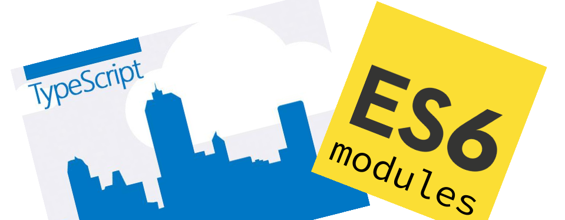

-----

<!-- .slide:data-background="#1A3819" -->
<span style="color:white">이건 궁금하실거 같아요</span>

## Typescript 왜 썼나요? <!-- .element: class="fragment" -->

-----

왜 쓰긴...
## 필요하니깐 썼죠!

-----

## egjs 2.x 작업

<span class="yellow">eg.MovableCoord</span>를 개선해보자.

-----

## eg.MovableCoord

<div style="display:flex; background-color:white; justify-content: space-between; color: black; padding:30px; border-radius: 20px">
  <div style="width:30%">
  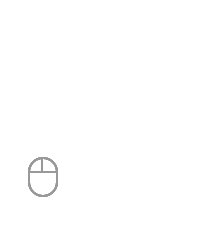
  <div>마우스, 터치로<br>이동하는 이벤트</div>
  </div>
 <div style="width:30%" class="fragment">
  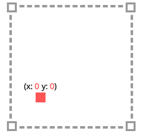
  <div>x, y 축값으로 변경</div>
  </div>  
  <div style="width:30%" class="fragment">
  
  <div>UI로 결과 반영</div>
  </div>    
</div>


-----

## 뭘 개선하려는데?

<span class="underline">마우스하고 키보드</span><span class="yellow">만</span>...<br>
<span class="underline">x,y 축</span><span class="yellow">만</span>...

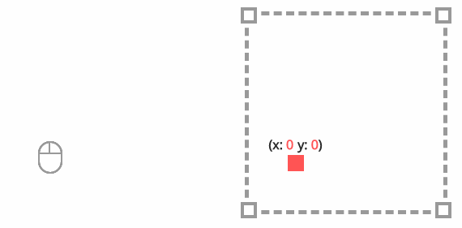


-----

<div>
  <span class="yellow">줌</span>으로도 좌표를 만들고 싶은데...<br>
  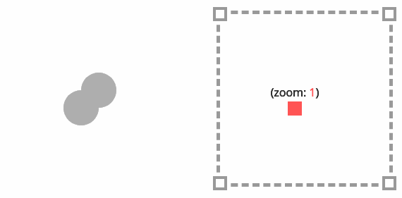
</div>

-----

<div>
  <span class="yellow">마우스 휠</span>로도 좌표를 만들고 싶은데...<br>
  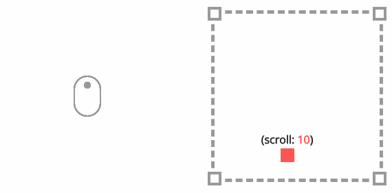
</div>

-----

<div>
  <span class="yellow">키보드</span>로도 좌표를 만들고 싶은데...<br>
  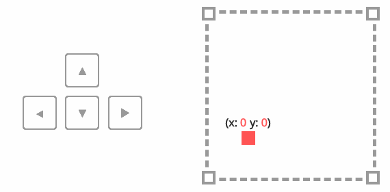
</div>

-----

## 아무거나 <!-- .element: style="color:#FF5E99" --> 
를 좌표로 만들고 싶은데...
### ???

-----

## 어떻게 하지?

이런거 예전에 많이 본 것 같은데...<br>
발음 어려웠던 거였는데...

## Polymorphism! <!-- .element: class="fragment yellow" -->

-----

동일 형태. 동일 기능이지만 구현체만 다르게 하면 되겠네.<br>
상속은 커플링이 커지니깐... 

### 자바의 <span class="yellow">interface</span>가 그립네.

-----

그냥. <strong>자바스크립트</strong>로 구현 열심히 하고 
## <span class="yellow">문서화</span> 잘해야겠다

-----

### 아! 또 있었지.
<span class="underline">x,y 축</span><span class="yellow">만</span>...

-----

2개 축만 사용하는게 아니라 <span class="yellow bigsize">N개의 축</span>을 사용
<div style="display:flex; background-color:white; justify-content: space-between; color: black; padding:30px; border-radius: 20px">
  <div style="width:50%">
    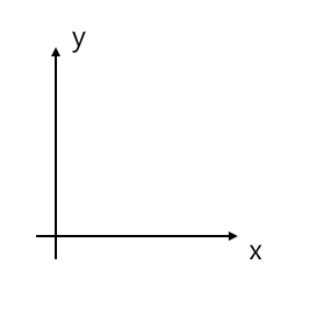
    <div>x, y 좌표로 변환</div>
  </div>
  <div style="width:50%" class="fragment">
    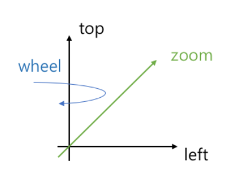
    <div>zoom, left, top, wheel, keyboard…. 좌표로 변환</div>
  </div>
</div>

-----


<span class="bigsize">헐~</span> 다시 만들어야겠다.

<div class="fragment">
<p>만드는 김에 MovableCord를 <strong class="bigsize">Axes</strong>로 바꿔야겠다.</p>

<small><a href="http://d2.naver.com/helloworld/0590136">D2 Hello world "사용자의 액션에 반응하는 UI 라이브러리, eg.Axes"</a></small>
</div>

-----

테스트 코드가 충분하지만...<br>
<strong class="bigsize">Coverage 93%</strong>

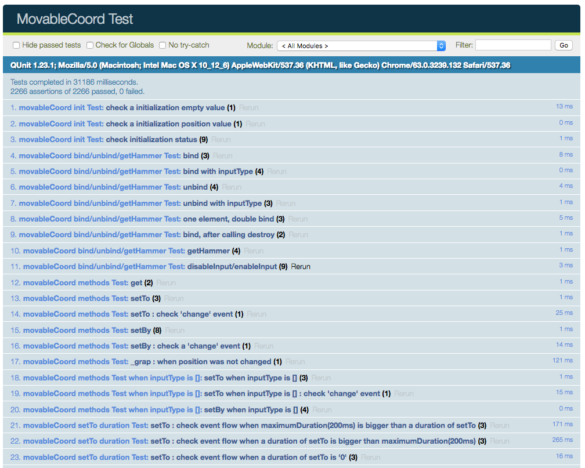

-----

### 별도움이 안되었음.

내부 구조 변경이 아닌 <em>API 자체 변경</em>이어서


-----

# 아하!
## <span class="yellow">Typescript</span>가 있었지


-----

### 다양한 입력 타입은
InputType <strong>인터페이스</strong>를 적용


```ts
interface IInputType {
  axes: string[];
  element: HTMLElement;
  mapAxes(axes: string[]);
  connect(observer: IInputTypeObserver): IInputType;
  disconnect();
  destroy();
}
```

-----

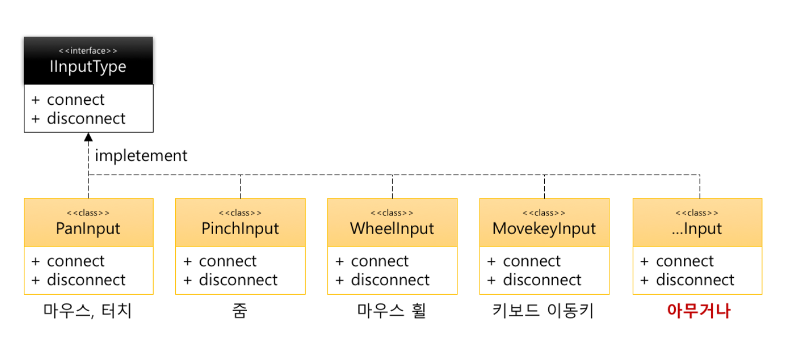

<strong class="yellow">기능별</strong>로 구현하자!

-----

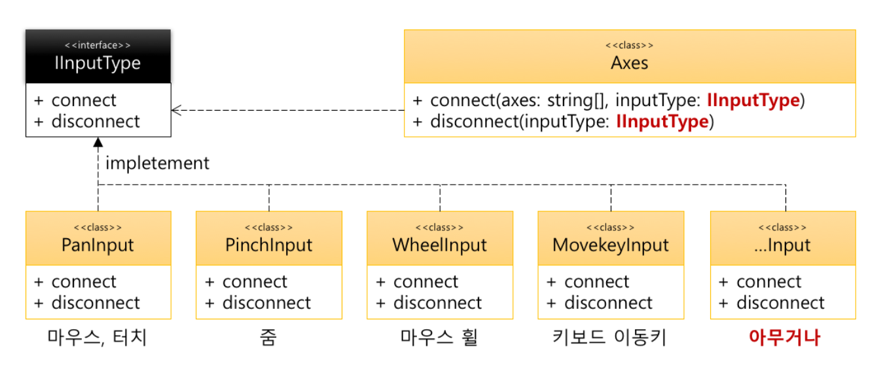

Axes와는 <strong>Loosely coupling</strong> 관계

-----

<!-- .slide:data-background="#e7ad52" data-transition="zoom" -->
## Typescript로 얻은 것!

<p style="color:white">The Good Parts</p>

-----

interface로 <strong>설계 의도가 코드에 명확히 보임</strong>

```ts
class PanInput implements IInputType {
  connect(observer: IInputTypeObserver): IInputType {
    // ...
  }
  disconnect() {
    // ...
  }
}
```

-----

구현 해야할 것을 안했다면... <strong>멤메</strong>

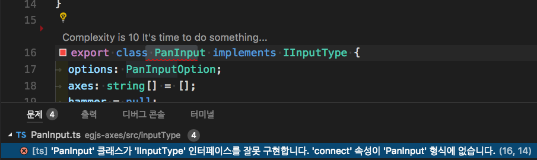

<p class="fragment">더군다나...툴을 쓰면 <storng class="yellow">구현체 형태</strong>까지 만들어 줌</p>

-----


잘못된 값을 넣거나 필수값을 안넣으면... <strong>멤메</strong>

<pre><code data-trim data-noescape>
const axes = new Axes({
  // range 값이 필수. 없어서 에러. 
  // 'range' 속성이 '{ circular: true; }' 형식에 없습니다.
  <mark>rotateX: {
    circular: true  
  },</mark>
  rotateY: {
    range: [0, 360],
    circular: true
  }
}, {
  // 잘못된 값을 넣어서 에러
  // 'string' 형식은 'number' 형식에 할당할 수 없습니다.'
  deceleration: <mark>"0"</mark> 
});
</code></pre>

-----


<strong>점(.)</strong>의 Code Assist

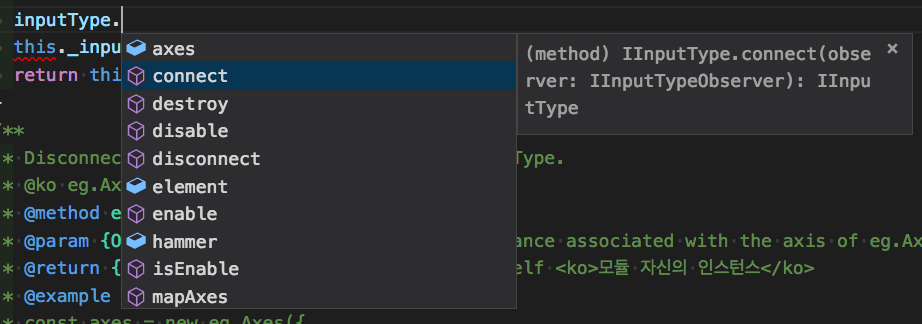


-----

<strong>코드 이동</strong>은 덤!

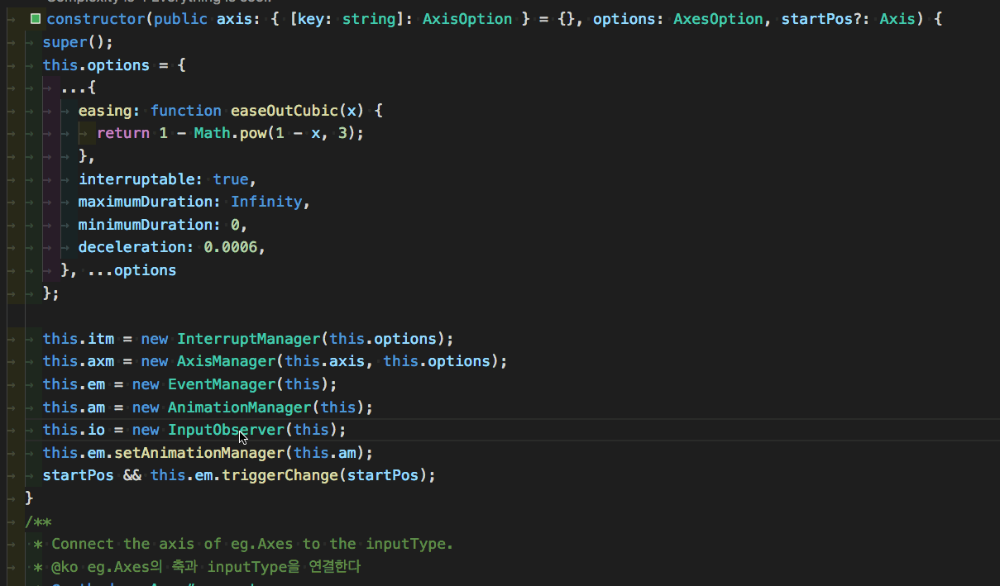

-----

사용자 정보를 <strong class="yellow">좌표로 변환</strong>해야하는 경우가 많음.

<div style="display:flex; background-color:white; justify-content: space-between; color: black; padding:30px; border-radius: 20px">
  <div style="width:50%">
  
  <div>다양한 입력 데이터</div>
  </div>
 <div style="width:50%">
  
  <div>N개의 축 값으로 변경</div>
  </div>  
</div>


-----

data이지만 같은 data가 아님
<pre><code data-trim>[{
  name: "손찬욱",
  age: "먹을 만큼 먹음",
  weight: "알아서 뭐하게"
}, { /* ... */ }, // ...
].map((<mark>data</mark>) => ({
  name: x.name,
  orgAge: x.age,
  orgWeight: x.weight,
  <mark>age</mark>: isNaN(x.age) ? 20 : x.age,
  <mark>weight</mark>: isNaN(x.weight) ? 60 : x.weight,
  // ...
})).map((<mark>data</mark>) => { // ... })
}).reduce((<mark>data</mark>) => { // ... })
</code></pre>

-----

데이터의 타입이 있어서 <strong class="bigsize">오~</strong>
<pre><code data-trim>[{
  name: "손찬욱",
  age: "먹을 만큼 먹음",
  weight: "알아서 뭐하게",
  family: ["hong", "june", "seo"]
}, { /* ... */ }, // ...
].map((<mark>data: UserInfo</mark>) => ({
  name: x.name,
  orgAge: x.age,
  orgWeight: x.weight,
  age: isNaN(x.age) ? 20 : x.age,
  weight: isNaN(x.weight) ? 60 : x.weight
})).map((<mark>data: StoredUser</mark>) => {
  <span class="fragment"><mark>data.orgAge;</mark></span>
  <span class="fragment"><mark>data.family;</mark> // Error</span>
}).reduce((<mark>data: User</mark>) => // ...)
</code></pre>

-----

데이터를 <strong class="yellow">전달</strong>하거나 <strong class="yellow">변형</strong>하는 경우에는 
<strong class="bigsize">Great!!!</strong>

<div class="fragment">
  <h4><span class="underline">lodash</span>나 <span class="underline">rxjs</span>와 같은 류의 라이브러리와 캐미가 좋음</h4>
</div>

-----

<!-- .slide:data-background="#8c4738" data-transition="zoom"-->
## Typescript로 잃은 것!

The Bad Parts

-----

- 환경설정 문제
- 3'rd party 사용 문제
- 타입변환 문제
- import 문제
- 과한 사용은 오히려 독! 자존감 붕괴

-----

### 그럼 다음에 기회가 된다면 

## <strong class="yellow">Typescript를 쓰겠어요? 안쓰겠어요?</strong>

-----

# YES!

-----

여기에서 이야기한 자세한 설명은  
다음 사이트에서 보실수 있습니다.


