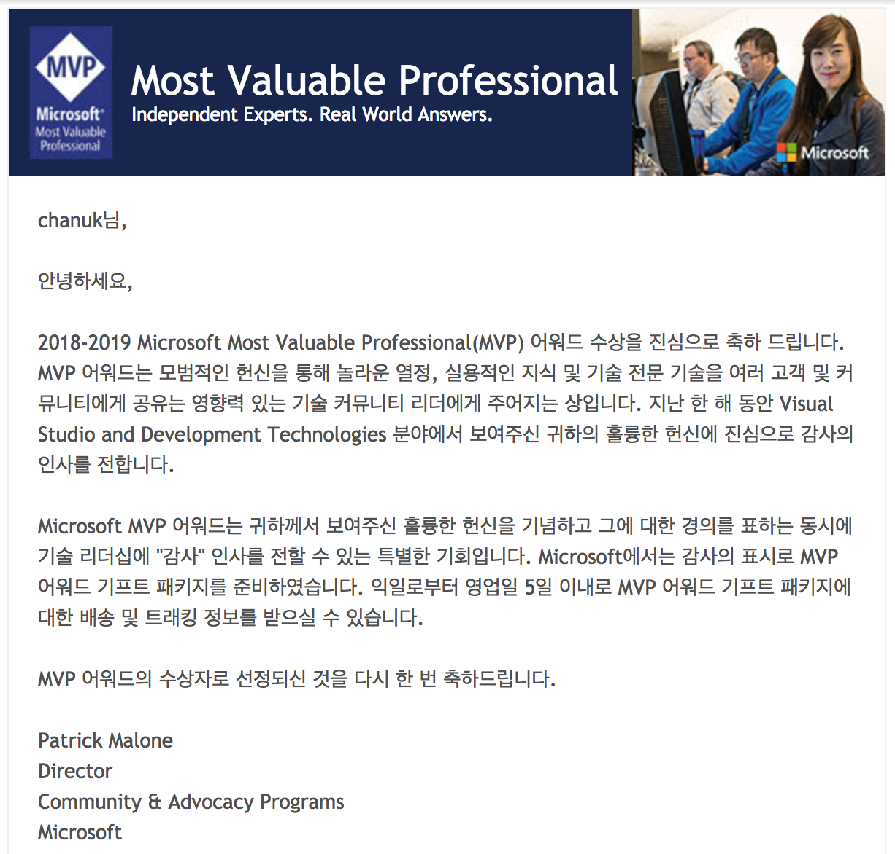

추석 고향가기전에 Microsoft로 부터 다음과 같은 메일을 받았다.

오~ 마이갓!  
내가 `Microsoft MVP (Most Valuable Professional)`라니...
사실 MS는 내 삶에 많은 영향을 끼친 기업이 었다.

어렸을때 프로그래머가 되고 싶어했던 이유도 `빌게이츠` 때문이었다. 빌게이츠가 대단한 프로그래머 일거라는 잘못된 생각(빌게이츠는 프로그래머이기도 하지만 그보다는 위대한 사업가...)으로 난 이 길을 택했다.

## 프로그래머

그때는 그냥 막연히 프로그래머가 되고 싶었던 것 같다.  
학교 공부도 '대학가면 프로그래밍 공부할 수 있겠지' 라는 생각으로 했던 것 같다.  
물론, 코딩한다고 DOS책도 사서보고 C/C++ 프로그래밍 책도 사서 혼자 보기도 했지만 직접 완성도 있는 프로그램을 만든적은 없었던것 같다.  
지금이라면 주의에 커뮤니티도 많고, 경진 대회도 있고, 정보도 많아서 배우려는 의지만 있으면 뭔가를 해볼수 있는 시기이지만, 그때 당시 내 주의에는 프로그래머란 직업도 없었을 뿐더러 주변에 컴퓨터도 거의 없을때 였다.  
그래서 어떻게 해야 프로그래머가 되어야하는지 막막할 때였다.  
주변의 누군가라도 한명 있었다면 더 좋은 경험을 했을수도 있었을 텐데라는 아쉬움이 들기도한다.
또는 내가 지방이 아닌 수도권에서라도 살고 있었다면 지금의 모습보다 더 나은 모습으로 살아가지 않을까 하는 생각도 든다.

## MS빠

암튼, 대학에와서 그 좋아하는 프로그래밍을 하게되면서 개인적으로는 정말 즐거웠던 것 같다.
코딩하는 것도 잼있고 더불어 성적도 잘나오고, 뭔가를 알아간다는 즐거움도 함께 느꼈던 시기였던것 같다.
그때 당시 나는 MFC를 배우고 Visual Studio를 쓰면서 앞으로는 C#이 주요 언어가 될것 이라며 혼자 C# 공부를 하고 다니기도 하였다.
물론, 졸업 전까지도 MS는 내 동경의 대상이었고 내 기술 스텍의 주요 영역이기도 하였다.  
한마디로 그 당시에는 `난 MS빠`였다.

## Bye~ Microsoft

하지만, 직장에 가서 본 현실은 너무 달랐다.  
직장에서 C, C++, MFC는 장비업체를 제외하고는 대다수 Java 기반의 웹 플랫폼 사업을 하고 있었다. MS가 제공하는 제품은 Window와 오피스를 제외하고는 어느것 하나 없었다. MS의 제품은 돈많은 기업이나 MS와 이해관계가 있는 회사에서만 쓰는 것들이었다.  
사실 이때부터 MS에 대한 관심은 내 삶에서 점점 멀어져갔던 것 같다.  
오히려 훌륭한 오픈소스에 더 관심이 많이 갔고, MS보다는 Apple. Apple 보다는 구글에 더 많은 관심이 갔다.
이렇게 내 삶에서 MS가 잊혀져 갔다.

## Meet Again!

최근 들어 구글의 Angular를 관심을 갖게되면서부터 그동안 잊혀졌던 MS가 내 삶에 조금씩 스며들어 왔다.
VSCode를 사용하게 되고, Angular를 쓰면서 Typescript와 RxJS를 사용하게 됨으로써 나도 모르게 MS와 다시 연을 맺게 되었다.

사실 MS 제품중 가장 좋은 것 중에 하나가 바로 Visual Studio 인것 같다. 훌륭한 code assist부터 디버깅툴까지 정말 갑 오프 갑인 툴이다.  
이 툴이 있기에 한때 MS빠가 되기도 했었다.  
사실 내가 Front End로 기술영역을 바꾼 이후로 이런 IDE에 대한 아쉬움이 있었다.  
하지만. `Javascript의 맛은 자유로움이라고 했던가?`  
그냥 가벼운 편집기만 있어도 충분히 개발을 할수 있었을 뿐만아니라 Chrome DevTool 자체가 워낙에 좋기 때문에 부족함이 없었다.

다만 편집기가 좀 있으면 좋겠다는 생각으로 가벼운 [SublimeText](https://www.sublimetext.com/)를 사용하고 있었다.
그런데 작업하는 workspace가 커지면서 점점 느려지는 편집기를 보면서 IDE를 갈아타기로 마음을 먹었다.  
그때 다시 내 눈에 들어 온게 [VSCode](https://code.visualstudio.com/)였다.

VSCode는 오픈소스 V8 기반의 편집기로서 MS가 가지고 있는 Visual Stuido를 연상하게 만들 정도로 잘 만들어진 IDE 툴이었다. 지금은 나의 IDE 툴로 잘 쓰고 있다.
지금쓰고 있는 이 글도 VSCode로 마크다운 문서를 만들어 쓰고 있는 것이다.
참 좋다!

## Microsoft MVP

지인의 우연한 소개로 신청서를 적었다. 사실 크게 관심도 없어서 잊고 지냈었는데 [MVP](https://mvp.microsoft.com/en-us/PublicProfile/5002818)가 되었다.

막상 되고보니 뭔가 해야할 것 같은 책임감이 든다.  
VSCode Extention이라도 만들어야하는 기분이다.

그래서 MVP 사이트에서 한국에있는 MVP분들을 한번 찾아봤다.
https://mvp.microsoft.com/en-us/MvpSearch?lo=Korea

모두 71명의 MVP중 나처럼 개발자 MVP분이 총 21명 검색되었다.
MS책도 내고, 커뮤니티도 하시고, 개발도 하시는 등 굉장한 분들이 등록 되어있었다.  
난 VSCode를 쓰고, Typescript를 사용하고, RxJS에 대한 책을 쓰고 있지만... 사실 MS와 직접적으로 관련이 있는 일을 내가 한 것은 없다.

지금부터라도 좀더 적극적으로 관심을 가지고 MS 제품군들을 써봐야겠다.
MVP기간 중에 부족한 부분이 있으면 컨트리뷰트도하고, 의견도 내놓아야겠다.
