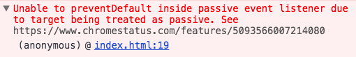

iScroll contribution을 하다가 우연히 알게된 이슈가 있어 몇자 적어본다.

Chrome 49부터 [EventListenerOptions](https://github.com/WICG/EventListenerOptions/blob/gh-pages/explainer.md) 옵션을 지원한다.

기존 addEventListener의 3번째 파라미터로 캡쳐링/버블링 여부를 제어할 수 있는 부분이 `EventListenerOptions`이라는 객체형태의 추가 옵션을 받을수 있게 되었다.

jQuery를 쓸 이유가 하나씩 줄고 있다. 허허허

**EventListenerOptions 사용 전**

```js
document.addEventListener('touchstart', handler, false);
```

**EventListenerOptions 사용 후**

```js
document.addEventListener('touchstart', handler, {
  capture: false,
  once: false,
  passive: false,
});
```

현재 크롬에서 지원하는 EventListenerOptions 옵션은 다음과 같다.

- capture: 이벤트 캡쳐링 적용 여부. [크롬 49부터 지원](https://www.chromestatus.com/feature/5718574840676352)
- once: 이벤트를 한번만 호출하고 해제되는 옵션. [크롬 55부터 지원](https://developers.google.com/web/updates/2016/10/addeventlistener-once)
- passive: 스크롤 성능 향상을 위한 옵션으로 `true`일 경우, 스크롤을 위해 블록되는 것을 방지한다. 이 경우, `preventDefault`를 사용할 수 없다. [크롬 51부터 지원](https://developers.google.com/web/updates/2016/06/passive-event-listeners)

이 중, passive 속성은 성능향상을 위해, 브라우저의 기능을 프로그래밍으로 제어할수 있다.

> passive 속성에 대한 링크
> https://github.com/WICG/EventListenerOptions/blob/gh-pages/explainer.md

passive 속성이 `false`인 경우에 touchstart, touchmove와 같은 이벤트가 발생하면 preventDefault를 이용하여 실제 이벤트 자체를 막을 수 있기 때문에, 브라우저는 scroll을 계속 할지 안할지를 매번 감시해야만 한다.
하지만, passive 속성이 `true`일 경우에는 `preventDefault를 이용하여 scroll 이벤트를 막지 않겠다`고 브라우저에게 이야기하는 것과 같다. 따라서, 이 룰을 어기면 브라우저는 가차없이 다음과 같은 에러를 던진다.


다행이 passive 속성의 기본값은 `false` 이기 때문에, 기존 코드는 문제가 되지 않는다.

## 하지만...

`Chrome 54+` 부터 EventListenerOptions의 passive 속성이 특별한 상황일 경우에는 기본값이 `true`로 설정된다.

> document또는 body에 이벤트 리스너를 추가할때, touchstart, touchmove와 같이 스크롤이 블록되는 이벤트인 경우, passive의 기본 속성값은 true가 된다.

예를 들어 다음과 같은 코드는

```js
document.addEventListener(
  'touchmove',
  function (e) {
    e.preventDefault();
  },
  false
);
```

아래와 같은 무시무시한 에러가 발생한다.



혹시 이런 코드가 있으면 아래 같이 수정하시면 된다. 짜잔~!

```js
document.addEventListener(
  'touchmove',
  function (e) {
    e.preventDefault();
  },
  isPassive()
    ? {
        capture: false,
        passive: false,
      }
    : false
);
```

여기 사용한 isPassive 함수는 passive 속성 여부를 확인하는 유틸 함수이고, 상세 구현은 다음과 같다.

```js
function isPassive() {
  var supportsPassiveOption = false;
  try {
    addEventListener(
      'test',
      null,
      Object.defineProperty({}, 'passive', {
        get: function () {
          supportsPassiveOption = true;
        },
      })
    );
  } catch (e) {}
  return supportsPassiveOption;
}
```

https://github.com/cubiq/iscroll/blob/master/demos/demoUtils.js#L2-L12

앞으로는 브라우저 내부를 점점 프로그램으로 제어할수 있는 API들이 쏟아질 것 같다.
웹개발을 하는 입장에서는 굉장히 좋은 방향성 같다.
