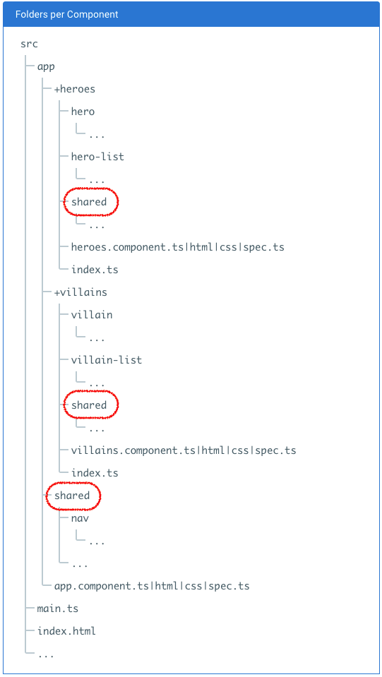

React로 프로젝트를 진행하신 분들의 경험을 듣는 기회가 있었다.
많은 이야기가 있었지만, 그 중 공통적으로 React가 아쉽다고 이야기한 부분 중 하나로, 초기 개발환경에 대한 부분이 지원되었으면 좋겠다는 이야기가 있었다.

> feature 단위로 폴더를 구성할 지, type 단위로 폴더를 구성할 지,  
> Webpack을 쓸지 grunt,gulp를 쓸 지,

소소하지만, 개발시 논란의 여지가 되는 부분들.
개발자라면 익히 경험했을 것이다.

feature 단위인 경우는 작업 분할이 쉬운 반면, type 단위의 경우는 각 타입별 확인이 편하며, 공통 기능들을 관리할 수 있는 장점이 있다. 이런 타입의 특.장점을 살려 차선책으로 2가지 타입을 병행해서 사용하는 경우도 존재한다.

구성원들의 상황에 따라 "이거 정해지는 대로 쓰자" 부터 "향후 유지보수에 막대한 영향력을 미치기 때문에 정말 중요하게 결정해야 한다" 고 주장하는 이도 있다. 이런 주장이 둘 다 틀린 주장은 아니다.
하지만, 개인적으로 이런 환경에 대한 것은 `정답이 없는것 같다. 단지 Best Practice가 있을 뿐이다`

React에서는 이런 Best Practice를 직접 찾아서 적용하고 검토해봐야 하는 상황에 직면하는 경우가 많은 반면, 다행히 Angular2는 이런 부분에 대한 고민이 공식적(official)으로 정리가 되어 있다.

## Angular2 Style Guide

https://angular.io/docs/ts/latest/guide/style-guide.html

[LIFT (Locate, Identify, Flat, Try to DRY) 원리](https://angular.io/docs/ts/latest/guide/style-guide.html#!#application-structure)에 따라 폴더구조를 구성하고 있다.
우선, 기본적인 모양은 feature 단위로 구성하고, 그 feature 내부에서 공통적으로 활용하는 부분은 shared를 나눠서 관리하고 있다.



처음에는
"음... 이렇게 그냥 잘 정했구나" 정도로 생각했는데....

개인적으로 놀란 것은...
바로, Angular-cli도 이 구조로 구성을 한다는 것이다.

내가 주목했던 부분은 바로

> #### 일관성
>
> 그리고
>
> #### 자주 접하게 되는 고민의 솔루션

이 Angular2에 녹아 있다는 것이다.

우리가 프레임워크를 쓰는 이유 중의 하나는 `자주 접하는 문제에 대한 솔루션`을 프레임워크를 통해 손쉽게 해결하고, `일관된 코드`를 유지하고, `재사용성`을 높임으로써 보다 `높은 생산성을 유지`하기 위해서 이다.
이런 의미에서 Angular2는 프레임워크가 추구해야할 근본 취지를 잘 지키고 있는 것으로 보인다.

## Angular-cli

React에서는 최근 [create-react-app](https://facebook.github.io/react/blog/2016/07/22/create-apps-with-no-configuration.html)이 등장했다. 아직은 미약하지만 고무적인 일이다.
하지만, Angular2 개발자들에게는 이미 준비 되어 있다.
바로 위에서 잠깐 언급했던 [Angular-cli](https://cli.angular.io/) 이다.

Angular-cli는 지금도 개발이 되고 있지만, 기본적으로 Angular2에서 가이드하는 코딩 스타일을 준수하고 있다.
아쉽게도 세세한 부분에 대해서는 가이드와 일치 하지 않는 부분이 존재하지만, 그 부분은 차차 개선되리라 믿는다.

잘은 모르지만, 아마도, 지금 Angular-cli 가 ember-cli를 기준으로 만들어지고 있기 때문에, 약간 엇박자가 나오고 있는 부분이 있는 것 같다.

아래는 실제로 개인적으로 겪었던 일이다.

angular-cli에 의해 생성한 프로젝트는 기본적으로 `tslint.json` 을 생성한다. 만약, `tslint.json` 파일의 규칙을 사용자가 바꾼 후, angular-cli를 통해 컴포넌트나 서비스를 만들게 되면. `tslint.json`에 변경한 규칙이 적용되지 않는다.
이 부분에 대해서는 개발하고 있는 [github에 요청](https://github.com/angular/angular-cli/issues/1546)해 봤으나, 특별한 답을 얻지 못했다.
angular-cli로 생성한 프로젝트에서 제공하는 `npm run format` 명령 또한 마찬가지다. `tslint.json`을 기반으로 formating이 적용되지 않는다.

그래서 알아낸 사실은...
angular-cli는 `.clang-format`에 의해 code style을 관리하고, 이를 기준으로 명령이 수행된다.
따라서, 만약 `tslint.json의 규칙을 바꾼다면, .clang-format도 함께 바꿔줘야한다.`
바로 요렇게 .clang-format에 추가한다.

```
JavaScriptQuotes: Double
IndentWidth: 4
TabWidth: 4
UseTab: ForIndentation
```

위 코드는 더블 쿼테이션과 space대신 탭을 쓴 예이다.

> 참고로 clang-format 관련 사이트  
> https://clangformat.com/  
> http://clang.llvm.org/docs/ClangFormatStyleOptions.html

아마 내부적으로 ember-cli의 dependency를 제거하기 위한 노력이 진행되고 있는 것으로 보인다.
그런 취지에서 나온게 바로 angular-cli webpack 버전인 것 같다.

아래 같이 설치하면 webpack 버전 angular-cli를 받을 수 있다.

```
npm install -g angular-cli@webpack
```

친절하게도 기존 개발자를 위해 migration 가이드도 있다.  
https://github.com/angular/angular-cli/blob/master/WEBPACK_UPDATE.md

정말 반가운 소식이다. 나도 개인적으로 webpack이 더 좋다. 친숙하기도 하고 ㅋㅋ

올해 내로 꼭! 더 좋은 모습이 나오길 기대해 본다.
