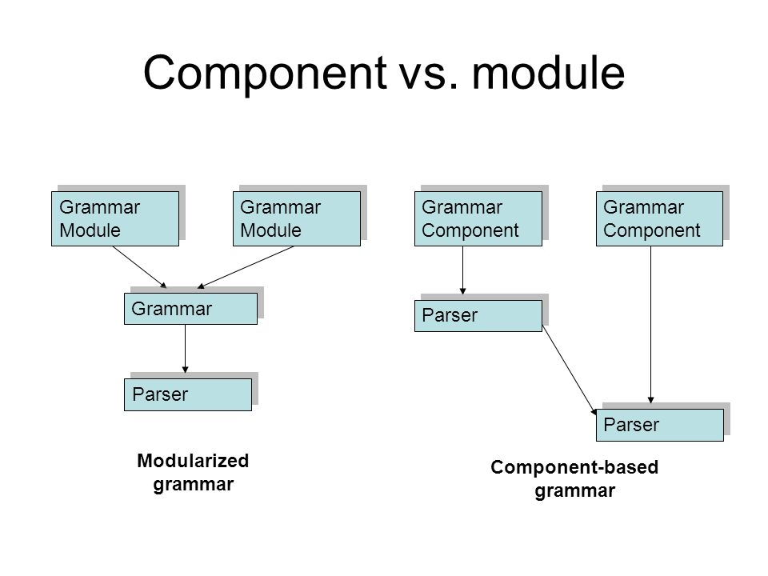

## Angular2 rc5: Component에서 ngModule 단위로

2016년 8월 9일 [Angular2 rc5](https://github.com/angular/angular/tree/2.0.0-rc.5/)가 발표되었다. Angular2 rc5에서는 전체적으로 구조 자체를 바꾸었다. 기존 Angular1이 module 방식을 채택했던 것에 비해 Angular2는 React와 같이 Component 단위로 구성되었다. 하지만, rc5에서는 다시 예전의 모습으로 돌아왔다.

`그렇다면, Angular2는 Component 방식에서 Angular1에서 쓰던 module 방식으로 왜 돌아 왔을까?`

> 어떤 기능(feature)을 구현하기에 Component는 너무 작은 단위이다.

하나의 기능(feature)를 개발하기 위해서는 UI를 구성하는 View가 있을 수 있고, 기능을 담당하는 service가 있을 수 있다. 더불어, feature내에서 사용하는 pipe나 directive도 존재할 수 있다.
ngModule은 이런 Component, Direcitve, Pipe, serice를 하나로 묶어서 관리 할수 있는 단위이다.
각각의 요소들이 ngModule 단위로 묶이다 보니 ngModule 단위의 `배포나 관리` 또한 편해졌다.
더불어, Router에서 ngModule 단위로 `Lazy Loading`도 가능해 졌다.

> ngModule 내에서의 Dependency는 공유된다.

이젠 이전 버전에 무의식적으로 넣었던 `module.id`도 더 이상 코드에 기술 할 필요가 없고, Component별로 명시하던 `directives, pipes, 등`도 더 이상 기술 할 필요가 없다.
모두 ngModule에 명시하면 된다. 이 방식의 장점은 ngModule에서 dependency를 관리하고, 실제 사용하는 dependency를 한 눈에 다~ 볼 수 있다. 뿐만 아니라, 코드도 더 간결해진다.
이렇게 할수 있는 이유는 바로 ngModule이 JavaScript의 module과 같이 module 단위로 scope를 갖기 때문에, ngModule에 명시된 Component들은 ngModule에 명시된 dependencie 객체들(directive, pipe, service, component)을 자유롭게 사용할 수 있다.
참고로, Component의 directives, pipes들은 [depreacted](https://docs.google.com/document/d/1isijHlib4fnukj-UxX5X1eWdUar6UkiGKPDFlOuNy1U/pub#h.5fritim1x5kz) 되었다.

하지만, 불편한 것도 있다. ngModule에서 쓰는 모든 자원을 declarations이나 providers로 수동으로 명시 해줘야하는 번거로움(?)이 있다. 또한, React와 다르게 Component 기반이 아닌 ngModule 단위의 접근으로 바뀌다 보니, 가벼운 느낌보다도 뭔가 무거워진 느낌도 든다.

rc5에 대한 자세한 사항은 다음 링크를 확인해보기 바란다.

- https://angular.io/docs/ts/latest/guide/ngmodule.html
- https://angularjs.blogspot.kr/2016/08/angular-2-rc5-ngmodules-lazy-loading.html

## Angular2는 왜 자꾸 인터페이스를 바꾸는가?

기존 rc4에서는 router와 form에 대한 인터페이스를 바꾸더니, 이번에는 Component 기반의 구조에서 ngModule 기반으로 구조 자체를 변경하였다.
일반적인 프로세스 단계로 봤을 때, [rc(Release Candidate)](https://en.wikipedia.org/wiki/Software_release_life_cycle#Release_candidate) 버전은 인터페이스 변경보다는 버그 개선에 포커스가 맞춰져 있지만, Angular2는 rc가 발표될 때마다 대다수 인터페이스를 변경하고 있다.

> 지금 서비스에 Angular2를 도입하려는 사람들에게는 지극히 비상식적인 일인 것 같지만, 다른 한편으로는 고무적인 일 인것 같다. 물론 개인적인 생각이다.

모든 S/W가 마찬가지겠지만, 특히 프레임워크가 한 번 릴리즈 된 이후, 인터페이스를 변경하는 것은 정말 어려운 일이다. 따라서, 정말 잘 결정해야만 한다. 그러기 위해서는 사용자의 피드백을 중심으로 논의가 이루어져야 하며, 그 논의의 결과가 프레임워크에 반영되어야 할 것이다.
Angular2는 이런면에서 사용자의 피드백을 열심히 받고 있는 것 같다. 다양한 의견들에 대한 논의가 이루어지고 있고 이로 인해 Angular2가 변해가고 있다.

> ngModule에 대한 어느 사용자의 커멘트 https://github.com/angular/angular/issues/10552#issuecomment-238819504

지금까지의 Angular2의 행보로 본다면, Angular1과 React에서 많은 교훈 점을 찾고자 노력하고 있는 모습이 역력하다.

React의 단방향 설계와 성능적인 장점 요소를 가져오면서도,
Angular1이 가지고 있었던 프레임워크의 역할과 개발생산성의 장점을 모두 잡으려고 하는 노력이 보인다. 더불어, ember 프레임워크의 장점 중의 하나인 ember-cli도 angular-cli를 통해 하나 하나 흡수해 나가고 있다.

앞으로 정식 릴리즈가 될 때까지 얼마나 많은 rc가 배포 될지는 모르지만...
고민한 만큼 뭔가 대단한 녀석이 나올 것만 같다.

