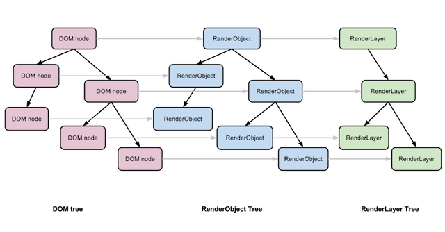
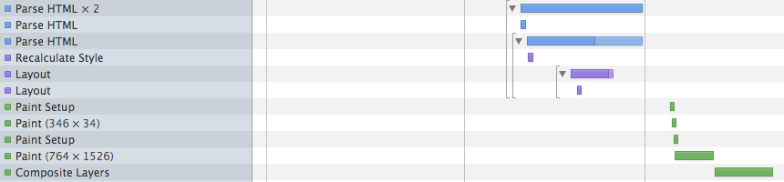
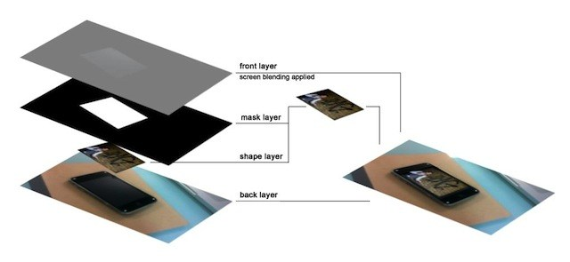
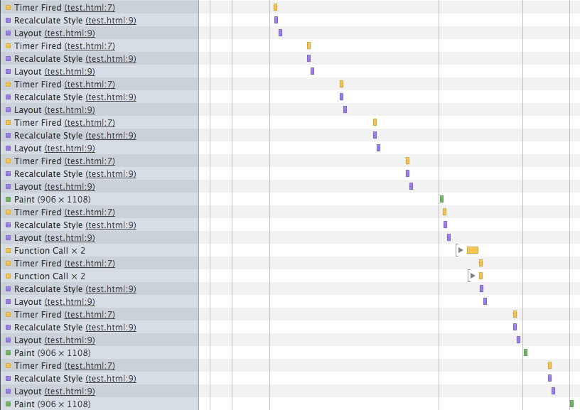
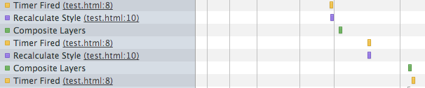

애니메이션이 많은 화면에서는 성능적 문제에 노출되기 쉽다.
특히, 하드웨어 성능이 PC에 비해 열악한 모바일 환경에서는 더욱 성능적 이슈에 직면하기 쉽다.

이 글에서는 성능에 필요한 브라우저 랜더링 과정을 이해하고, 이를 이용하여 애니메이션을 구현할때 유의해야할 점을 살펴보도록 하자.

## 브라우저 랜더링 과정

웹 브라우저의 애니메이션 성능에 대해 논하기 전에 이해해야 할 것이 바로 브라우저 랜더링 과정이다. 애니메이션도 브라우저 랜더링 과정의 한 형태이기 때문에, 브라우저 랜더링 과정을 이해하면, 성능의 bottleneck 부분을 찾을 수 있다

간단한 HTML을 통해 브라우저 랜더링 과정을 이해해보자.

아래는 BODY아래에 6개의 div가 있는 간단한 HTML 파일이다.

```html
<html>
  <body>
    <div>DOM1 - RendersLayer</div>
    <div>DOM2 - RendersLayer</div>
    <div>DOM3 - RendersLayer</div>
    <div
      style="-webkit-transform: rotateY(30deg) rotateX(-30deg); width: 400px;"
    >
      DOM4 - RendersLayer - GraphicLayer (transform : rotate)
    </div>
    <div style="display:none">DOM5</div>
    <div>DOM6 - RendersLayer</div>
  </body>
</html>
```

> Demo : http://jsbin.com/EsewaSIX/3

위 파일이 화면에 보여지기까지의 과정을 살펴보면 다음과 같다.

1. 브라우저는 HTML을 파싱한다.
2. DOM을 구성한다. 여기에서는 기본적으로 구성되는 DOM을 제외하고 DIV 6개가 생성된다. (text dom을 설명에서 제외)
3. DOM 중에서 화면에 표기될 DOM1,2,3,4,6을 4. RenderTree로 구성한다.
4. RenderObject Tree 중에서 별도의 영역으로 구성할 수 있는 DOM4를 RenderLayer Tree로 구성한다.
5. 브라우저는 구성된 정보를 바탕으로 비동기식으로 표현한다



> 출처. http://www.chromium.org/developers/design-documents/gpu-accelerated-compositing-in-chrome

위 과정을 크롬브라우저 devTool의 timeline을 이용하여 실제 랜더링이 어떻게 되는지를 확인 해 볼 수 있다. 크롬에서 개발자 도구를 열고, Timeline 탭을 클릭후, 위 HTML을 불러오면, 다음과 같이 랜더링 과정을 확인 할 수 있다



- Parse HTML은 HTML을 파싱할 경우 발생.
  - 테스트 페이지가 파싱된다.
- Recalculate Style은 엘리먼트에 스타일이 적용될 경우 발생.
  - div에 지정된 style 속성이 적용된다.
- Layout 적용된 style에 의해 위치나 크기가 변경되어 계산이 필요한 경우에 발생.
  - div의 width style 지정으로 인해 layout 계산 작업이 진행된다.
- Paint 엘리먼트가 화면에 다시 그려져야할 경우에 발생
  - transform을 사용한 div4는 별도의 RenderLayer로 구성되어 paint되고, 그외 영역(document)에서도 paint된다.
- Composite Layers 변경되지 않는 각각의 RenderLayer를 합성할 때에 발생
  - transform을 사용한 div4 RenderLayer와 document의 Renderlayer가 합성되어 표현된다.

브라우저는 한 화면을 화면에 보이기 위해서 위와 같은 다양한 과정을 수행한다. 위의 Timeline에서는 HTML Parse 과정이 가장 많은 시간이 걸리지만, 실제 애니메이션 구현 시에는 HTML 파싱이 완료된 후, 사용자의 액션에 의해 동작되기 때문에, 애니메이션 성능에 영향을 미치는 요소는 다르다. ``애니메이션이 동작할 때는 layout 작업 이나, 연속적인 paint 작업으로 인해 성능문제가 발생한다.`

## 애니메이션 성능을 높이는 방법

위에서 살펴봤듯이 랜더링 과정중에 div의 style 속성이 무엇이 지정되느냐에 따라서, 별도의 layer(RenderLayer)가 생성되기도 하고, layout 계산이 되기도 한다.

### 1. Layer 구성하기

우선 layer개념에 대해 알아보자. 여기에서는 설명의 편의상 RenderLayer를 Layer라고 지칭한다. 브라우저가 layer를 나누는 목적은 변경이 될 요소가 많은 영역을 별도로 관리하여, 해당 영역이 변경되었을때, 그 부분만을 반영하기 위한 것이다. 또한 이렇게 나뉜 각각의 layer는 layer 병합(composite)을 통해서 paint 또는 layout 없이 새로운 화면을 구성할 수 있다



> 출처. http://blog.dotify.fr/interactive-video-part-2-developing-the-player-with-the-new-as3-api/

브라우저가 DOM을 Layer로 구성하는 경우는 다음과 같다.

- 3D(translate3d, preserve-3d, ,..)나 perspective transform을 사용하는 경우
- VIDEO, CANVAS 태그를 사용하는 경우
- Flash나 ActiveX를 사용하는 경우
- CSS Animation, CSS filter를 사용하는 경우
- 자식엘리먼트가 layer로 구성되어 있을 경우
- z-index가 낮은 형제일리먼트가 layer로 구성되어 있을 경우, 대상 엘리먼트도 layer로 구성됨

애니메이션은 애니메이션되는 대상의 style을 주기적으로 변경하여 이동하게 되는데 이때, 변경되는 style로 인해, 많은 paint나 layout이 연속적으로 발생하여 애니메이션의 성능을 지연하는 경우가 발생한다. 이때에는 `layer composite을 이용하여 paint와 layout이 발생되지 않도록 유도하는 것이 성능적으로 이점을 얻을 수 있다.`

### 2. GPU 가속 사용하기

GPU가속은 앞에서 설명한 composite layer 방식으로만 동작한다. 앞의 내용과 다른 것은 각각의 layer를 GPU 메모리에 bitmap 형태의 texture로 저장하여, 실제 composite layer작업을 할때에는 GPU의 메모리에서 관련작업을 진행한다. 따라서 굉장히 빠르다.
다음 style이 적용되면 브라우저는 GPU에 해당 엘리먼트 영역(Layer)을 메모리에 texture로 저장한다.

- -webkit-transform : translate3d
- -webkit-transform : translateZ
- -webkit-transform : rotate3d
- -webkit-transform : scale3d
- -webkit-transform-style : preserved-3d

하지만, GPU는 하드웨어의 성능에 따라 성능이 달라지기 때문에, GPU가속을 사용할때는 주의를 기울어야한다.

1. 무분별한 GPU사용은 오히려 브라우저를 느리게한다.
2. 엘리먼트에 GPU사용 속성이 부여되는 순간 브라우저가 대상영역을 GPU메모리에 올리기 때문에, 컨텐츠가 클 경우에는 깜빡이는 현상이 발생할수 있다.
3. 엘리먼트에 GPU사용 속성이 부여되면 Layer로 분리되며, Layer는 변경되는 내용이 없는 한 다시 엘리먼트 내용을 GPU메모리에 올리지 않는다.
4. GPU사용 속성을 사용한 엘리먼트의 내용이 변경되면 GPU 메모리에 갱신되기 때문에, 엘리먼트의 내용변경을 미리하고, 그 이후에 GPU사용 속성을 부여하도록 한다.
5. 저사양의 폰에서 하드웨어가속을 사용하는 것은 오히려 성능저하의 주범이 된다.
   경험적으로 iOS3.x, Android는 4.1이상을 지원하는 단말기에서는 GPU 가속을 적용하는 것이 더 좋은 성능을 나타내었다.

### 3. 애니메이션동작시 Layout 변경하는 스타일이나 메소드 사용하지 않기

브라우저 랜더링 과정중 가장 느린 작업 중의 하나가 layout 작업이다. 이 작업은 엘리먼트의 위치나 크기를 계산하는 작업이기 때문에, 비용이 높고, 자주 사용할 경우, 성능에 치명적이다. 특히, 주기적으로 엘리먼트의 style을 변경하는 애니메이션에서 width, height와 같이 대상의 크기를 변경하는 layout 작업이 발생하면, 부드러운 애니메이션을 기대하기는 어렵다.

다음은 layout을 유발하는 스타일이나 메소드이다

> - Element : clientHeight, clientLeft, clientTop, clientWidth, focus(), getBoundingClientRect(), getClientRects(), innerText, offsetHeight, offsetLeft, offsetParent, offsetTop, offsetWidth, outerText, scrollByLines(), scrollByPages(), scrollHeight, scrollIntoView(), scrollIntoViewIfNeeded(), scrollLeft, scrollTop, scrollWidth

- Position : left, top, position, float
- BOX, Border : height, width, padding, margin, display, border-width, border
- Range : getBoundingClientRect(), getClientRects()
- Window : getComputedStyle(), scrollBy(), scrollTo(), scrollX, scrollY, webkitConvertPointFromNodeToPage(), webkitConvertPointFromPageToNode()

따라서 가능하면 애니메이션 동작 시 위에 나열된 메소드와 속성은 호출하거나 변경하지 않는 것이 좋다. 혹시 변경이 필요하다면 애니메이션 동작시가 아닌 동작 전,후에 미리 작업을 하거나, layout이 발생하지 않는 대처 속성을 사용하는 것이 좋다.

다음은 layout을 변경하는 메소드를 대처할 수 있는 속성들이다.
이 속성들은 모두 composite layer를 구성한다.

> - left => translateX

- top => translateY
- filter:fade => opacity

안타깝게도 width, height를 변경하는 경우에는 어쩔수 없이 layout이 변경되기 때문에
가능하면 사용을 지양하도록 한다. `꼭! 필요하다면 scale을 이용한다.`

## 실습

위에서 언급한 내용을 기준으로 박스를 오른쪽으로 옮기는 예제를 성능 개선 해보자.
다음은 간단하게 박스를 이동하는 예제이다.

```js
<div id="testDiv" style="width:100px;height:100px;background-color:#188B18;position:absolute;"></div>

<script type="text/javascript">
  var el = document.getElementById("testDiv");
  var nAdd = 0;
  var nInterval = setInterval(function(){
    nAdd += 10;
    el.style.left = nAdd + "px";
    if(nAdd >= 400){
      clearInterval(nInterval);
      nInterval = null;
    }
  }, 16);
</script>
```

> Demo : http://jsbin.com/IkeJelA/1

위 예제는 left를 변경하여 상자를 이동한다. left는 layout을 변경하기 때문에 매번 layout작업이 발생한다.
위 과정을 Chrome DevTool의 Timeline을 통해 보면 다음과 같다.
지속적으로 Recalculate Style – Layout – paint가 반복적 발생하는 것을 볼 수 있다.



애니메이션이 동작하는 동안 지속적으로 layout과 paint가 반복적으로 발생하는 것을 확인하였다. Layout과 paint 비용을 개선하기 위해, layer로 상자를 구성하여 layer composite이 발생하도록 유도하고 GPU 가속을 사용하도록 개선한다.

Layer를 구성하기위해 left로 변경되는 방식을 transform의 translate으로 변경하고, GPU 가속을 사용하기 위해, translate 대신, translate3d를 사용하도록 한다.

```js
<div id="testDiv" style="width:100px;height:100px;background-color:#188B18;position:absolute;"></div>

<script type="text/javascript">
  var el = document.getElementById("testDiv");
  var nAdd = 0;
  var nInterval = setInterval(function(){
    nAdd += 10;
    el.style.webkitTransform = "translate3d(" + nAdd + "px,0,0)";
    if(nAdd >= 400){
      clearInterval(nInterval);
      nInterval = null;
    }
  }, 16);
</script>
```

> Demo : http://jsbin.com/eQEqIJa/1/

위 과정을 Chrome DevTool의 Timeline을 통해 보면 다음과 같다.



Layout 작업이 사라지고, Recalculate Style – Composite Layer 작업만 존재한다.

모바일에서 두 예제를 확인해 보면, 두번째 예제가 첫번째 예제보다도 빠르고 매끄럽게 이동하는 것을 확인할 수 있다.
브라우저의 특성을 이해하면 간단한 속성 변경만으로도 많은 성능향상을 할 수 있다.

## 참조 문서

- http://www.html5rocks.com/en/tutorials/speed/layers/
- https://speakerdeck.com/jaffathecake/rendering-without-lumps
- http://www.chrisdanford.com/blog/2011/07/24/understanding-hardware-compositing-css-transforms/
- http://www.chromium.org/developers/design-documents/gpu-accelerated-compositing-in-chrome
