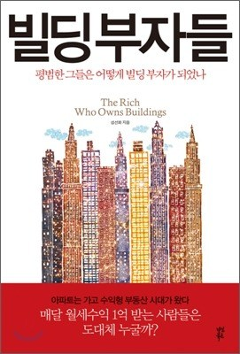

요즘 수익형부동산에 대한 관심이 몰리는 추세를 타서 한번 읽어본 책이다.
악착같이 모아서 떵떵거리고 사는 사람들의 이야기들이다.

대다수 사업으로 자금을 마련한 후, 빌딩투자로 돌아선 사람들이 전형적인 대표적이지만,
개중에 순수근로자로서 착실하게 근검 절약하여 종자돈을 모아
수익형 오피스텔에 투자해서 잘사는 사람들도 나온다.

첫부분을 읽다보면 기가 빠지기 마련이다. 100억, 50억 이런 금액이 별대수롭지 않게 나오니
나와는 별개의 일들처럼 느껴지지만…
마지막 장에서는 천만원가지고. 시작하는 step을 나름 현실적으로 기술하고 있다.

> 결론은. 근검절약하여 종자돈 만들고,
> 그 종자돈으로 경매로 나온 오피스텔이나 상가 잡아라. 돈이 부족하면 그 물건가지고 대출 이빠이 땡기고, 대출금액과 월세의 차익으로 이익이 나게해라.
> 그러면, 경매로 인한 시세차익도 얻고, 월세도 꼬박꼬박 받아간다.
> 이런 짓(?) 몇 번씩 하게 되면 결국은 빌딩도 살수 있다. 라는 말이다.

말은 쉽지 ㅋㅋ
현실적으로 따져보면,

- 첫째. 경매 물건을 그렇게 따야하고,
- 둘째로, 취득세와 같은 세금은 내용에 빠져있고,
- 셋째로, 입주자가 쭉~ 유지가 되는 경우면 가능하다.

하지만 이책 읽으면서 얻은 것은 `수익형 부동산`을 가져야겠다라는 생각과 대출껴도 마진만 맞으면 해라. 그리고, 경매에 다시 관심을 가져보자라는 생각 ㅋㅋ
