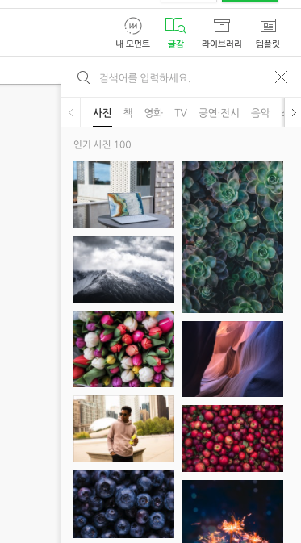

작년쯤에 Hexo로 만들어서 쓰던 블로그를 [네이버 블로그](httsp://m.blog.naver.com/crazymonlong)로 옮겼었다.

> [이 블로그는 이제 사용하지 않습니다. 네이버 블로그로 이전합니다.](../moveTo)

## Hexo 블로그
그 때 네이버 블로그로 옮긴 가장 큰 이유는 `Hexo로 된 블로그의 유지보수 비용` 때문이다.

내가 블로그를 자주 쓰는 사람은 아니지만 그래도 가끔은 내 생각을 정리하고  
때로는 공부했던 내용 중 생각 정리가 필요한 부분에 대해서는 블로그를 사용하였다.

마음먹고 글을 쓰려는데 Hexo쪽 이슈 등으로 인해 번번이 시간을 많이 보내는 경우가 많아서 언젠가는 한번 뒤집어 엎어야겠다는 생각을 늘 마음 속에 품고 있었다.

물론 그때 React + GraphQL 기반의 Gatsby가 유행을 타고 있는 시기여서 Gatsby로 바꿀까도 생각했지만...  
기존에 웹상에 퍼져있는 글들의 링크를 무시하고 갈아타기에는 내 시간과 열정이 많이 부족했었다.

그래서 차선책으로 가장 접근이 편한 네이버 블로그를 이용하였다.

## 네이버 블로그

네이버 블로그의 에디터 기능은 사실 더할 나위 없이 편리하다.
쉽게 앱이나 웹에서 작성해서 올릴 수 있었다.

특히, 나 같은 경우에는 글을 쓸 때 글의 내용과 연관성이 있는 내용의 사진을 고르는 데에만 많은 시간을 소비한다.
네이버 에디터에서는 사진, 책과 같은 글감을 넣을 수 있어서 글을 쓰는데 많은 시간을 아낄 수 있었다.

더군다나 네이버를 통해 광고도 붙일 수 있고 네이버의 검색 트래픽도 받을 수 있으니 나쁘지 않은 선택으로 보였다.  
예쁘지 않은 네이버 블로그의 PC는 내가 담당하고 있는 개발 영역이기도 하니 앞으로 더 나아지리라 생각되었다 ㅎ

## 네이버 블로그에서 Gatsby로 
### 낮은 검색율
이번에 네이버 블로그에서 Gatsby로 옮기게 되었는데 그 이유는 **우선 검색율이 현저히 떨어지기 때문이다.**  
기술 내용을 주로 쓰는 나 같은 경우라면 네이버 블로그는 비추이다.  
네이버 블로그는 전문적인 내용보다는 맛집과 같은 대중적인 내용의 글을 쓰는 사람에게 적합한 블로그이다.
물론 내가 열심히 글을 쓰지 않은 면도 있지만... 그래도 기술 문서의 검색율은 정말 낮다.

나 또한 기술 문서나 관련 내용을 찾기 위해서 구글 검색을 이용하면서 이런 생각을 왜 못했는지 모르겠다. 후~

### 개발자로서 채우고 싶은 욕망
Getsby를 써보면 아시겠지만 static 블로그를 만들기에는 상당히 잘 만들어진 프레임워크이다.
React와 GraphQL에 대한 이해만 있다면 원하는 기능을 하나 하나 만들어 나갈 수 있다.
심심하지 않게 개발하는 재미도 있다.

네이버 블로그는 정말 잘 만들어진 사이트이지만 PC의 경우 너무 오랫동안 개선이 되지 않고 있다. 너무 못 생겼다 ㅎ  
사실 앞으로의 변화도 기대하기 어렵다고 판단된다.

### 생각만큼 유용하지 않은 사용자 접근성
내가 글을 쓰는 경우는 따지고 보니 크게 2가지 였다.
사생활 노출(?)이나 기술 문서. 또는 수필 아닌 수필 같은 장문의 글들? 또는 책 읽은 소감 등등등

처음에는 이 두 가지 욕구를 모두 네이버 블로그에서 다 풀어보려고 했다.  
해본 소감으로는 **👎**

네이버 블로그는 태생부터 긴 글을 쓰는게 수월하게 구성되어 있다보니 각 잡고 긴글을 쓰는 용도가 아니라면 상당히 번잡스럽고 불편했다.
간단한 사생활 노출(?) 용도로는 적합하지 않았다.

네이버 앱과 웹이 있지만 인스타그램이나 페이스북과 같은 SNS에 비할바가 못되었다.

## 결론
그래서 내가 내린 이번 결론은

긴 글은 내가 마음대로 만들고 고칠 수 있는 친숙한 **Getsby**로 바꾸고,   
짧은 내 사생활 노출(?) 글은 인스타그램이나 페이스북과 같은 **SNS**를 쓰기로 했다.

그래서 네이버 블로그는 그대로 방치해두고 이번에 Gatsby로 바꾸고 마이그레이션도 했다. (개 노.가.대)

웹에 퍼진 검색링크가 깨지면 어떠하리...  
내가 광고로 돈 벌것도 아니고  
심심할 때 개발하고  
필요할 때 글쓰기만 하면 되는데 쳇.
