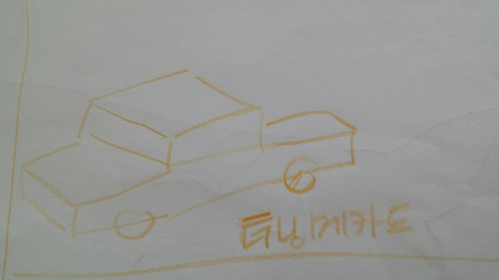
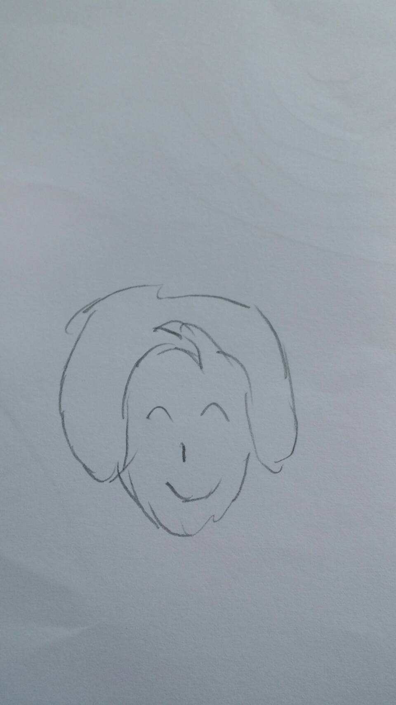

집에서 아이와 같은 입장에서.
같은 수준으로 많이 놀아주려고 노력하는 아빠라고 지금까지 생각해 왔는데,
실제로 내가 내 아이를 얼마나 이해하고 있는지 의심이 간다.

집에서 요즘은 종종 그림 게임을 한다.
엄마가 스무고개 식의 문제를 내면,
나랑 아들이 그림을 그려서 정답을 맞추는 게임이다.

아이와하는 게임에서 감칠맛 나게 져주는게 목적이기 때문에,
최대한 성의는 있데, 답을 못 맞추어야한다.
그런데 이 게임은 실제로 내가 답 맞추기가 어렵기 때문에, 리얼리티가 더 살아서 그런지.
아이가 더 좋아한다.

오늘 문제 중 기억에 남는 것은 이 문제이다.

### "아이가 가장 좋아하는 것은?"

나의 답은 당연. `터닝메카드`
이번에는 앞에서 아이가 많이 맞추었기 때문에 긴장감을 더하기 위해서 정답을 그렸다.
그림은 가급적 조잡하게 해서 아이의 자존심을 살려주고, 답은 내가 맞추는 식으로 계획했다.

헉....
그런데 아이의 답이 압권이다.

바로 `엄마`를 그런 것이었다.

아빠가 좋다고 할때는 언제고 엄마를 그렸냐? 라는 작은 배신감과 함께.
내가 내 아들이 좋아하는 걸 착각하고 있었구나 라는 상실감이 함께 엄습해 왔다.

오히려 터닝메카드를 그린 내 손이 더 부끄러웠다.
대다수 부모들이 그렇지만, 내가 내 아이가 뭘 좋아하는지. 어떤 생각을 하고 있는지는
내가 잘 알고 있다고 생각했는데. 착각 중에 착각을 하고 있었나보다.

그동안은 돌이켜 생각해보면, '우리 아이는 이럴꺼야'라는 내 생각만으로 아이들을 다루어 왔던 것 같기도하다.
앞으로는 내 생각보다 아이의 생각을 먼저 물어보도록 노력해야겠다.
