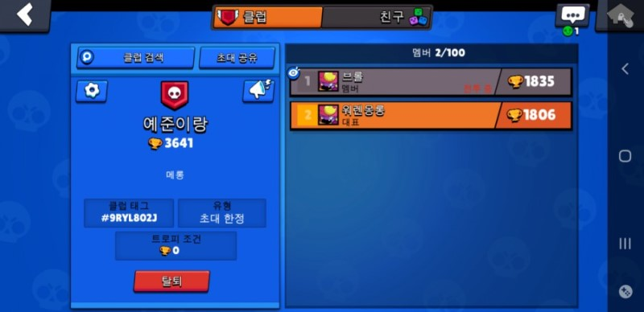

<iframe width="544" height="306" src="https://serviceapi.nmv.naver.com/flash/convertIframeTag.nhn?vid=4446485F42FBB873D494E77B8BF50C066627&outKey=V1268758b0266c0ca928942272755ce26674f5e89cab5c9e403f242272755ce26674f" frameborder="no" scrolling="no" title="NaverVideo" allow="autoplay; gyroscope; accelerometer; encrypted-media" allowfullscreen></iframe>

2번째 타자연습 7~8 자리연습을 시켰는데... 많이 힘들어한다.
아이 손가락이 짧아서 그런지 shift를 어려워 하네.

8단계에서 짜증내서 엄마가 와서 중재해주어
8단계통과는 다음에 하기로 하고 1~6 단계를 복습하기로함.

생각보다 1~3단계는 이제 능숙히 잘함.
애들이라 빠르네 ㅋㅋ

다음번은 4~8단계하고 낱말연습 1.2를 해보기로 함

약속한 대로 30분 게임을...

<iframe width="544" height="306" src="https://serviceapi.nmv.naver.com/flash/convertIframeTag.nhn?vid=987CD20AD079D60CD615757BD6F9E80411AA&outKey=V1279bb5eb022345e9bf636d2b3b182180d9138c627be8991c0d336d2b3b182180d91" frameborder="no" scrolling="no" title="NaverVideo" allow="autoplay; gyroscope; accelerometer; encrypted-media" allowfullscreen></iframe>

> 뭔가 타자 보다 게임실력이 더 느는 것 같음

이제 나보다 레벨이 높음

​
