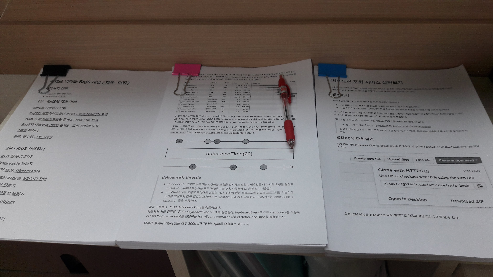

아~ 드디어 원고를 탈고했다.

인쇄를 했더니 A4 한박스가 훌러덩 다 나갔다.
많은 양을 써놓은게 뿌듯하기도 했지만 한 편으로는 무슨 부귀영화를 누리려고 이렇게까지 살았나? 라는 생각도 들었다.

사실 책은 다 썼지만 아직 제목을 정하지는 못했다. 예제 위주로 RxJS를 익힐 수 있도록 작성한 책이긴 한데... 뭔가 임팩트 있는 제목을 아직까지 못찾았다.
이러다보면 결국 출판사에서 제안하는 이름을 선택 택하겠지 ^^;

책을 읽는 사람이 읽기만 해도 이해를 쉽게 할 수 있도록 가급적이면 상세히 쓰려고 노력했지만 잘 녹아들어갔는지는 원고 교정이 끝난 이후에 피드백을 좀 받아봐야겠다.

아~ 사실 더 다루고 싶은 내용도 정말 많았다. 하지만 욕심을 많이 버렸다.
RxJS 6.0이 나와서 전체적으로 소스도 바꾸고 하다보니 욕심부리다 보면 올해도 책을 못낼 것 같은 생각이 들어 마무리를 지었다.

담에 기회가 되면 더 많은 내용을 다루는 것을 숙제로 남기고... 그동안 하고싶었던 일들을 좀 여유롭게 해봐야겠다.

마지막으로 지금까지 묵묵히 바쁜척하는 남편을 도와준 우리 와이프와 아이들에게 마지막으로 감사를 보낸다.
이제 넷플릭스로 미드도 보고 게임기로 게임좀 원없이 해보자 ㅋㅋ
