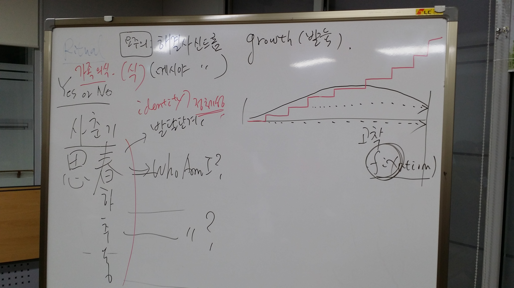
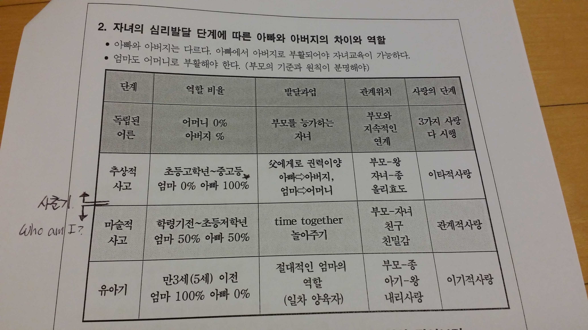

### 중2병. 사춘기

중2병이라 불리우는 사춘기. 아이가 분노에 차있는 게 정상적인 발단 과정인가?
사춘기가 병리학적 문제인가? 아니면 자연스러운것인가?

결론부터 이야기하면 분노에 차있는 것은 문제이다. 불만의 표출일수도 있고, 사랑을 못받아서 그럴수도 있다. 하지만, 요즘 어떤 부모가 아이에게 사랑을 안주는 사람이 있는가? 적어도 오늘 이 자리에 나온 아빠들은 그런 분 같지는 않았다.
그렇다면, 무엇이 문제인가?
우선 사춘기라는 사전적인 의미부터 찾아보자.

[사춘기(思春期)](http://krdic.naver.com/detail.nhn?docid=19479800)
생각할 사에 봄춘자. 봄을 생각한다. 즉, `나는 무엇인가? 에 대한 정체성을 생각하는 시기이다.` 인생의 방향을 찾는 시기. 잘하는 것, 하고싶은 것들.
이런 것들을 생각하는 시기에 왜 분노가 생기는가?
아이는 절벽 위의 어린새와 같은 입장이기 때문이다. 뛰어는 내려야 하는데 뛰어 내리지 못하는 무능함, 부족함. 이런것들로 인해 분노가 생긴다고 한다.
그럼 이때 부모는 어떻게 해야 하나?
절벽에서 밀어뜨려서 혼자 살수 있도록 도와주는 것. 아이가 하고 싶어하는 직업체험같은 것을 도와주는 것이 필요할 것 같다.

### 아이의 성장과정에서 부모의 역할.

사춘기 전까지는 친밀감이 더 중요하고, 그 이후부터는 아이의 눈높이를 부모에 맞추도록 하는게 중요함. 사춘기 이후 부터는 아버지의 역할이 절대적.
아이에게 재량을 주고, 아이에게 선택권을 주는 것은 사춘기 이후부터.

융의 관점에서 이야기해 준 해와달이 된 오누이 이야기.
부모의 불안심리가 오히려 아이를 해칠 수 있다는 이야기. 등
한마디로, 너무 과잉보호하지 말아라는 이야기.

아빠로서 자식을 대하는 기준을 알 수 있어서 좋았다.
이런 이야기 들으면서 내가 고쳐야겠다고 생각한 것은

> 1. 먹을 것이 있으면 아빠 먼저, 엄마. 그리고 나서 아이이게 주기
> 2. 아이에게 존댓말 하는 바보 짓하지 않기.
> 3. 아이에게 존댓말 하게 시키기.

2시간이 넘는 시간을 들으면서도, 시간 가는줄 몰랐다.
또한, 정말 좋은 아빠들 많구나 나는 생각도 들었다.
