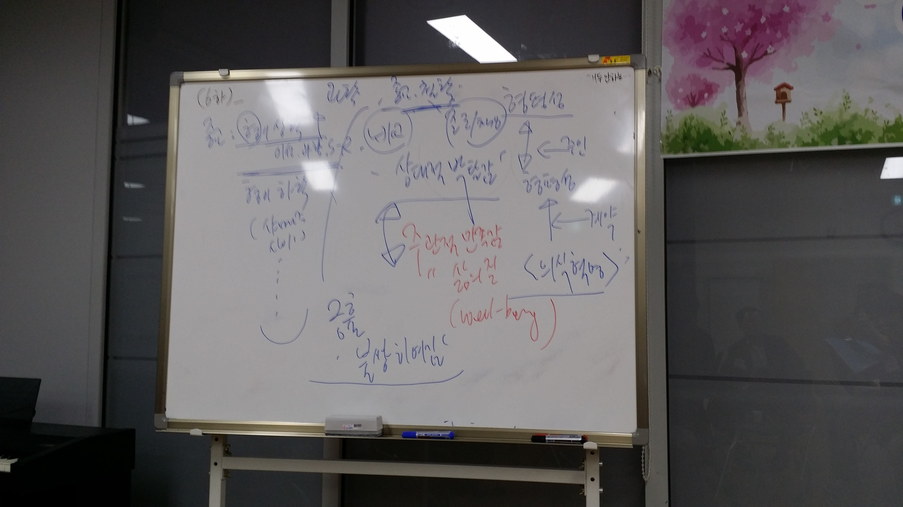

책임이라는 주제로 이야기를 나눴다.

### 책임.

책임 져야하는 범위. 생각이 아닌 타인에게 보여준 행동,말은 책임을 져야한다고 이야기했다. 즉, 책임이라는 것을 논할때의 기본적인 바탕은 `타인`이라는 존재를 인식하는 단계부터 이다.
따라서, 아이에게 책임이라는 것을 심어주기 위해서는 타인을 인지할수 있는 `추상적인 사고`를 할 수 있을 정도로 성숙해야 한다.

> 유태인은 자식에게 "무조건 해보라"고 이야기한단다. 다만, 너가 한 행동에 대해서는 책임을 져야한다고 이야기한다.
> 반면, 우리 나라 부모들은 자식에게 "하지마라" 부터 이야기 한다. 이렇게 되면 애들은 부모에게 부정적인 인식을 먼저 가진 뿐 자신의 행동에 책임을 질줄 모르게 된다.

### 사육, 양육, 교육

강사님이 이야기한 것 중에, 책임과 관련해서, 사육,양육,교육을 구분하는 이야기를 들었는데 정말 인상 깊었다.

만약, 아이가 학교에서 유리창을 깨뜨려 3만원을 변상을 해야하는 상황이 되었을때, 부모의 태도에 따라, 사육, 양육, 교육이 무엇인지 구분할 수 있다.

#### 사육

아이에게는 "어디 다친데는 없니?"라고 물어보고, 선생님께 직접 찾아가 어떻게 아이가 유리를 깨게 되었는지 듣고, 직접 3만원을 변상하는 부모.

#### 양육

아이에게 "어디 다친데는 없니?" 라고 물어본 후, 어떻게 해서 이런일이 있었는지, 아이가 잘못한 일인지를 확인한 후, 3만원을 아이에게 전달한다. 그리고, 선생님께 "잘못했다"고 꼭! 이야기 하라고 전하는 부모.

#### 교육

아이에게 "어디 다친데는 없니?" 라고 물어본 후, 어떻게 해서 이런일이 있었는지, 아이가 잘못한 일인지를 확인한 후, 3만원을 아이에게 전달한다. 그리고, 선생님께 "잘못했다"고 이야기하도록 시키는 부모.
더불어, 아이가 책임질수 있도록 시키는 부모.
아이에게 이렇게 이야기한다. "너의 잘못으로 우리가정에 3만원의 피해가 발생했다. 너는 경제적으로 돈을 벌수 있으니, 아빠가 대신 빌려주마. 대신, 너는 3만원 값어치에 해당하는 일을 해야한다"

부모는 칠판과 동전 (100원짜리, 200원짜리, 300원짜리)을 준비한다.

- 규칙1. 불평을 하던간에 부모가 시키는 일을 하면 100원 변제
- 규칙2. 부모가 시키는 일을 즐겁게 하면 200원 변제
- 규칙3. 부모가 시키지도 않았는데 스스로 하면 300원 변제.

이런 규칙을 지켜서 아이가 책임을 질수 있도록 한다.
그리고 아이가 3만원을 모두 갚았을때는 아이를 꼭 안아주고 이렇게 이야기해준다. "아들 3만원 갚으느라 정말 고생했어. 아빠는 우리 아들이 자랑스럽구나."

`교육`의 사례를 들으면서, 생각만해도, 너무 감동적인 상황일 것 같다. 부모입장에서도 뿌듯하고, 자식입장에서도 책임의 소중함을 느낄수 있을것 같다. 다른건 몰라도 이건 꼭! 실천해봐야겠다.

#### Debate VS Discuss

아버지들 끼리도 debate이라는 것을 해보았다.
Debate은 `논쟁`하는 것이고, Discuss는 `상의 토론`하는 것이란다.
내용은 성경에 나오는 `신약성경 마태복음 20장 1~16` 장 내용이다.

> 하루 품삯을 약속하고 일꾼을 뽑는 포도농장 주인이 아침 7시에도 일꾼을 뽑고, 9시에도 뽑고 12시에도 뽑고, 오후3시에도 뽑고, 5시에도 뽑은 후, 6시에 일을 마감하며, 모두에게 하루 품삯(1데나리온)을 주었다. 이때, 7시에 뽑은 사람이 오후 5시에 들어온 사람과 어떻게 똑같이 품삯을 주느냐고 따지는 이야기이다.

7시에 온사람은 주인에게 `불공평`에 대해 불만을 제기했지만, 오히려 주인은 `공평하게` 나눠 줬기에 문제가 없다고 반론을 하고 있다. 즉, `형평성의 문제를 형평성으로 받아치고 있다.`
또한, 일용직 노동자를 바라보는 주인의 마음을 헤아릴 수 있는 의식이 성장해야한다고 이야기했다.

아이들도 때론 괴변으로 이야기 하지만, 부모가 논리적으로 또는 이런 debate에 대한 준비가 되어 있지 않다면, 아이에게 끌려가게 된다고 한다. 또한, 아이와도 함께 이런류의 debate을 해 나가면서 아이와 부모 모두 의식을 성장할 수 있다고 한다.

솔직히 이 debate에 대해서는 아이가 어려서 아직 감이 안왔지만, 아이와 토론하고, 논쟁하는 것 또한 굉장히 재미있는 시간이 될 것 같긴 하다.

데비드 호킨스의 [의식혁명](http://www.yes24.com/24/goods/5661671?scode=032&OzSrank=1)이라는 책을 추천하셨다. 이 책도 읽어 봐야겠다.

