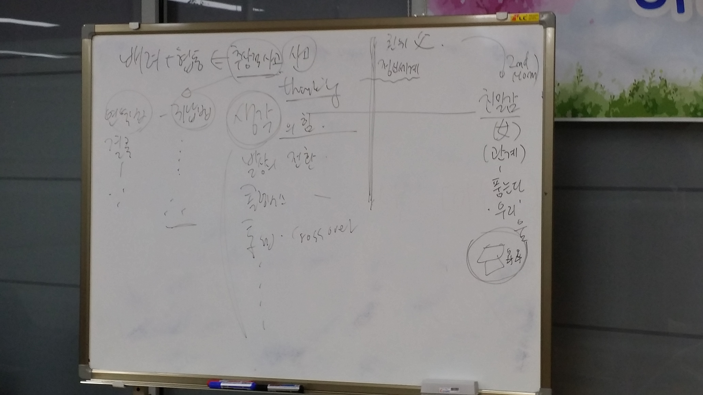
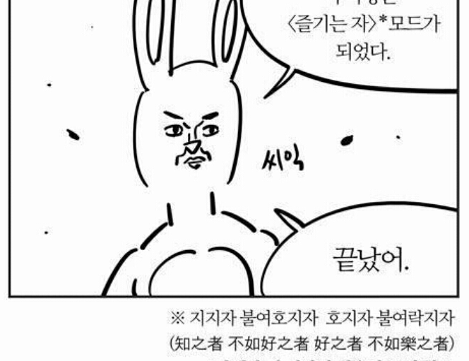

배려와 협동이라는 주제로 이야기를 나눴다.
우선 이 배려와 협동이라는 게 타인을 전제로 깔기 때문에 `추상적 사고`가 바탕이 되어야 가능하단다.

즉, 사고의 힘을 키워주어야 한단다.

### 귀납적 교육

학교의 교육은 `연역법`식 교육. 결론을 미리 이야기하고, 설명하는 방식으로, 빠르게 지식을 습득할 수는 있지만, 생각하는 힘을 기르지는 못한다.
따라서 `귀납적`식 교육을 해야한다. 과정을 통해 결과를 찾아가는 교육이 필요하다.

이에 대한 내용은 `거꾸로 교실` 이라는 게 있단다. 찾아보니, 의외로 많은 내용이 있었다. 실제 내용은 좀 다른 것이지만, 이것도 따로 좀 봐봐야겠다.

<iframe id="ytplayer" type="text/html" width="100%" height="400"
  src="https://www.youtube.com/embed/a5Q8Ruv4xVc"
  frameborder="0"></iframe>
  
### 취미. 게임

아이에게 취미를 갖게 해주라는 이야기도 하셨다. 개인적으로 취미가 없다 보니. 물론, 주식과 같은 게 있지만, 마냥 즐길 수 있는 취미가 없는 내 입장에서는 아이가 즐거워 하는 일이 있다면 도시락 싸들고 가면서 시켜주고 싶다.
결론은, 이말년의 `즐기는자 모드`를 만들어 주라는 이야기.

### 놀이, 경쟁?

공부를 `놀이`같이 하라는 것이다.
실제로 해 봤는데, 숫자 공부를 "둥글게 둥글게" 놀이로 하는 거였다.
우선 한 사람당, 1,2,3,4와 같은 숫자로 지정하고, 둥글게 둥들게 돌면서, 숫자 15를 만들어라. 라는 식으로, 협동해서 문제를 해결하는 식의 놀이였다.
만약, 한 명이 남게 되면, 다시 한 명도 안남기고 숫자의 합을 맞추면서 조를 다시 짜바라는 식으로, 배려와 협동을 느낄수 있도록 하는 놀이를 하는 방식이었다.

이런 교육은 `경쟁`보다는 협력과 배려를 키울수 있는 좋은 방식인 것 같다.

### 교육 끝.

4 주간의 교육이 끝났는데, 가장 놀라운 것은 정말로 좋은 아버지들이 많구나 였다.
개인적으로 난 좋은 아빠야 라는 생각이 부끄러운 4주였다.

그리고 가장 중요한 것!
아버지가 가정에서 해야할 일이 중요한 일이 많구나. 부터. 아버지로서 공부해야하고, 노력해야하는 부분이 정말로 많다는 것을 느꼈다.
다음에도 이런 교육이 있으면 꼭!꼭!꼭! 참여해야 겠다.
