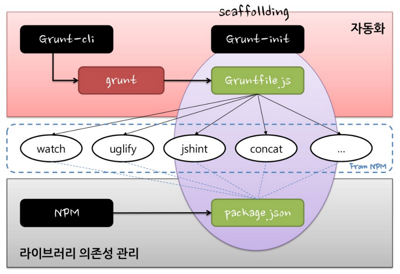

### GruntJS

http://gruntjs.com/

#### 사전 설치

1. 노드 설치
   https://nodejs.org/en/

2. grunt-cli 설치

```
npm install grunt-cli -g
```

#### Grunt 구조



- npm 을 이용하여 라이브러리 의존성 관리를 하고, grunt를 이용하여 타스크 자동화를 구성한다.

#### Grunt 파일

`Task`와 `Target`으로 구성되어 있다.

- property에 grunt.loadNpmTasks이나, registerTask에 의해, grunt plugin이 등록되면, property는 task로 동작한다.
- target은 task 하위의 작업들을 지칭하며, task의 하위 객체 이다.
- task의 하위 객체 중 options 객체가 있다면, 전체 task의 옵션으로 인식한다. 또한, options 객체는 target아래에 존재할수 있다.

### Grunt plugins

- jshint : https://github.com/gruntjs/grunt-contrib-jshint
  JavaScript 정적 검사 플러그인

- csslint : https://github.com/gruntjs/grunt-contrib-csslint
  CSS 정적 검사 플러그인

- concat : https://github.com/gruntjs/grunt-contrib-concat
  CSS, JS 파일을 머지하는 플러그인

- spritesmith : https://github.com/Ensighten/grunt-spritesmith
  CSS Sprite 플러그인

- uglify : https://github.com/gruntjs/grunt-contrib-uglify
  JavaScript 최소화(minify)하고, 난독화(obfuscation)하는 플러그인

- cssmin : https://github.com/gruntjs/grunt-contrib-cssmin
  CSS의 내용을 최소화(minify)하는 플러그인

- htmlmin : https://github.com/gruntjs/grunt-contrib-htmlmin
  HTML의 내용을 최소화(minify)하는 플러그인

- responsive-images : https://github.com/andismith/grunt-responsive-images
  이미지별 반응형 이미지를 생성하는 플러그인

  > graphicsmagick 설치 (http://www.graphicsmagick.org/download.html)
  > Window — ftp://ftp.graphicsmagick.org/pub/GraphicsMagick/windows/

- imagemin : https://github.com/gruntjs/grunt-contrib-imagemin
  이미지 최적화 플러그인

- time-grunt : https://github.com/sindresorhus/time-grunt
  grunt 작업 시간을 알려주는 플러그인

- load-grunt-tasks : https://github.com/sindresorhus/load-grunt-tasks
  grunt 플러그인을 자동으로 로딩해주는 플러그인

- load-grunt-config : https://github.com/firstandthird/load-grunt-config
  grunt 파일을 task별로 쪼개서 관리할수 있는 플러그인

- watch : https://github.com/gruntjs/grunt-contrib-watch
  파일이 변경되었을 경우, 특정 작업을 할수 있는 플러그인

### Reference

http://www.html5rocks.com/ko/tutorials/tooling/supercharging-your-gruntfile/
