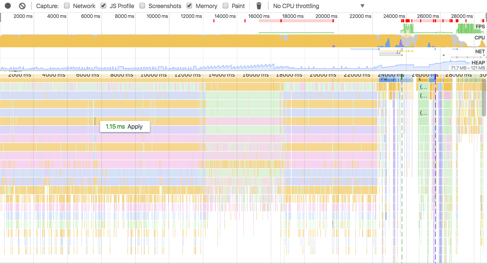
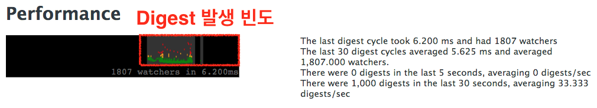
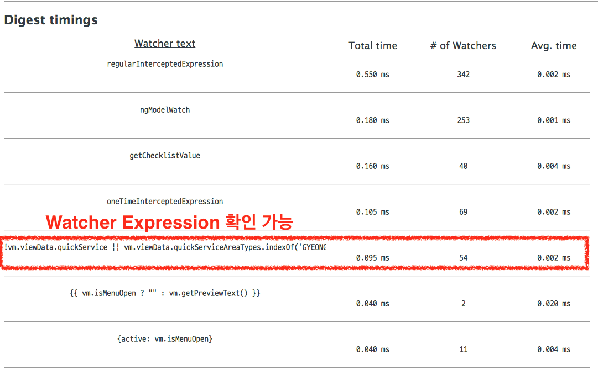
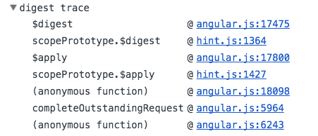
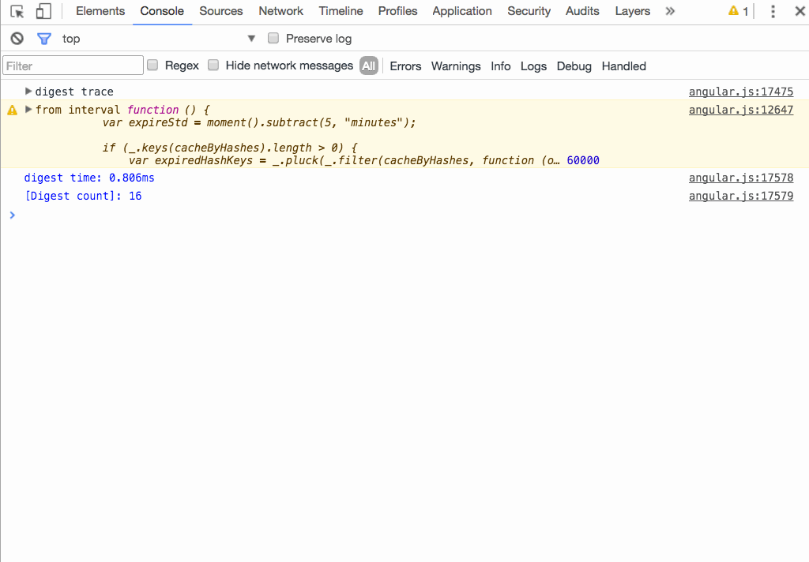
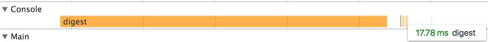
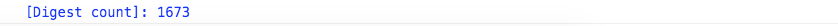
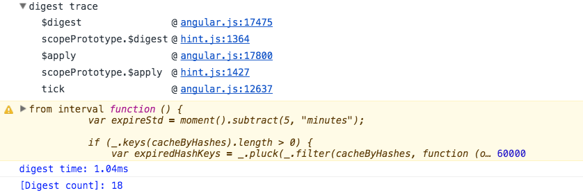

Angular1은 높은 생산성을 갖는 좋은 프레임워크이긴 하지만, 성능 부분은 아쉬운 점이 많이 있습니다.
그 중 하나로, 데이터 동기화를 처리하는 `Digest Loop`에 대한 이야기를 많이 합니다.
아쉽지만, 이 부분은 Angular1을 만들때 챙기지 못한 부분 중에 하나죠.

이 부분에 대한 튜닝 가이드는 지금까지 굉장히 정리가 잘된 자료 들이 많이 있습니다.

- https://www.alexkras.com/11-tips-to-improve-angularjs-performance/
- https://speakerdeck.com/avivby/angular-performance-101

**하지만, 정작 Digest 문제가 발생했을 때, 어떻게 찾아야하는 지에 대한 이야기는 아쉽지만 아무도 이야기 해주지 않습니다.**

우선 FE좀 해본 개발자라면, 성능 문제가 발생했을 때,  
크롬의 DevTool을 열고, Timeline을 열어서 문제의 원인을 찾으려고 합니다.

짜잔. 다음과 같습니다.


해당 서비스 개발자가 봐도 이 많은 호출 스택에서 뭐가 문제인지를 찾아내기는 쉽지가 않습니다.
더군다나 저같이 잠시 지원한 입장에서 Timeline만을 갖고 이 문제의 원인을 찾기는 정말 쉬운 문제가 아닙니다.
단지, "Digest Loop가 많이 도는 구나" 정도를 알수는 있겠죠.

## Digest Loop

Angular의 Digest Loop는 Watcher 수와 Watcher Expression의 수행시간에 비례합니다.

> Digest Loop = Wacher 수 \* Wacher Expression 호출 시간

**따라서, Digest Loop에 의해 성능 문제가 발생했을때 이를 해결하는 방법은 크게 3가지 입니다.**

1. Watcher 수를 줄이는 방법
2. Watcher Expression 호출 시간을 줄이는 방법
3. Digest Loop를 호출 수를 줄이는 방법

물론, Angular1의 [Batarang](https://chrome.google.com/webstore/detail/angularjs-batarang/ighdmehidhipcmcojjgiloacoafjmpfk) 을 이용하여, Digest Loop가 어떻게 도는지 확인 할 수는 있습니다.
아래 보시는 것 처럼, `얼마나 많이 발생하고, 어떤 Watcher Expression이 많이 도는지는 확인 할수 있습니다.`



**그런데, 정작, 이렇게 많이 발생하는 Digest Loop가 어디서 발생하는지를 찾아내는 방법은 없습니다.**

## Digest Loop를 유발하는 곳 손쉽게 찾는 방법

Angular는 기본적으로 `비동기 시점이 종료되는 시점`에 digest가 호출됩니다.
따라서, `Ajax call이 발생하는 부분, timeout/interval이 종료되는 부분, ng-click과 같이 사용자 이벤트`가 호출되는 부분에서 digest loop가 호출됩니다.

사용자 이벤트가 호출되는 부분은 사용자가 명시적으로 하는 행위이기 때문에, 발생시점과 발생하는 곳을 가급적 쉽게 찾을수 있습니다.
다만, Ajax call 이나, timeout/interval은 코드에 녹아 있기 때문에, 찾기가 쉽지 않습니다.

이를 쉽게 확인하는 방법은 사실 간단합니다.
바로, Angular 소스 코드에서 Digest Loop가 발생하는 시점에 [크롬 로그](https://developers.google.com/web/tools/chrome-devtools/console/console-reference)를 찍는 방법입니다.
단순 로그 출력이지만, 그 효과는 큽니다.

1. 크롬에서 console.trace 로그를 찍으면 다음과 같이 호출 스택을 확인할 수 있으며, `해당 소스로의 이동이 가능`합니다.  
   
2. 크롬에서 function 을 로그로 찍으면 `해당 소스로의 이동이 가능`합니다.  
   
3. 크롬에서 console.time/timeEnd를 사용하시면, Timeline 탭에서 로그를 확인 할수 있습니다.  
   
4. 크롬에서 console.count를 사용할 경우, 몇번 호출되었는지 로그를 통해 알수 있습니다.
   

## Angular 1.5.8 로그 추가 버전

능력 부족과 시간 부족으로 툴은 못 만들었지만, Angular 1.5.8 소스에 로그를 찍어 봤습니다.
[angular.js.1.5.8.zip](./angular.js.1.5.8.zip)

개발시에 Angular.js 파일을 교체하시면 크롬 콘솔에서 로그를 바로 확인할 수 있습니다.


그 외 angular 버전에 적용하시려면 다음 코드 조각을 참조하시기 바랍니다.

**ajax - \$httpProvider를 이용**

Ajax의 경우 Angular 코드에 로그를 삽입하는게 아니라, HTTP interceptor를 등록해서 호출 여부를 확인할 수 있습니다.

```js
$httpProvider.useApplyAsync(true);

// HTTP 인터셉터
$httpProvider.interceptors.push(function () {
  return {
    request: function (request) {
      console.time('[http] ', request.url);
      return request;
    },
    response: function (response) {
      console.timeEnd('[http] ' + response.config.url);
      return response;
    },
  };
});
```

**timeout - angular 소스 수정**

```js
function timeout(fn, delay, invokeApply) {
  //... 생략
  timeoutId = $browser.defer(function () {
    try {
      // [Start] $timeout에 의해 rootScope.apply가 호출된 경우
      !skipApply && console.warn('from timeout', fn, delay);
      // [End] $timeout에 의해 rootScope.apply가 호출된 경우
      deferred.resolve(fn.apply(null, args));
    } catch (e) {
      deferred.reject(e);
      $exceptionHandler(e);
    } finally {
      delete deferreds[promise.$$timeoutId];
    }
    if (!skipApply) $rootScope.$apply();
  }, delay);
  //... 생략
}
```

**interval - angular 소스 수정**

```
function interval(fn, delay, count, invokeApply) {
  //...생략
  function callback() {
    // [Start] $interval에 의해 rootScope.apply가 호출된 경우
    !skipApply && console.warn("from interval", fn, delay);
    // [End] $interval에 의해 rootScope.apply가 호출된 경우
    if (!hasParams) {
      fn(iteration);
    } else {
      fn.apply(null, args);
    }
  }
}
```

**digest 함수 - angular 소스 수정**

```js
$digest: function() {
  // [Start] $digest가 호출된 경우
  console.trace("digest trace");
  console.time("digest time");
  // [End] $digest가 호출된 경우
  beginPhase('$digest');

  //... 생략
  do { // "while dirty" loop
    //... 생략
    do { // "traverse the scopes" loop
      //... 생략
    } while ((current = next));
  } while (dirty || asyncQueue.length);

  clearPhase();
  // [Start] $digest가 호출된 count 확인
  console.timeEnd("digest time");
  console.count("[Digest count]");
  // [End] $digest가 호출된 count 확인
}
```
