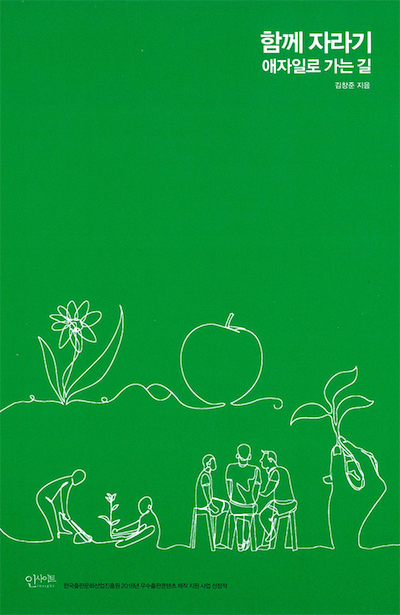

개발자를 어떻게 학습시킬것 인가?에 대한 자기성찰을 좀 해보려고 한다.

이 성찰의 결정적인 계기는
애자일 컨설팅 대표로 있는 김창준님이 내놓은 책을 읽으면서 느꼈던 내 수치심으로 부터 시작되었다.

연말이라 좀 시간도 있고 해서 책을 하나 사서 봤다. 김창준님이 내놓은 신간 책이다.
책 내용은 사실 지금까지 이 분이 [블로그](http://agile.egloos.com/)를 통해 이야기한 내용과 별반 다르지 않다.
좀 더 구체적으로 친절하게 정리해 놓은 책이다. 결론은 좋은 책이다.

새롭지 않는 내용을 읽으면서 왜 새삼스럽게 나는 수치심을 느꼈는가?  
수치심이라는 표현이 맞는지 모르겠다.  
아~ 진작에 이 책대로 행동했으면 좋았겠다는 후회정도로 표현해보자.

사람은 겪어보지 않으면 모른다고 했던가?  
아마 지금의 내 상황에 가장 적합한 표현일 것이다.  
예전에 읽을 때는 아~ 그런가보다. 좋은 내용이네. 정도의 느낌이 었다면
이번에는 책읽은 감동을 하나라도 놓치지 않기 위해 이렇게 새벽녘에 혼자 노트북을 켜고 글을 쓰고 있다.

이 책은 학습과 협력을 바탕으로 애자일에 대한 이야기를 약간 하고 있다. 하지만 그 중심 키워드는 항상 `학습`과 `협력`이다.  
개발자의 입장에서 학습은 정말 정말 중요한 요소이다.  
내가 개발자를 면접 볼때도 항상 중요하게 보는 포인트이기도 하다.  
FE와 같이 기술의 발전속도가 굉장히 빠른 분야는 특히나 더 중요하다.  
내가 이 책에서 `아하`라고 느꼈던 부분은 효과적인 학습 방법에 대한 내용이다.

지금까지 나는 무언가를 배울 때 `오~ 재미있겠다`라는 생각으로 시작해서 학습하고 학습한 것을 바탕으로 다시 연습하고 다시 연습한 것을 바탕으로 프로젝트에 적용해보고 다시 적용한 경험을 가지고 다시 학습하는 싸이클을 만들어 갔다.  
하지만 이건 내가 그냥 무의식에서 했던 작업이었다.  
그래서 내가 그러했듯이 남들도 이렇게 하겠지라는 생각이 무의식 속에 있었다.

## 힘든 학습

올해 우리팀에서 FE개발자이지만 서버영역을 배워보고 싶어하는 동료가 있었다.  
직접 하고자하는 동기 부여도 충분해 보였고 회사 경력도 가지고 있는 분이었다.  
팀 차원에서도 랜더 서버 운영을 위해서 필요한 영역이었기에 학습 후에 팀원들과 공유하는 자리를 가지면 개인과 팀에 서로 도움이 될것 같았다.  
그래서 내가 지원했던 부분은 `집중 할수 있는 충분한 시간을 제공` 해주는 것이었다.

하지만, 시간이 지날 수록 처음의 내 생각과 다르게 진행하는 동료가 개인적으로 굉장히 힘들어 했다.  
혼자 학습의 길을 잘 찾아가지 못했던 것이 보였다.  
몇 일이 지나가도 진척이 잘 보이지 않았다.  
중간에 몇 번이고 피드백을 주고 진척되지 않는 상황에 대한 내용을 여쭤보려고 했으나... 그러질 못했다.  
아니 그러질 안했다.  
결국에 시간이 더 지나고 나서야 진행하는 부분에 대해 내가 몇가지 `피드백`도 주었고 도움을 줄 수 있는 서버쪽 동료를 `협업자`로 지원해 주었다.  
그나마 예전보다 나아졌지만 여전히 동료는 이 작업 자체를 힘들어 했다.
결국에는 사내에 잘 정리되어있는 가이드 문서를 참조하면서부터 학습의 속도가 높아지고 작업에 속도감이 붙었다.

## 좋은 학습

왜 이렇게 힘들게 이 과정을 겪었을까?  
학습하려는 학습자의 학습 능력이 부족했을까?  
아니라고 본다.

이 동료분에게 다른 과제를 주어보았다.  
앞에와 동일하게 충분한 동기부여가 있는 FE웹관련 리서치 작업을 요청해 보았다.
전과 동일하게 `집중 할수 있는 충분한 시간을 제공` 해주었다.

다른게 있다면

- 첫째. 2~3일마다 만나서 중간 중간 `피드백`을 하고 이슈들을 이야기했다. (후반부에는 일주일 정도)
- 둘째. 자신이 이미 알고 있는 영역 내에서의 리서치 작업이기 때문에 난이도가 적당한 수준이었다.

이 둘만 다른 상황에서 결과물은 너무나 달랐다.  
작업 기간도 짧았을 뿐만아니라 작업했던 동료의 만족도도 달랐다.  
물론 결과물의 품질도 많이 달랐다.

왜 똑같은 사람이 한 작업의 결과물이 이렇게 달라질 수 있었을까?

지금 생각해보면 이 상황의 패착은 전적으로 `나의 코칭 방식` 때문이다.  
학습을 위해 필요한 요소를 내가 잘 지원하지 못했던 것이다.

그냥 막연히 `충분한 동기`를 가지고 있는 동료였기 때문에 `충분한 시간`을 주면 된다고 생각했다.  
하지만 빠진게 있었다. 바로 `적절한 피드백`이 었다.  
첫번째 작업에서 난 적절한 피드백을 주지 못했던 것이다.  
난 이 동료를 몰아 넣고 방관만 하고 있었던 것이 었다.  
`내가 내 동료를 신뢰하지 못한다`는 생각을 전달하는 것 같아서 `피드백`을 주지않고 바보같이 오히려 참을성을 갖고 더 기다린 것이다.  
또한 결정적으로 내가 놓치고 있었던 점이 있었다.  
이 분이 `몰입 할수 있는 환경`을 만들지 못했다는 점이다.  
몰입은 `적절한 난이도`에서 가장 최적의 몰입을 할수 있다. 하지만 난 이 분을 잘 파악하지 못하고 있었다.  
회사에서 개발 경력이 있어서 서버쪽도 쉽게 배울수 있을 것이라는 착각을 한 것이다.  
이 분이 잘 할수 있도록 하기 위해서는 아무것도 모르는 초심자 수준에서 그에 걸맞는 과제를 던져 주어야했던 것이다.  
그리고 그 과제를 통해 성취감을 얻으면 다음 단계의 과제를 던져주었어야만 했다.

## 결론

그래서 개발자를 효과적으로 학습하기 위한 방법을 정리해보면 다음과 같다.

- 학습의 동기
- 적절한 피드백
- 적절한 난이도의 학습.일
- 그리고 집중 할 수 있는 시간

을 제공하여 개발자를 학습시킨다면 학습을 하는 당사자도 성장의 만족감을 얻을 것이고  
코칭하는 입장에서도 보람을 얻을수 있을 것이다.

뭐~ 물론 내가 경험했던 이 일이 정답은 아니다.  
하지만 도움은 되리라 생각한다.  
다시 한번 제 경험을 정리할수 있도록 도와준 김창준님의 책에 감사를 표하며 이 글을 마친다.
