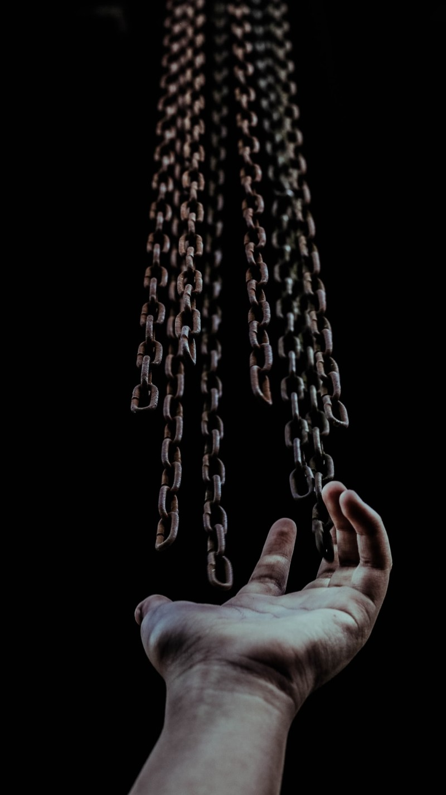

삭막한 이야기인지 모르겠지만. 세상은 갑과 을이 존재한다고 본다. 아니 존재한다.  
적어도 내가 지금까지 경험했던 사회생활에는 항상 존재했다.  
때론 내가 을이 되기도 하고 때론 내가 갑이 되기도 했다.  
평등한 세상. 평등한 조직이라고 이야기하지만 암묵적으로 갑과 을의 관계는 형성되어 있다.  
정떨어지는 이야기 일지 모르겠지만. 사랑하는 연인 사이에도 갑과 을은 존재한다. 머릿속에서 샘솟는 도파민이 그걸 인지하지 못하게 하는 것뿐이다.

아래 이야기는 10여 년이 지난 나의 경험이기 때문에 지금과는 많이 다르고. 많이 발전했을 거라 생각된다.
그냥 어떤 사람의 지극히 편향적인 경험기라고 생각해 주면 좋겠다.

## 첫 직장의 갑과 을

내 사회생활을 잠시 이야기해보자.

내 첫 직장은 L모 그룹의 전산시스템을 담당하는 SI 기업이었다. 첫 입사를 L모 기업에 입사했다는 뿌듯함도 잠시 내 첫 번째 회사 생활은 을의 연속이었다.

우선 그룹사의 전산 시스템을 담당하는 회사이다 보니 하는 일이 본질적으로 '을'의 입장에 있었다.

더군다나 내가 처음 배정받은 팀은 "공공 S/W 아키텍처" 팀. 기술적으로 훌륭한 사람들의 그룹이었지만 하는 일은 사실상 "을"의 입장이 많았다.

하지만. 그 팀에 있었던 많은 분들이 IT 기술 성장에 지금도 이바지하고 있는 것을 보면 한 편으로는 굉장한 집단이었던 것 같다. 나는 운 좋게도 신입사원이었지만 그 팀에 배정받았다.

​
우선 "공공사업" 을 지원하는 부서이다 보니 필연적으로 공공기관에서 진행하는 국책 사업을 진행하다. 이런 구조로 인해 우선 1차로 갑/을이 결정된다.

> **공공기관 (갑) - 내가 다녔던 회사 (을)**

© zulmaury, 출처 Unsplash

사업 수주가 성공하면 이제 본격적으로 프로젝트가 시작된다. 우리 팀 사람들은 이 프로젝트에 투입되어 기술 리딩을 담당하였다.

## 개발 시작 단계 - 현실적인 을

개발 시작 단계에서 개발자는 주로 도메인을 분석하고 그 도메인 구성을 위한 모델을 설계하고 구축한다.  
이때 우리는 프로젝트의 아키텍처를 설계하고 구축한다.

좀 자세히 살펴보면 다음과 같다.  
설계한 아키텍처에서 사용하는 프레임웍을 구축하고,  
공통 업무, 공통 코드를 작성하고,  
외부 및 솔루션 연계 작업을 위한 설계를 구성한다.

마지막으로 설계 및 구축한 아키텍처, 공통 업무, 공통 모듈, 연계 모듈, 솔루션 적용 등에 대한 가이드를 작성하고 프로젝트에 투입된 개발자를 교육한다.

이때 우리의 목적은 개발자가 우리가 만든 아키텍처의 굴레에서 되도록이면 벗어나지(?) 않도록, 또는 서비스 요구 사항을 손쉽게 수용하여 개발자가 더 빠르게 개발할 수 있도록 도우는 것이다. 더군다나 개발이 빠르게 진행될 수 있는 기술 전반적인 자문 및 지원을 한다.

쉽게 말하면 **개발자가 도메인 기반의 개발에만 집중할 수 있도록 도와주는 역할**을 한다.

생각의 차이야 있겠지만. 이때 또 다른 갑/을 관계가 생성된다.

개발자들의 입장에서 아키텍트는 을이 된다. 개발자의 요구 사항을 수용해야 하는 존재이기도 하거니와 본격적인 개발이 들어가기 전까지 필요한 기술적인 모든 부분을 제공하고 가이드 해주어야 하는 주체가 되기 때문이다.

> **개발자 (갑) - 아키텍트 (을)**

아니 왜 기술 리딩이 을이죠?라는 의문이 든다면 당신은 아직 현실 세계의 프로젝트를 경험하지 못한 분일 것이다. 후훗!

​
한 가지 예를 들어보자.

기술 리딩을 할 때 기술적인 잣대와 엄격한 기준을 가지고 개발자에게 맞추라고 한다면... 아마도 이점이 프로젝트의 리스크로 부각될 것이다.

> "아키에서 제공하는 모듈이 쓸만한 게 없어서 다시 만들어야 해서 개발 시작을 못하겠다"  
> "사용하기가 어려워서 적용하기 힘들다"  
> "제공하는 가이드가 부족해서 개발이 더디 된다"  
> "개발 지원이 원활하지 않다. 기술 이슈를 도와줄 사람이 없다"

​
어느 한편으로는 맞는 말일 수도 있지만. 개인적인 경험으로 본다면 **이건 대다수 변경일 가능성이 높다.** 특히나 바쁘고 힘든 프로젝트 상황에서는 내 잘못을 덮거나 전이 시킬 그 누군가를 항상 찾게 된다.

하지만 더 웃긴 것은 현실에서는 이들의 말을 믿으려 하고 부각시키려고 한다.

**왜? 내가 책임을 질 순 없으니깐.**

© villxsmil, 출처 Unsplash

참으로 안타까운 현실이지만 냉혹한 사실이다.

보통 사람들은 자신의 잘못을 인정하고 고치려고 하는 것보다는 천성적으로 그걸 회피하고 다른 사람의 탓으로 돌리고 싶어 한다. 사람에 따라 역량의 차이는 있겠지만. 결국에는 의식하지 않은 이상 그런 성향을 보인다.

그렇기 때문에 그렇지 않은 사람들이 역사 책에 나오고, 존경받는 사람이 되는 것이다.

물론 이런 현실적인 이유를 떠나서라도  
좀 손해 보더라도, 지금 당장 생각하고 있는 기준이 조금은 무너진다 하더라도

> **가급적 많은 것을 받아들이고 수용하는 게 장기적인 문제 해결에는 더 도움이 된다.  
> 해결책은 문제가 쌓이면 쌓일수록 더 선명히 보이니깐.**
> ​
> 현실적이든 이상적이든.  
> 결국 아키텍트 입장에서는 다소 힘들더라도 개발자의 요구 사항을 가급적이면 수용해야 하고, 가급적이면 그들이 해결할 수 없는 문제를 손쉽게 해결하기 위해 노력해야 한다.

## 개발 마무리 단계 - 을의 역전

개발자들이 개발을 시작하고 피크를 치고, QA를 받고 있을 때 우리도 마찬가지로 계속~ 개발을 하고 QA를 했다. ㅠㅠ

더불어 공통 업무, 공통 모듈, 연계/ 솔루션 연동 등의 개발도 마무리 짓고  
오픈 준비를 위한 성능 테스트, 장애 테스트도 준비한다.

이때 조금 달라지는 것은 개발자와 아키텍트의 관계이다.
이 단계에서는 요구 사항의 수용보다는 반대로 개발자들의 간곡한(?) 부탁이 연이어 오는 시기이다.

> "요구 사항이 이렇게 되어있는데 공통 쪽에서 좀 해줄 수는 없을까요?"  
> "죄송한데 제자리 와서 잠시 봐주실 수 없나요? 정말 감사합니다"  
> "..."

또한 이때부터는 우리의 요구 사항이 개발자에게 전달되는 시기이기도 하다.

> "성능 테스트 결과 해당 쿼리 개선이 필요합니다. 개선이 안되면 오픈 시 이슈가 될 것 같습니다."  
> "성능 테스트 결과 작업한 코드로 인해 OOM이 발생합니다. 개선이 안되면 오픈 일정을 재검토해야 합니다."  
> "장애 테스트 결과 해당 로직으로 인한 fail over가 동작하지 않습니다. 개선이 안되면 오픈 일정을 재검토해야 합니다."  
> "..."

이렇게 되는 이유는 바로

**우리가 제공하는 모듈, 아키텍처를 쓰고 있기 때문에** 사실상 둘 사이의 관계가 역전되기 시작한다.

> **개발자 (을) - 아키텍트 (갑)**

이게 굉장히 중요한 점이다.  
한 예로 유튜브와 같은 서비스를 봐보라.  
그 서비스의 시작은 모두 다 **"제발 써 주세요"**의 철저한 을의 스탠다드로 접근한다.  
공짜로 쓰게도 해주고, 이벤트로 프로모션도 한다.

이렇게 하는 이유는 자신들의 생존과 직결과는 문제이기 때문이다.

**사용자가 없는 서비스가 무슨 의미가 있겠는가?**

하지만 서비스를 사용하는 사람들이 늘고, 사용자들이 우리 서비스를 잘 사용하기 시작하면 기존의 태도가 바뀌기 시작한다.
자신의 철학에 위배되는 영상에게는 노란 딱지도 붙이고. 심지어 사용자 계정을 자르기도 한다.

나는 이를 갑/과 을이 바뀐 상황이라고 표현하지만  
서비스 입장에서는 **자신만의 철학과 아이덴티티를 더욱 공고히 쌓아가는 노력의 다른 표현**인 것이다.

## 프로젝트 오픈 시점

프로젝트가 오픈되기 전까지 정말 이해하기 어려울 정도의 갑의 횡포(?)가 있다.

프로젝트 오픈 일이 다가올수록 공공기관(갑)은 자신의 요구 사항을 관철시키기 위하거나 자신의 요구 사항을 더 잘 표현하기 위해... 정말 무수히 많은 변경을 진행하게 된다.

> "첨부터 그렇게 말하든가. 왜 이제서야?"  
> "안돼, 안돼. 못해!"

사실 못한다고 이야기를 하긴 하지만. 냉정하게 자르기에는 현실적으로 어려움이 있다.

크게 2가지 이유가 있는데

첫 번째. **오픈을 해야 잔금이 입금되니깐**  
두 번째. 앞으로 **유지 보수 계약**을 지금 내 앞에 있는 담당자에게 따 내야 하니깐.  
이런 이유 등으로 인해 그 요구 사항을 다 무처럼 쳐내기는 어렵다.

© joshappel, 출처 Unsplash

> 원칙적으로는
> 요구 사항을 수용하지 않으면 프로젝트 오픈에 리스크라고 판단되는 요구 사항만을 받아야 하는 게 맞지만.
>
> 현실적으로는
> 요구 사항 수용으로 프로젝트가 리스크에 빠지지 않을 정도까지 받아야 하는 게 현실이다.

여러 가지 이유가 있겠지만.  
근본적인 이유는 바로 **사람**이 관여하기 때문이다.

오픈 시점에 상위 보고를 했더니 반응이 맹맹하거나.... 오픈 전에서야 그동안 못 챙겨 봤던 게 생각나 더 본다든지... 이런 여러 사람들의 시너지(?)에 의해 항상 프로젝트 말미에 변경사항이 요동을 친다.

이런 갑의 횡보(?)가 끝나면 마찬가지로 을의 역전이 시작된다.  
바로 유지 보수 계약이 끝난 시기이다.

이때도 재미있는 점은 프로젝트를 오픈시킨 예전에 내가 다녔던 회사 입장에서는

한동안은 유지 보수를 타 업체에 맞길 수 없다는 전제가 있다보니 이 시기 이후부터는 조금 더 합리적으로 의사결정이 이루어진다.

즉, 갑과 을의 입장이 바뀌게 된다.

> **공공기관 (을) - 내가 다녔던 회사 (갑)**

물론 이런 상황적인 문제를 개선하기 위해 공공기관에서는 수고스럽더라도 유지 보수 계약 기간은 가급적이면 짧게 가져가려고 한다. 한동안은 그 회사에 의지해야 하는 것은 사실이지만 그래도 잠시나마 놓쳤던 주도권을 다시 잡을 수 있는 기간을 갖기 위해서이다.

## 프로젝트가 끝나고 나서

프로젝트가 끝나면 우리는 팀으로 복귀해서 일정 기간의 리프레시 기간을 갖고 다시 다른 프로젝트에 복귀하거나 그렇지 못한 나 같은 경우에는 유지 보수 팀을 맡아서 꾸려가는 일을 해나가곤 했다

돌이켜서 생각해보면

> 프로젝트 하나를 끝내고 만들어 가는 과정이 갑과 을 관계의 주도권이 옮겨가는 과정이었고,  
> 그 팽팽한 긴장감 속에서 하나의 제품, 서비스가 완성되어 가는 과정이었다.

그때는 구성원으로서 흘러가는 대로 굴러가는 대로 그 프로젝트에 몸담았던 입장이었기에 사실 이런 생각을 그때는 해보지 못했다.

개인적으로 마냥 개발이 즐거웠고, 새로운 것을 배우고 헤쳐나간다는 게 재미있었던 것 같았다. 이제야 안 사실이지만 그때까지만 해도 사람들이 전부 다 나 같은 줄 알았다.

내가 약간은 별종이다라는 것을 관리라는 업무를 시작하면서 안 걸 보면 이런 면에서는 난 참으로 무지한 사람이었던 것 같다.

## 지금도 계속되는 갑과 을

이상적이고 아름다운 세상이면 좋겠지만. 적어도 내 시각 내에서 갑과 을의 관계는 지금도 계속되고 앞으로 계속될 것이다.

단지 그 정도가 있을 뿐이다.  
그런 이유는 바로 사람이 관여하기 때문이다.  
하지만 내가 갑의 위치가 아니다 하더라도 실망하지는 말자.

> **갑과 을은 상황과 시기에 따라 항상 바뀌고, 을의 노력으로 조금은 더 좋은 세상이 되기 때문이다.**
