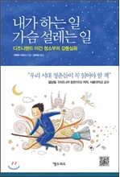

라디오에서 좋은 책을 소개시켜 줬다고해서 한번 사서 봐봤다.
뭐 내용은 일본 디즈니랜드에서 일한 가마타라는 일본사람이 매니저로서 경험했던일들을 몇 가지 에피소드로 풀어쓴 책이다.

기대를 너무 해서일까? 기대와는 다르게 별 내용이 없었다.
책 서론이 책 전체의 내용이 었다.

디즈니 랜드에서 야간 청소부를 하면서 살아가는 사람들이 자신이 하는 일에 자부심을 가지고
꿈을 키워가는 몇가지 에피소드를 소개한다.

물론, 느끼고 배운 점은 있지만. 한마디로 좀 실망스런 책이다.
단 하나 배운게 있다면.
`내 일에 자부심을 갖고, 내 일로 행복을 찾는 사람들이 있기에 가슴 설레며 일할 수 있다` 정도..

그나마 이 책에서 느꼈던 몇 마디들..

> ‘믿음을 공유하면 못 넘는 일은 없다’
> ‘무슨 일이든 쉽게 한계를 짓지 말고 끈기 있게 시도하다 보면 이뤄낼 수 있다’
> ‘시도하지 않으면 변화도 없다. 상황을 바꾸기 위해서는 누군가 첫걸음을 떼야한다. 제가 하겠습니다.’
> ‘꿈꾸지 않는 사람은 누구도 꿈꾸게 할 수 없다.’
> ‘꿈은 결국 이뤄지더라고요. 포기만 하지 않으면.’
