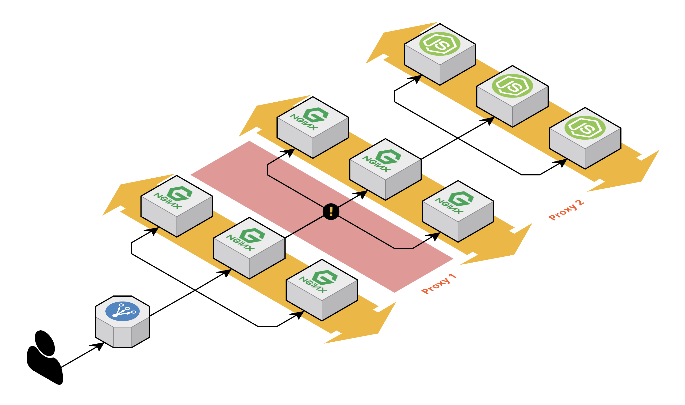

nginx proxy 설정을 하다가 삽질한 경험을 공유한다.  
알고보면 굉장히 간단한 내용이고 그 해결책은 근본을 벗어나지 않는 것이었지만  
원래 삽질이라는 게 자신이 경험하지 않는 내용에 대해서는 그 본질을 깨닫기가 어렵다.

그래서 경력이 많든 적든 정도의 차이는 있지만 매번 겪게되는 과정이자 앞으로도 계속 겪게되는 과정이다.
그저 이런 과정을 통해서 알고만 있었던 지식을 비로서 내 것으로 만들었다는 위안(?)으로 삼게된다.


nginx 에서 Reverse Proxy를 적용하는 일반적인 상황은 보통 내부 시스템을 감추어 `보안적인 이슈`를 해결하기 위한 용도로 활용되거나.
다른 서비스로의 연결을 통해 `동일 도메인의 장점`을 활용하는 용도로 사용한다.  
그 외에도 여러가지가 있겠지만 내가 경험한 것은 이 정도의 요구사항을 충족시키기 위해 사용하였다.

nginx proxy를 사용하기 위해서는 [ngx_http_proxy_module](http://nginx.org/en/docs/http/ngx_http_proxy_module.html)이 필요하다.
이 모듈은 nginx 설치시에 이미 활성화된 모듈이기에 편하게 사용할 수 있다.

## nginx proxy 사용 전에 알아야할 nginx의 동작
nginx reverse proxy를 적용하는 예를 보면 보통 다음과 같이 적용한다.

```nginx
location / {
    proxy_pass http://127.0.0.1:3000;

    proxy_set_header    Host                $host:$server_port;
    proxy_set_header    X-Real-IP           $real_ip;
    proxy_set_header    X-Forwarded-For     $proxy_add_x_forwarded_for;
    proxy_set_header    X-Forwarded-Proto   $real_scheme;
    proxy_set_header    X-Forwarded-Port    $server_port;
    proxy_set_header    Connection "";
    proxy_http_version  1.1;
}
```

이때 우리가 알아야할 nginx의 작동방식에 대해 살펴보자.

### 클라이언트로부터 전달된 내용이 proxy되는 대상으로 모두 전달 된다.
이렇게 되는 이유는 [proxy_pass_request_headers](http://nginx.org/en/docs/http/ngx_http_proxy_module.html#proxy_pass_request_headers)와 [proxy_pass_request_body](http://nginx.org/en/docs/http/ngx_http_proxy_module.html#proxy_pass_request_body) 옵션의 기본값이 모두 `on`이기 때문이다.
위 두 개의 옵션은 전달된 request의 header와 body의 값을 그대로 proxy되는 대상으로 전달하는 역할을 한다.

### 전달되는 header 값 중 기본적으로 재정의되는 header가 있다.
nginx는 기본적으로 proxy될 때 요청의 헤더 정보 중 `Host`와 `Connection`를 다음과 같이 재정의한다.
```nginx
proxy_set_header Host       $proxy_host;
proxy_set_header Connection close;
```
그렇기 때문에 보통 [proxy_set_header](http://nginx.org/en/docs/http/ngx_http_proxy_module.html#proxy_set_header)를 통해 Host와 Connection을 재정의한다.

### nginx에서 무시하는 헤더값들이 있다.
이 내용은 proxy와는 다른 항목이지만 내가 겪은 proxy 삽질의 원인이 되는 내용이었다.

[ngx_http_core_module](http://nginx.org/en/docs/http/ngx_http_core_module.html) 모듈에는 [underscores_in_headers](http://nginx.org/en/docs/http/ngx_http_core_module.html#underscores_in_headers)와 [ignore_invalid_headers](http://nginx.org/en/docs/http/ngx_http_core_module.html#ignore_invalid_headers) 옵션이 있다.

이 옵션은 header의 validation에 대한 옵션이다.

[ignore_invalid_headers](http://nginx.org/en/docs/http/ngx_http_core_module.html#ignore_invalid_headers) 옵션이 기본적으로 `on` 되어있기 때문에 nginx에서 파싱하는 header 명의 규칙은 다음의 규칙을 준수하지 않으면 유효하지 않는 헤더로 판단한다.

> Valid names are composed of English letters, digits, hyphens

특이한 점이 있는데 [underscores_in_headers](http://nginx.org/en/docs/http/ngx_http_core_module.html#underscores_in_headers) 옵션의 기본값이 `off` 이기 때문에 기본적으로 underscores 또한 헤더명으로 쓸 수 없다.

예를 들어 `nid_no`와 같은 헤더명에는 underscore(_)가 있기 때문에 유효하지 않는 해더로 인지하여 request의 header 정보에서 제외된다.

## 삽질
자~ 그럼 이제 내가 겪은 문제를 살펴봐보자.



앞 쪽에 nginx 두 개를 통해서 node.js로 클라이언트의 요청이 전달된다.
문제는 첫 번째 nginx에서 인증 관련 해더 `nid_no`가 생성되어 두 번째 nginx로 전달되고 다시 node.js로 전달된다.
실제 확인을 해보니 두 번째 nginx로 `nid_no`가 전달되지 않는 것이 문제였다.
nginx proxy 설정은 위에서 기술한 것 처럼 설정을 하였다.

왜? `nid_no` 헤더가 두번째 nginx로 전달이 되지 않았을까? (proxy1 부분)

`nid_no`에서와 같이 헤더명에 underscore(_)가 존재하였기 때문에 [underscores_in_headers](http://nginx.org/en/docs/http/ngx_http_core_module.html#underscores_in_headers) 옵션을 `on`으로 설정하면 이 문제는 해결될 수 있을 것으로 판단되었다. 하지만 내 예상처럼 정상 동작하지 않았다.

[proxy_set_header](http://nginx.org/en/docs/http/ngx_http_proxy_module.html#proxy_set_header)를 통해 강제로 설정해 보기도 하고,  [proxy_pass_request_headers](http://nginx.org/en/docs/http/ngx_http_proxy_module.html#proxy_pass_request_headers)와 [proxy_pass_request_body](http://nginx.org/en/docs/http/ngx_http_proxy_module.html#proxy_pass_request_body) 옵션을 강제로 지정하면서 해결되기를 기대해봤으나... 모두 예상과 같이 동작하지 않았다.

한참을 삽질 중에 공식 문서의 옵션을 찬찬히 읽어봤다.

[underscores_in_headers](http://nginx.org/en/docs/http/ngx_http_core_module.html#underscores_in_headers) 옵션에서 결국 정답을 찾아서 해결하였다.
해당 문구를 잘 읽어보자.
> Enables or disables the use of underscores in client request header fields. When the use of underscores is disabled, request header fields whose names contain underscores are marked as invalid and become subject to the ignore_invalid_headers directive.

내가 바로 놓친 부분은 바로 이 단어이다.  
`in client request header fields.`

내가 구성하려고 했던 부분 중 client에 해당하는 부분이 어느 곳인지를 먼저 아는게 가장 중요했다. 

> 첫번째 nginx의 클라이언트는 `사용자의 브라우저`가 되고  
> 두번째 nginx의 클라이언트는 `첫번째 nginx`가 된다.

즉, [underscores_in_headers](http://nginx.org/en/docs/http/ngx_http_core_module.html#underscores_in_headers) 옵션을 적용해야하는 nginx는 바로 두번째 nginx에 적용되어야만 했다.

하지만 난 첫번째 nginx에서 underscore 헤더를 다루기 때문에 첫번째 nginx에 설정을 하면서 안된다고 툴툴거리고 있었던 것이다.


## 결론

암튼 다시한번 느끼는 것이지만

정답은 항상 가까운데 있고,  
문제가 잘 안 풀릴 때에는 기존에 하던 것을 다 멈추고,  
문제를 천천히 곱씹어 보면 해결할 수 있다는 것이다!  