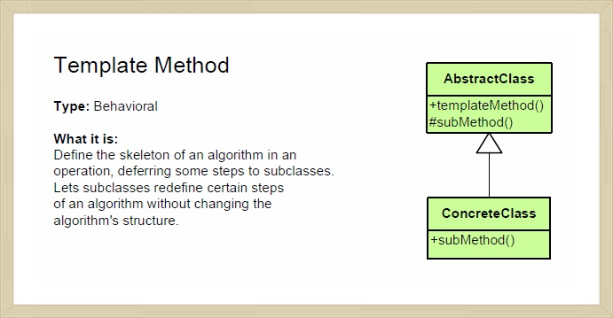

개인적으로 개발을 하면서 꼭 필요한 것 중의 **하나가 개발에 대한 경험**이고, 또 다른 하나가 그 경험을 통한 **사고의 정리와 확장**에 있다. 개발경력은 단지 숫자에 불과할 뿐이다. 그 시간동안 얼마나 **다양한 경험과 깊은 고민을 했는지**가 현재 자신의 개발 역량을 만들어 간다.

하지만, 어디 개발 뿐이겠는가? ㅋㅋ

물론, 천재적인(?) 감각과 통찰력으로 책 만보고도 잘하는 사람도 드물게 있긴 하다. 하지만 나 같은 범인들은 `당하지 않고는 느끼지 못하고, 고민하지 않으면 통찰력을 얻을 수 없다.`

그래서 마침 좋은 책도 나오고 해서 FE개발 좀 했다는 노친네(?) 분들과 오브젝트 책으로 생각을 정리할 목적으로 스터디를 시작했다.

스터디라고해서 뭐 거창한 것은 아니고 그냥 책을 읽어와서 이런 저런 잡담을 주기적으로 하는 시간을 갖기로 했다.

오늘은 그 첫번째로 이 책의 1~2장에 대한 내용을 토대로 이야기했던 내용. 그리고 내 생각들의 정리를 위한 기록들이다.

<!-- more -->

## 객체 지향 프로그래밍 이야기

프로그래밍을 개인적으로 제대로 학습해 본 것은 `C++로 쓰여진 객체지향프로그래밍` 책이었다. 주황색(?)과 파란색(?)의 표지의 책으로 기억된다… 문법부터 나온 책이었는데 그때 배운 내용을 바탕으로 아직까지도 잘 써먹고(?) 있다. 누가 가르쳐 주는 것도 아니고 개발로 뭔가를 해본 것도 아니기에 난해하고 이해하기 어려워서 몇 번을 반복해서 본 기억이 있다.

이게 "상속"이구나 이게 "클래스"하고 "인터페이스" 구나 하는 정도의 이해 수준을 가지고 나름 `다 배웠다는 교만함`으로 살았던 기억이 난다.

그 이후로 아마도 처음보는 객체지향 프로그래밍 관련 책 같다.

이 책은 시작부터 `프로그래밍 패러다임`에 대한 용어를 다룬다. 작년에 쓴 [내 책](https://book.naver.com/bookdb/book_detail.nhn?bid=13799611)에서는 다양한 패러다임(반응형/함수형 프로그래밍 패러다임)이 나오는 내용 임에도 불구하고 미처 다루지 못했던 내용을 이 책에서는 아주 잘 다루고 있다.
(왜 이렇게 풀지 못했지… 라는 생각에 부끄러움이 밀려왔다. 하하하)

이후 소프트웨어 모듈의 목적에 대해 기술하고 있다. 이걸 보고 초등학교때 '인사 잘해라'는 선생님의 가르침을 잊은 것 처럼 얼굴이 화끈거렸다.

> 소프트웨어 모듈은
>
> 첫째. 제대로 동작해야하고
> 둘째. 변경을 위해 존재해야하며
> 셋째. 가독성이 좋아야한다.

## 간혹 우리는 두번째 목적을 잊어버린다. 왜?

이 스펙이 크게 변경될 일은 현실적으로 우리가 예측가능한 범위에서 많이 일어나지 않을뿐만아니라 그런것을 고려하면서 개발하기에는 일정이 너무 짧기때문에 오히려 첫번째와 세번째 이유에 더 초점을 맞추게 된다.

하긴 두번째 이유 때문에 객체지향이니 함수형이니 반응형이니 하는 프로그래밍 패러다임을 배우고, 테스트 코드를 짜놓고 변경에 대비하고 있는데… 현업 개발을 하다보면 이걸 명료하게(?) 잊어버린다.

어찌보면 경험이 쌓이면서 변경을 대비하기 위한 코딩의 기술(?)들이 이미 녹아들어 갔기 때문일 수도 있다. 그냥 '그렇게 짜는게 좋다'라는 감(?)만이 남아 있게된다.

이 책의 1~2장 까지는 객체지향 프로그래밍의 개념을 `왜?` 라는 관점에서 예제와 함께 비교적 쉽게 설명하고 있다. 하지만 역시나조금은 지루한 내용이고, 초보자들이 이해하기 어려운 내용이다.

뭐 핵심만 이야기한다면 아래같이 간단히 나타낼 수도 있다.

> 의존성이 있다 === 변경이 될 수 있다.
>
> So, 결합도를 낮춘다.
>
> How?
>
> - **캡슐화**를 통해 내,외부의 경계를 명확히하여 자율성을 보장하여 의존성을 줄인다.
> - 구현과 인터페이스로 나눠서 인터페이스로만 메시지를 주고받는다
> - 객체에 **책임**을 주어 할당하여 **자율적**으로 처리하도록 하자. 이로 인해 응집도를 높인다.

위 기본적인 개념을 바탕으로 어떻게 코드를 개선해 나가는지를 설명하고 있다.

## 상속

위 방식을 효과적으로 해결하기 위한 객체지향 프로그래밍의 방법 중 하나로 상속이 나오고, 이로 인한 추상화와 다형성 이야기가 나온다. 이런 개념은 인터넷을 잘 찾으렴 나오니깐 과감히 생략하고. 우리가 잘못 사용(?) 하고 있는 상속에 대한 이야기를 좀 해보자.

FE개발 좀 했다는 노친네(?) 분들과도 이 상속이 논의의 중심이 되었다.

이 상속이라는게 어떻게 보면 참 편리하다. 부모를 그대로 쏙 닮은 자식을 아주 손쉽게 만들수 있기 때문이다.

왜냐면 내 중복코드가 정말 기가 막히게 사라지기 때문이다. 유지보수도 더 편한 것 같고, 뭔가 테크닉으로 노가대를 없앴다는 프로그래머로서의 뿌듯함도 생긴다.

## 잘못된 상속의 폐해

실제로 내가 겪은 개발 사례로 이야기해보자. UI 대표적인 컴포넌트로 캐로셀과 스크롤이 있다.

둘다 사용자의 액션을 받아서 UI를 움직이는 동일한 기능을 담당한다. 다만 다른 것은 캐로셀은 별도의 인덱스가 있어서 사용자의 액션에 따라 한 판씩 이동하는 것에 비해 스크롤은 모두 동일하지만 사용자의 액션에 의해 스크롤되는 UI 컴포넌트이다.

인덱스 기능을 빼면 사실 둘 다 같다. 그럼 동일한 기능이니깐 공통 사용자 액션을 바탕으로 상속해서 요렇게 하면 좋겠다라는 유혹(?)이 시작된다. 여기까지는 사실 괜찮다.

관여하는 모듈도 많지도 않고 나름 나쁘지 않다. 하지만 이제 요구사항이 늘면서 우린 헬게이트로 빠지게 된다.

캐로셀의 이동 모양만 변경한 여러 종류의 캐로셀을 만드는 요구사항이 추가되었다.

Carousel을 상속함으로써 이동 모양에 대한 부분만 overriding 하면, SlideCarousel, PreviewCarousel, CubeCarousel 등 다양한 캐로셀을 손쉽게 만들 수 있었다. 이때는 참 뿌듯했다. 몇 줄 안되는 코드로 다양한 요구사항을 손쉽게 해결했으니 ㅋㅋㅋ

하지만 문제는 여기서 부터였다. 여러 종류의 캐로셀마다 다양한 요구사항들이 추가되었고 이로 인해 하위에 있는 XXXCarousel이 변경되었고, 이로 인해 오히려 상위의 컴포넌트도 변경을 해야하는 상황이 도래했다.

코드는 줄었지만. 변경시 마다 상위 모듈이 함께 변경 될 소지가 있었고 각각의 역할은 자율성을 갖지 못하고 영향을 미치게되었다. 가장 미치게 하는 것은 코드는 짧아졌지만 `상위 모듈을 다 이해하지 않은 이상` 코드의 변경이 어려워졌다.

이때 했던 실수를 이 책에서는 명확하게 집혀주고 있다.

> 상속은 구현 상속이 아니라 인터페이스 상속을 위해 사용해야 한다.

이를 구현의 `재사용성 관점`으로 접근하면 나와 같은 경험을 할 수 있다. 하지만 인터페이스 상속. 즉, 다형성을 이용하기 위한 인터페이스 상속은 좋은 결과를 낳는다. 물론, `구현 자체를 공유할 필요가 없는 경우`라면 인터페이스만을 사용하는 것이 훨~씬 유연한 구조를 가져갈 수 있다.

위에서 예시로 든 캐로셀과 스크롤의 경우에는 1차적으로는 사용자 액션 부분을 모듈화 하여 자율성을 부여한 후, 이를 캐로셀이나 스크롤에서 사용하는 사용자 액션을 사용하는 `합성` 방법이 더 효과적이다.

다음으로 다양한 종류의 캐로셀의 경우, 캐로셀의 <u>구현체를 공유할 필요가 없다면 인터페이스</u>로 `추상화` 를 하고 그렇지 않고 <u>구현체를 일부 공유해야한다면</u> `상속`을 이용하여 `템플릿 메소드 패턴`을 고려하는 것도 좋은 방법이다.

## 인터페이스와 상속

J2EE로 구현된 모듈들을 보면 많은 상속된 객체를 사용하고 있고 사용자에게는 대체로 인터페이스 구현 형태를 제시하고 있다.

개발을 처음 시작할 때는 인터페이스를 보면서 이런 생각을 했었다.

아니 그냥 만들면 될 것을 왜? 굳이 인터페이스를 만들어야 하는가?

사실 Java개발을 할때 가장 불편하고 짜증났던 것 중에 하나가 이런 중복 코드를 매번 재생성해야하는 것이 사실 좀 불합리해 보였다. 하지만 그 대상이 여러 개라면… 즉 다형성이 필요하다면 이야기는 달라진다. 인터페이스 만한게 없다.

> 난 이런 메시지를 줄테니 잘 모르겠고 넌 이런 형태의 응답을 줘!

인터페이스 빼고는 의존성이 없다. 규칙만 잘 지키면 된다. 하지만. 상속은 어떠한가?

상속은 사실 `굉장한 강결합`이다. 부모의 메소드를 알지 못하면 모르고, 부모가 어떻게 동작하는지에 대한 내용을 모르면 자식의 영향도를 파악하기가 어렵다. 한마디로 일차로 **캡슐화 위반**이다. 캡슐화 위반은 사실상 의존성의 증대를 의미한다.

개인적인 생각으로는 극단적이지만 `상속은 필요 없다`에 한 표를 주고 싶다. 너무 매정하다 싶으면 이렇게 고치고 싶다.

`상속은 최대 한 번이면 족하다.`

상속은 결합도가 높은 패턴이기 때문에 정말 자신이 잘 만들 자신이 있거나 그렇지 않다면 오히려 당신의 퇴근시간을 늦출 수 있는 지름길이 될 수 있다.
