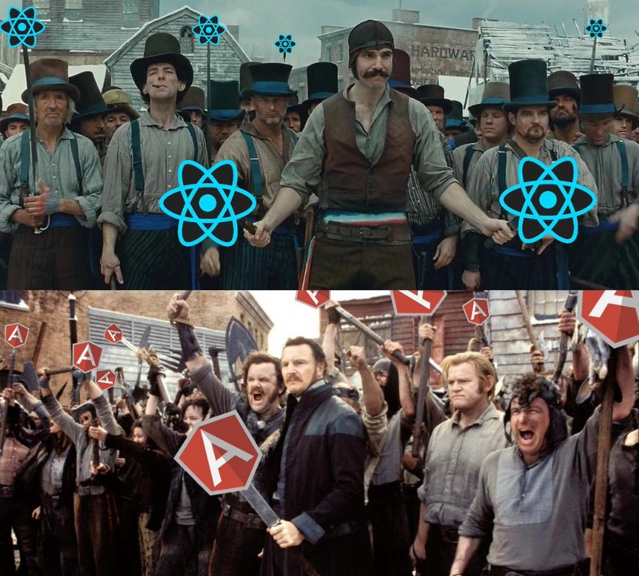
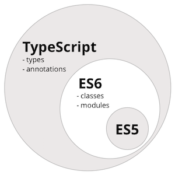

Angular 1.x은 높은 생산성으로 많은 개발자들의 마음을 뺏아 갔습니다. 반면, `Two-way binding과 client rendering 구조로 성능에 문제가 있다`라는 지탄을 받았습니다.
이런 Front-End 프레임워크에 대한 관심은 Facebook의 React로 이어졌습니다.
React는 `Virtual DOM과 JSX의 server rendering을 이용하여 성능이 좋다`라는 이야기와 함께 개발자들에게 뜨거운 관심을 받았습니다. 2016년 개발자들 사이에서 가장 뜨거운 감자였으며, 지금도 많은 개발자들이 관심을 갖고, 도입을 고려하는 있는 프레임워크(?)입니다.

하지만, 저의 개인적인 견해는

> **우리는 React보다 Angular2에 더 주목해야한다**

고 생각합니다.

React는 라이브러리이고, Angular2는 프레임워크이기 때문에 [비교](https://medium.freecodecamp.com/angular-2-versus-react-there-will-be-blood-66595faafd51#.6xe92bylv)하는 것 자체가 말이 안된다고 이야기하는 이도 있지만, 지극히 제 관점에서 React와 Angular2 생태계 내에서 비교를 간단히 해보겠습니다.


## Performance

### 구조적인 개선

저희가 만드는 서비스에서 `느리다`라고 말하는 부분이 실제로는 어떤 부분일까요?

- Client Rendering으로 인해 하얀화면이 보이는 것? ([FOUC](http://netil.github.io/slides/angularjs/#/17):Flash of unstyled content)
- 데이터 변경시, 여러 뷰들이 실시간으로 일괄 변경되는 부분?
- 애니메이션 동작시 매끄럽지 않은 부분?
- ...

#### Server Rendering 지원

처음에 이야기한 **Client Rendering** 부분은 Angular 1.x 가 구조적으로 극복하기 힘든부분입니다. 하지만 Angular2에서는 [angular-universal](https://github.com/angular/universal) 을 통해 React와 같이 `Server Rendering을 지원합니다.`

#### 단방향 데이터 흐름의 구조

다음으로 **데이터 변경시 여러 뷰들이 실시간으로 변경되는 부분** 입니다.
Angular 1.x에서는 Two-way binding을 이용하여, 데이터 변경만으로 뷰들을 일괄 변경할 수 있는 기능을 제공했지만, 이와 같이 데이터 흐름이 `양방향`으로 이루어 지다 보니, cascade 효과가 발생하여, 불필요한 digest가 발생합니다. 이로 인해 구조적으로 성능문제에 직면하게 될 확률이 높아 집니다.
반면, React에서는 `단방향 데이터 흐름`을 통해 데이터가 상위에서 하위로 전달하는 방식을 사용합니다. 따라서, Angular1과 같이 성능적인 문제에 직면하게 될 확률이 낮습니다.
Angular2도 React와 같이 컴포넌트 단위의 `단방향 데이터 흐름의 구조를 취하고 있습니다.`

마지막으로, **애니메이션 동작시 매끄럽지 않는 부분**은 사실 React나 Angular 1/2로 해결하기에는 어려움이 있습니다. 오히려 Native를 이용한 개발이 더 효과적이기 때문에 이부분에 대한 설명은 생략하도록 하겠습니다.

### 데이터 변경 확인 방법

React, Angular 1/2 모두 `DOM을 기준`으로 작업하는 기존 방식(JQuery)과 다르게, `데이터 기준`으로 개발을 해야만 합니다. 이때 가장 중요한 것이 `실제 데이터가 변경되는 시점을 찾는 방법`입니다.

React에서는 데이터 변경여부를 [Immutable 객체를 이용하거나, Virtual DOM을 이용](https://github.com/studye/react/wiki/%5BChapter-7-Performance-Tunning%5D#react%EC%9D%98-%EC%84%B1%EB%8A%A5%EC%9D%84-%EA%B2%B0%EC%A0%95-%EC%A7%93%EB%8A%94-%EC%9A%94%EC%86%8C)하여 비교를 합니다. 실제 브라우저 DOM을 기준으로 비교하지 않기때문에, 그만큼 성능이 빠릅니다. 하지만, Angular1에서는 이러한 기능이 없었기 때문에, `digest loop`를 통해 변경여부를 확인합니다. 더군다나, 양방향 데이터 흐름 덕(?)에 [digest lopp 1번 호출시, 최소 2번 최대 9번까지 확인하게 됩니다.](https://sculove.github.io/slides/seeAngularJSthroughCases/#/3/3)
하지만, Angular2에서는 이런 문제를 `ChangeDitector Tree, Immutable, Observable`을 이용하여 React와 같이 `메모리 영역에서 변경여부를 확인합니다.`

> **즉, Angular2는 Angular1과 같은 단점을 보강했고, React와 같은 구조를 가지고 있기 때문에, 성능상 크게 차이는 없다라고 이야기할 수 있을 것 같네요.**

---

자 여기까지는 `Angular2도 React 만큼 괜찮다` 라는 일종의 변론이었고, 이제 본격적으로 React보다 Angular2에 더 주목해야하는 이유에 대해 이야기해 보겠습니다.

## React보다 Angular2에 더 주목해야하는 이유

### 1. 템플릿(마크업)과 코드의 분리

React는 개발시 코드 안에 JSX가 포함되어 있습니다. 마크업부터 처음부터 다 개발하는 FE개발자라면 오히려 굉장한 장점일 수 있습니다. 하지만, `마크업 개발자와 FE 개발자가 협업해야하는 상황`이라면 꽤나 불편한 환경일 수 있습니다. (물론, React에서는 복잡한 작업을 통해 JSX와 코드를 분리할 수 있습니다. 하지만,... 근본적으로 떼어내기는 쉬운일이 아닙니다.)

```js
render() {
	var list = this.props.pagelist.map((v, i) => {
		return <li key={i}><Link to={v.url}>{v.text}</Link></li>
	});
	return (
		<div className="main-container">
			<h1>{this.props.title}</h1>
			<p>{this.state.message}</p>
			<nav className="navbar navbar-default" role="navigation">
				<div className="col-sm-7 col-sm-offset-2">
					{list}
				</div>
			</nav>
			{this.props.children}
		</div>
	);
}
```

하지만, Angular2에서는 다음과 같이 템플릿 자체를 별도의 파일로 관리 할 수 있습니다.

```
@Component({
	templateUrl: 'app.component.html',
    // ...
})
```

### 2. HTML 표준과 Web Component

React는 JSX라는 새로운 언어로 뷰를 만듭니다. 이 JSX 는 우리가 생각하는 마크업(HTML)과 비슷하지만, 다른 언어입니다.
예를 들어 JSX 는 `꼭! 상위 루트가 있어야 합니다.`

```html
<rooot>...</root>
```

아래 같이 작성할 경우에는 에러가 발생합니다.

```html
<root1>...</root1> <root2>...</root2>
```

더군다나, html의 class 속성도 중복되기 때문에 `className`으로 변경해서 사용해야합니다.

하지만, `HTML 표준 마크업을 템플릿으로 사용하는 Angular2`는 JSX의 제약이 전혀 없습니다. 더군다나 Web Component 를 지원하고 있기 때문에, Shadow DOM과 같이 뷰 단위로 css를 지정할수도 있습니다.

### 3. TypeScript

#### 타입이 존재하지만. 존재하지 않는 언어

TypeScript를 지원하기 때문에 Angular2가 진입장벽이라고 이야기하시는 분이 많습니다. 사실, 저 또한 그랬습니다. 하지만, 좀 써보니 그렇지 않은 것 같습니다.
예를 들어, React에서는 Component의 prop에 타입을 지정합니다. 다음과 같습니다.

```js
Main.propTypes = {
  title: PropTypes.string.isRequired,
  pagelist: PropTypes.array,
};
```

자유도가 높은 JavaScript에서 왜 이런 작업을 하는 것일까요? 당연히 필요하기 때문입니다. `Front-End 비중이 높아지면 질수록, 타입체크는 꼭 필요한 기능` 중 하나인거죠.
하지만, TypeScript는 다음과 같이 코드에서 부터 타입을 명시할수 있습니다.

```js
var title: string;
var pagelist: string[];
```

`가장 좋은 점은 타입을 지정하는 것이 꼭! 필수는 아니다는 것입니다.` 그래서 TypeScript로 개발을 하더라도 그냥 JavaScript와 같이 쓸수 있습니다.

#### 미래를 준비하는 언어

React를 쓰려면 JSX를 변경하기 위해 transpile 과정을 꼭! 해야만 합니다. 그래서 일반적으로는 ES6 까지 함께 적용하여 개발을 합니다.
Angular2가 사용하는 TypeScript 또한 꼭! transplie 과정을 거칩니다. 어차피 개발환경에서 하는 일은 동일합니다.
하지만, TypeScript는 아래와 같이 ES5,6 기본 스펙을 포함하고 있고, 더불어 annotations과 type을 가지고 있습니다. ES2017에서 decorator, async와 같은 스펙이 이미 논의되고 있습니다. 이 부분이 TypeScript를 사용하게 되면 미리 사용할 수 있는 장점이 있습니다. 즉, 최신의 ECMAScript 를 사용할 수 있다는 것입니다.


### 4. 프레임워크 내에서의 설계

Angular1은 controller, service, directive등과 DI(Dependency Injection) 방식을 제공하여 많은 면에서 정해진 룰(?)에 의해 개발을 할 수 있는 장점이 있습니다. 반면, React는 Flux나 Redux와 같은 데이타 플로우 설계에 대한 많은 선택지가 있습니다.
많은 선택지가 있다는 것은 선택을 해야하는 자유도가 높아 유연성이 좋다는 의미이기도 하지만, 다른 한편으로는 [올바른 선택을 하기 위해서는 많은 경험과 높은 이해도가 필요하다](http://huns.me/development/1953)는 이야기 입니다.

Angular2는 Angular1과 React의 중간점에 있다고 생각됩니다. React와 다르게 프레임워크이기 때문에, 어느 정도 정해진 플로우를 사용하면서, Flux, Redux, RxJS와 같은 것을 유연하게 적용할수도 있습니다.

### 5. 브라우저 벤더 "구글"

Angular2는 구글 주도하에 개발되고 있는 Front-End 프레임워크입니다. 브라우저를 만드는 구글이기 때문에, Angular2에도 브라우저의 표준을 따르려고 하는 모습이 보입니다. 기본적으로 사용하는 템플릿도 HTML표준이고, 컴포넌트들의 모습도 Web Component를 지향하고 있으며, 심지어 애니메이션 처리하는 부분도 Web Animation API를 지향하고 있습니다.
물론, Facebook의 React도 그 행보가 유사하지만, 구글과 같이 민첩하고 직접적으로 표준을 지켜나가는 모습은 아닙니다.


> 간단한 페이지들은 오히려 프레임워크를 도입하지 않는 것이 더 효과적입니다. 하지만, 만약 프레임워크를 도입한다면, React뿐만 아니라, Angular2도 함께 고려해보는 것도 좋을것 같습니다.
> 참고로 Angular2는 2016말 정식릴리즈를 준비중이며, 현재는 RC.4까지 진행되었습니다.
