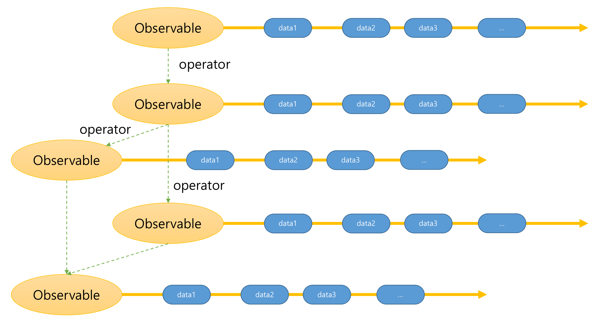
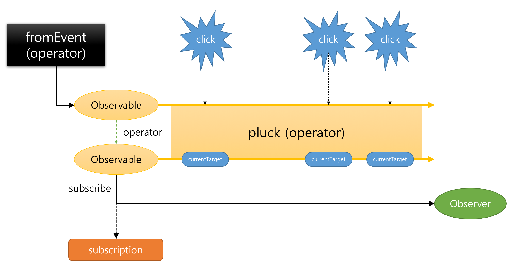

오늘 소개할 부분은 작성 중인 책 2부의 개론에 해당하는 내용이다.
이 장을 통해 `RxJS의 개발과정의 큰 그림`을 다시한번 살펴보기 바란다

---

1부에서는 RxJS의 본질을 알아가기 위해 RxJS가 고민했던 문제들을 살펴보았다. 2부에서부터는 RxJS 라이브러리에 대해 자세히 알아보자. 이 장을 통해서는 RxJS로 간단한 소스를 구현해보면서 RxJS의 사용법을 익혀보도록 하자.

## RxJS

RxJS의 공식 사이트에서는 RxJS에 대해 다음과 같이 정의하고 있다.

> RxJS is a library for composing asynchronous and event-based programs by using observable sequences.  
> RxJS는 Observable를 사용하여 비동기 및 이벤트 기반 프로그램을 작성하기 위한 라이브러리이다.

1부에서 필자가 정의한 `범용적인 데이터 플로우 솔루션`을 지향하는 라이브러리의 국소적인 표현이라고 할수 있다. 특이한 것은 공식 홈페이지에는 RxJS에 대해 `이벤트용 lodash 정도라고 생각해라`라는 말도 있다.

> Think of RxJS as Lodash for events.

앞의 용어가 RxJS의 철학에 대한 정의라면, 뒤의 정의는 실제 사용에 대한 정의라고 볼수 있다.
RxJS가 어렵다면 지금은 그냥 `비동기 Array/Collection 데이터`를 다루는 라이브러리 정도로 생각하고 접근해보자.

## RxJS 시작하기

### RxJS 첫번째 예제

RxJS로 간단한 예제를 만들어보자.
웹 개발시 가장 빈번히 이루어지는 이벤트를 처리하는 예제를 작성해보자.

페이지를 클릭했을 경우 event.currentTarget 정보를 콘솔로 찍어보도록 하자.

다음과 같이 간단히 작성할 수 있다.
이벤트 핸들러를 만들고, 그 핸들러를 `addEventListener`를 통해 등록하기만 하면 우리가 원하는 코드를 작성할 수 있다.

```js
const eventHandler = (event) => {
  console.log(event.currentTarget);
};
document.addEventListener('click', eventHandler);
```

이 코드와 동일한 기능을 RxJS로 작성해 보자.  
RxJS에서는 이벤트를 Observable로 변환하는 [fromEvent](http://reactivex.io/rxjs/class/es6/Observable.js~Observable.html#static-method-fromEvent) 메소드를 제공한다.
Observable의 `subscribe` 메소드를 이용하면 Observer가 Observable을 구독할 수 있다.  
즉, Observable에서 전달된 데이터를 Observer는 소비할 수 있다.

```js
const click$ = Rx.Observable.fromEvent(document, 'click'); // observable
const observer = (event) => {
  console.log(event.currentTarget);
};
click$.subscribe(observer);
```

RxJS에서는 이벤트 핸들러를 만들었던 것과 같이 Observer를 만들고,
addEventListener를 통해 이벤트 핸들러를 등록하는 것과 같이 observer를 Observable에 구독(subscribe)하였다.
다른 것이 있다면 브라우저를 통해 전달되는 이벤트 정보를 Observable로 변환하는 작업을 추가적으로 하고 있다.

### RxJS 첫번째 예제 개선하기

앞에서 살펴본 예제를 살펴보면 실제 우리가 필요한 정보는 click이 아니라 click 될때의 currentTarget 정보이다.

Observable 인스턴스의 [pluck](http://reactivex.io/rxjs/class/es6/Observable.js~Observable.html#instance-method-pluck) 메소드를 이용하면 이 의도를 코드에 더욱 명확히 나타낼 수 있다.

> pluck은 사전적으로 "~을 뽑다" 라는 의미이다.  
> 추출할 속성들을 "문자열"로 지정할수 있다. 이 함수의 반환값은 새로운 Observable 인스턴스 이다.  
> `public pluck(properties: ...string): Observable`

다음 코드는 pluck 메소드를 이용하여 코드의 의도를 더욱 분명하게 변경한 예이다.

```js
const currentTarget$ = Rx.Observable.fromEvent(document, 'click').pluck(
  'currentTarget'
); // observable

const observer = (currentTarget) => {
  console.log(currentTarget);
};
currentTarget$.subscribe(observer);
```

click이 발생하는 시점에 전달된 event 객체의 currentTarget을 전달하는 currentTarget\$을 만들 수 있다.
Observer는 currentTarget을 구독함으로써 currentTarget 데이터를 전달받을 수 있다.

### RxJS 두번째 예제

앞의 예제가 비동기 방식을 RxJS로 구현한 것이라면 이번에는 동기적인 작업을 RxJS로 구현해보자.
간단한 예로 사용자 정보를 가지는 배열에서 "촉"나라 사람만 추출하여보자.

다음과 같이 작성할 수 있다.
array의 `filter` 메소드를 통해 원하는 사용자만을 추출할 수 있다.

```js
const users = [
  {
    name: '유비',
    birthYear: 161,
    nationality: '촉',
  },
  {
    name: '손권',
    birthYear: 182,
    nationality: '오',
  },
  {
    name: '관우',
    birthYear: 160,
    nationality: '촉',
  },
  {
    name: '장비',
    birthYear: 168,
    nationality: '촉',
  },
  {
    name: '조조',
    birthYear: 155,
    nationality: '위',
  },
  {
    name: '손권',
    birthYear: 182,
    nationality: '오',
  },
].filter((user) => user.nationality === '촉');

const log = (user) => console.log(user);
users.forEach(log);
```

이 코드와 동일한 기능을 RxJS로 작성해 보자.
RxJS에서는 Array를 Observable로 변환하는 [from](http://reactivex.io/rxjs/class/es6/Observable.js~Observable.html#static-method-from) 메소드를 제공한다.

```js
const users$ = Rx.Observable.from([
  {
    name: '유비',
    birthYear: 161,
    nationality: '촉',
  },
  {
    name: '손권',
    birthYear: 182,
    nationality: '오',
  },
  {
    name: '관우',
    birthYear: 160,
    nationality: '촉',
  },
  {
    name: '장비',
    birthYear: 168,
    nationality: '촉',
  },
  {
    name: '조조',
    birthYear: 155,
    nationality: '위',
  },
  {
    name: '손권',
    birthYear: 182,
    nationality: '오',
  },
]).filter((user) => user.nationality === '촉');

const observer = (user) => console.log(user);
users$.subscribe(observer);
```

RxJS에서는 추출된 사용자를 콘솔에 출력하기 위해 log를 만든 것과 같이 Observer를 만들고,
forEach를 통해 log 함수를 호출하는 것과 같이 observer를 Observable에 구독(subscribe)하였다.
다른 것이 있다면 Array 객체를 Observable로 변환하는 작업을 추가적으로 하고 있다.

RxJS를 이용하면 데이터 소스(이벤트, 배열)를 Observable로 만들기만 하면 `비동기 방식도 동기 방식도 모두 동일한 행태로 개발`을 할수 있다.

## RxJS 4대 천왕

RxJS에서는 다루는 중요 개념은 다음과 같다.

- Observable
- Operator
- Observer
- Subscription
- Subject
- Scheduler

이 장에서는 이 중 항상 사용하게 되는 4개 개념인 Observable, Operator, Observer, Subscription에 대해 다루기로 하자.
나머지 Subject와 Scheduler는 뒷 장에서 다루도록 하겠다.

### Observable

시간을 축으로 연속적인 데이터를 저장하는 컬렉션을 표현한 객체이다. 데이터를 제공하는 소스나 Observabler과 연결되어 데이터를 제공한다. Operator와 함께 RxJS의 핵심 중의 핵심인 개념이다. 이를 stream이라고 부른다.


### Operator

Observable의 static 메소드나 인스턴스의 메소드로 Observable 객체를 반환하는 메소드를 Operator라고 한다. Operator는 현재의 Observable Instance를 기반으로 항상 새로운 Observable instance를 반환한다.
Operator는 Observable을 생성하기도 하고, 각각의 Observable을 연결하기도 한다. 또한, Observable을 분리하거나 합치기도 한다.
위 예제에서는 `Observable.fromEvent` operator를 이용하여 Observable을 생성하고 Observable 인스턴스의 `pluck` operator를 이용하여 데이터를 변경하였다.



### Observer

Observable에 의해 전달된 데이터를 소비하는 주체이다. Observer는 next, error, complete 함수를 가진 객체를 가리킨다. Observable에 의해 데이터가 전달될때는 next가 호출되고, 에러가 발생했을 때는 error 함수, 데이터 전달이 완료되었을 때는 complete함수가 호출되어진다.
Observer은 Observable과 subscribe 메소드를 통해 연결되어 진다.  
`Observable#subscribe 함수`는 Observer를 파라미터로 받는다.

**1. Observer 객체를 전달하는 subscribe 사용 예**

```js
const observer = {
  next: (x) => console.log('Observer가 Observable로부터 받은 데이터: ' + x),
  error: (err) =>
    console.error('Observer가 Observable로부터 받은 에러 데이터: ' + err),
  complete: () =>
    console.log('Observer가 Observable로부터 종료 되었다는 알림을 받은 경우'),
};
click$.subscribe(observer); // observer 객체를 파라미터로 받는다.
```

**2. next 콜백함수를 전달하는 subscribe 사용 예**

```js
// observer의 next 함수를 파라미터로 받는다.
click$.subscribe((x) =>
  console.log('Observer가 Observable로부터 받은 데이터: ' + x)
);
```

**3. next, error, complete 콜백함수를 전달하는 subscribe 사용 예**

```js
// observer의 next, error, complete 함수를 파라미터로 받는다.
click$.subscribe(x => console.log("Observer가 Observable로부터 받은 데이터: " + x),
    error: err => console.error("Observer가 Observable로부터 받은 에러 데이터: " + err),
    complete: () => console.log("Observer가 Observable로부터 종료 되었다는 알림을 받은 경우")
);
```

### Subscription

Observable.subscribe의 반환값이다. Subscription 객체는 자원의 해제를 담당한다. 등록된 Observable의 데이터를 더이상 전달 받고 싶지 않을 경우 `unsubscribe` 메소드를 호출하여 자원을 해제한다.


```js
// ...
const subscription = currentTarget$.subscribe(observer);

// subscription으로 자원 해제가 가능
subscription.unsubscribe();
```

## RxJS 개발 방법

위에서 제시한 예제를 rxjs의 4개 개념으로 표현하면 다음과 같다.


이벤트를 Observable로 변환하고 Observable의 pluck, filter 메소드를 통해 데이터를 변경한다. 데이터를 처리할 Observer를 만들고, Observable의 subscribe 메소드를 통해 Observer를 구독한다.

RxJS를 사용하여 개발할 때의 프로세스는 대부분 다음과 같은 과정을 거친다.

- 첫째. 데이터 소스를 Observable로 변경한다.
- 둘째. Observable의 operator를 통해 데이터를 변경하거나 추출한다.  
  또는 여러 개의 Observable을 하나의 Observable로 합치거나 하나의 Observable을 여러 개의 Observable로 만든다.
- 셋째. 원하는 데이터를 받아 처리하는 Observer를 만든다.
- 넷째. Observable의 subscribe를 통해 Observer를 등록한다.
- 다섯째. Observable 구독을 정지하고 자원을 해지한다.

## 정리

이번 장에서는 RxJS로 간단한 예제를 작성해 봄으로서 RxJS의 4가지 중요한 개념에 대해 살펴보았다. 더불어 RxJS개발 프로세스를 간단하게나마 살펴볼수 있었다.  
다음 장에서는 실제로 Observable을 만드는 방법에 대해 살펴보기로 하자.
