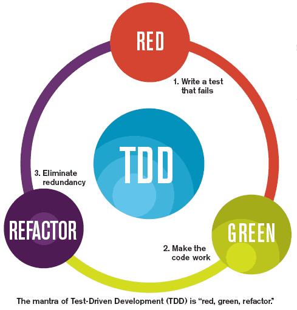

SW 업계 거장 중 한 명인 켄트 벡 아저씨가 2000년대 초반에 쓴 책이다.

개발 좀 한다는 사람이라면 누구나가 한 번쯤은 읽어 봤을 책으로 나 또한 소식적에 읽어본 책이다.

[테스트 주도 개발 - 켄트 벡](https://book.naver.com/bookdb/book_detail.nhn?bid=7443642)

Java 개발자로서 개인적으로 "이제 개발은 좀 하는데?"라는 생각을 가지고 "이제 품질도 챙겨야 되지 않겠어?"라는 다소 불순하고 건방진 의도로 책을 읽어서 그런지 다 읽고 나서도 별 감흥이 없었다.

> TDD라고 하면 그걸 왜 안 해?라고 말하는 신봉자들도 있고  
> TDD 그걸 어떻게 하냐? 현실적으로 일정이 박혀있고 시간도 없는데.  
> 어차피 바뀌는 것을 그렇게 해서 뭐 하냐?  
> 라고 말하는 사람들도 있다.
>
> 특히 UI 개발자들은 UI 테스트하는 것만큼 쓸데없는 짓이 없다고 이야기하는 사람도 있다.

개인적인 의견으로는 정도의 차이는 있을 뿐 전부 틀린 말은 아니다.

현재 프로젝트 상황에서 구성원들이 TDD의 소중함을 인식하고 있느냐? TDD의 가치를 알고 경험했느냐?에 따라 이러한 말은 때론 진실이 되고 때론 거짓이 된다.

이런 해묵은 논쟁을 하기 위해 내가 이 글을 쓰는 것은 아니다.

이 문제는 각자의 입장에서 풀길 바라고 내가 이 글을 쓰는 이유는 조금 다른 이유이다.  
**학습과 교육에 대한 이야기이다.**

## 커밋과 함께한 TDD 학습

몇 번의 출판을 통해 많이 바뀐 것도 있겠지만, 이번에 읽었을 때는 처음 본 책처럼 너무나 생소했다.

처음 책을 읽었을 때와 다르게 했던 점은

① 우선 코드를 눈으로만 보지 않았다. 눈으로 한번 싹~ 보고 손으로 직접 쳐봤다.  
② 커밋 단위로 TDD 단계를 진행해 보았다.  
 의도적이진 않았지만 TDD 단계를 커밋으로 기록하다 보니 개인적으로는 더 좋은 경험을 했던 것 같다

③ 팀원 몇몇과 생각을 함께 나눠서 이야기해 봤다

예전에 했던 업무가 "플랫폼" 업무였다. 플랫폼 특성상 테스트 코드를 짜지 않고서는 안정성을 확보하고 진행하기가 어려웠다. 그래서 하나의 PR에는 하나의 테스트 코드가 항상 함께였다.

하지만 개발 시에는 TDD에서 말하는 방식의 접근이 아니라 선 코딩. 후 테스트 방식으로 업무를 진행했었다. <u>그때는 이게 TDD의 이점이라고 생각했고 나에게 맞는 TDD를 찾았다고 생각했다</u>

어설프지만 짜놓았던 테스트 덕분에 릴리스할 때에
든든했고,  
함께해서 좋았고,  
한 마디로 편했다 ㅎ  
테스트는 나와 함께하는 QA 동료라는 느낌을 많이 받았다.

하지만  
이 책을 읽으면서  
그리고 실제 코드를 짜면서  
이 직종에 종사하면서  
참으로 잘못 이해하고 느끼고 있었다는 것을 느지막이 몸소 체감했다.

---

TDD에서는 Red-Green-Refactoring이라는 단계로 개발을 해 나간다. <u>**그동안 무시했던 이 과정이 지금 생각해 보니 무엇보다 중요하다는 것을 느꼈다.**</u>  
왜 그렇지 내가 이해한 이유를 살펴보자

**Red 단계.**

> 실패가 되는 테스트 코드를 작성한다.

이것의 의미는 <u>개발의 요구 사항을 구체화하고 인터페이스를 고민</u>하는데 의미가 있다.  
이 책에서는 다루지 않지만 개발 전에는 설계라는 것을 대략적으로 한다.  
그 설계를 바탕으로 요구 사항을 정리하고 그 요구 사항별로 구현을 해 나간다.

나는 Red 단계가 이러한 요구 사항의 구체적인 예를 만드는 과정이라고 느꼈다. 구체적인 예를 통해 접근하고 설계를 검증하고 다듬어 가는 출발점이다.

**Green 단계.**

> 성공하는 테스트 코드를 작성한다.

이것의 의미는 구현을 어떻게 할지는 모르겠지만 일단은 성공하게 만드는 과정이다. 성공이 되었다는 것은 구체적인 예, 인터페이스가 잘 정의되었다는 것을 의미한다.

**Refactoring 단계.**

> 중복된 부분을 제거하고 구현하고 리팩토링을 한다.

Green 단계를 거치면 구체적인 예, 인터페이스에 대한 검증은 끝난 단계이다. 이 단계에서 구현체를 바라보게 되면 개발자로서 느낄 수 있는 나쁜 코드의 냄새를 느낄 수 있다. 잘 모르겠던 구현의 피사체도 그려진다.

그래서 테스트가 깨지지 않는 한 자유롭게 내부 구현 코드를 바꿔가면서 신나게 코딩을 할 수 있다

더불어 이런 리팩토링을 하게 되면 테스트가 용이한 구조가 되고 테스트가 용이한 구조가 된다는 것은 응집도를 높이고 의존성을 떨어뜨리는 구조가 된다. 이런 구조는 테스트 코드를 짜는 게 더 유용하게 되어 결국은 선순환의 사이클을 형성하게 된다.

다시 한번 살펴보면 TDD는 사실 우리가 일반적으로 개발할 때의 과정과 별반 다르지 않다. 단계적으로 접근하는 과정을 준수하고, 테스트를 통해서 그 과정을 확인받는 과정을 이어 나갈 뿐이다.

테스트는 그 과정에서 우리에게 "안심해. 여기까지는 문제없어. 그리고 구조도 깔끔해"라는 것을 알려주는 좋은 동료인 것이다.

> 우리가 완성한 코드를 커밋으로 정리하고 그 커밋으로 기능단위의 변경 포인트를 구분하는 것과 같이 테스트도 우리가 작성한 코드의 기능 단위의 완성도를 기록하고 방어하는 하나의 수단으로 사용될 수 있다.

## 교육

이 책을 다시 읽게 되면서 느꼈던 점은 **"개발을 시작하는 하는 분들에게 TDD를 가리키고 훈육시키면 정말 좋겠다라는 생각이 들었다.**"

### 수용성

이렇게 생각한 이유 중에 하나는 우선 <u>수용성</u>이다.  
새로운 것을 배우는 분들은 기본적으로 수용성이 높다.

"이렇게 하는 게 개발을 제대로 하는 거야"라는 식의 날 깡패 같은 접근일지라도 좋은 프로세스를 강제적(?)으로 학습시키면 정말 좋겠다라는 생각이 들었다.  
한 마디로 TDD의 생활화가 더 쉬워질 것 같아서이다.

### 문제해결력

두 번째로는 <u>문제해결력</u>을 높이는 데 도움이 될 것 같다.

구체적인 예를 통해 문제를 나누고 해결하는 방법 자체가 TDD를 통해 학습이 가능하기 때문에 이를 통해 문제해결력을 높일 수 있을 것 같다.

### 기초 개발력

세 번째는 **기초개발력**이다.

개발을 처음 접하는 분에게는 문법을 아는 것도 중요하고 기능을 구현하는 것도 중요하다. 하지만 시간이 지날수록 동작만 하는 코드가 아니라 깔끔하고 유연한 코드를 작성해야만 한다. 그게 나뿐만 아니라 나의 동료의 행복한 삶(?)을 위해서라도 필요하다.

TDD를 공부하게 되면 기본적으로 리팩토링을 해야만 한다. 리팩토링을 하다 보면 당연히 디자인 패턴에 대한 관심이 증대되고 이를 통해 우리가 앞으로 겪어야 할지도 모르는 문제의 모범답안들을 살펴보게 되고 활용하게 된다.

논리회로와 문법을 뗀 아이들이 프로그래밍을 배울 준비가 되었다면  
시작부터 TDD로 학습을 시켜봐야겠다는 생각을 굳건히 해봤다. ㅎㅎ

> **"프로그래밍 학습을 TDD로 배웠어야 했다." 그리고 "TDD로 가르쳐야 했다"라는 생각과 확신이 들었다.**

## 정리

두 번째 읽은 책일지라도 쌓아온 경험이 있어서 쉬울 줄 알았지만... 생각만큼 이 책의 의미를 다 파악해서 읽는 것은 쉽지 않았다.

우선 저자의 주옥같은 명언의 의미를 경험 없이는 공감하기 어렵다는 것이다.  
성격책의 말씀과 같이 당연한 이야기지만 우리가 늘 깨닫고 후회하는 말처럼 느껴졌기 때문이다.

이 중 내 마음속에 항상 있었던 두려움을 끄집어 내어 적은 문장이 있어서 소개한다.

> **새로 전향한 사람들의 열의를 조심하라. 사람들에게 그렇게 하라고 다짜고짜 밀어붙이는 것만큼 TDD가 퍼지는 것을 빨리 막는 건 없다. - 켄트 벡 -**

굉장히 공감이 가고 쉽지 않은 문제라고 생각한다.  
팀 전체에 이러한 영향력을 하기 위해서 팀장 한 명만의 의지로 이루어질 수 없다는 것을 의미하기도 하다.

일반적인 개발 문화를 만드는 데에도 많은 시간이 걸리지만 특히 TDD 기반의 개발 문화를 동료들에게 이해하고, 팀원들이 지켜야 할 가치로 여기게 만드는 것은 정말 많은 노력과 서포트가 필요한 일이다.

우선 팀원 전부가 TDD에 익숙해질 때까지 개발을 기다릴 수 있는 오너는 아무도 없기 때문이다.

아직 해보지는 않았지만 개인적인 생각으로는 입사 초기부터 이런 과정을 의무적으로 제대로 학습시키는 게 중요할 것 같다.

누군가가 옆에서 꼭! 붙여서 알려주지 않는 이상 혼자 학습하기가 쉽지 않기 때문에 멘토도 붙이고.  
입사 초기 어수선한 시기에 의무적으로 경험할 수 있는 시간도 충분히 보장해 준다면 팀 전체에 이러한 문화를 녹이는 데 많은 도움이 될 것으로 생각된다.

다음에 기회가 된다면 꼭! 한번 해보고 싶다.

이 책에서는  
입에 테스트를 달고 설명하고  
테스트로 검증하면서  
테스트의 유용성을 구성원에게 알려서  
"널리 땅끝까지 TDD를 전파하라" 라고...(물론 이렇게 이야기하진 않았다 ㅎ) 하고 있지만.... ㅎ
