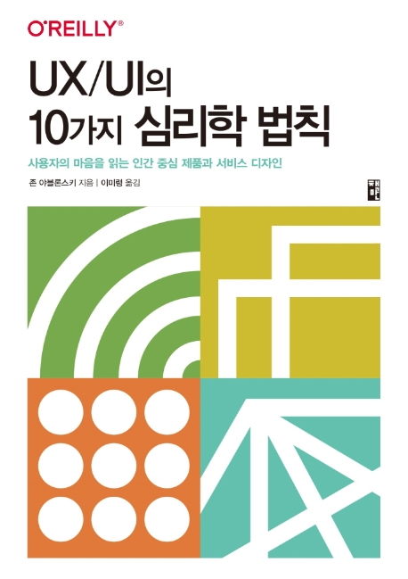

요즘 개인적으로 관심이 가는 분야가 `UX` 쪽이다.  
뭐 FrontEnd 개발자는 항상 UX에 관심을 가지고 UX를 접하고 있다. 그런데 왜 새삼 관심을 가지냐고?  
대부분의 개발자가 그렇듯이 나 또한 기술영역에 관심이 많아서 사실 UX의 편리함 보다는 `개발 생산성`에 더 관심을 많이 두고 있다.  
설계자나 디자이너쪽에서 제시하는 UX에 대해 `의문과 이견`은 있을지 언정 전문가가 아니다 보니 대체로 받아들이는 입장이 더 컸다.

개인적으로 기술영역은 차근차근 쌓아왔고 쌓아가고 있다는 믿음이 있지만
상대적으로 UX쪽은 뭔가 체계적으로 알아 본적이 별로 없었던 것 같아서 요즘 들어 책도 보고 아티클도 읽어 보고 있다.

예전에 동료로 부터 [Law of UX](https://lawsofux.com/) 사이트를 공유 받은 적이 있다.
`오~ 디자인은 이런식으로 하는 구나` 정도의 인사이트만 얻고 바로 창을 닫았던 기억이 있다.

이런 기억이 남아있었는지 이 사이트를 만든 저자분의 책을 골라서 읽어 봤다.
책도 두껍지도 않고 내용도 어렵지 않아서 순식간에 읽었다.

뭐 10가지 정도의 심리학 법칙을 소개하고 더불어 실제 사례들을 하나하나 소개해 준다.  
그 내용은 솔직히 특별하지는 않았다.  
현업에서 대다수 겪었던 내용이고 현업 디자이너들 또한 충실히 적용하고 있는 내용들이어서 새삼스럽지는 않았지만...
그 근거에 대해서는 흥미로운 책이었다.

- 디자이너들은 왜 이렇게 Pull to Refresh를 꼭 넣으려고 하지?
- 그놈의 좋아요는 왜 그렇게 화려하고 임팩트 있게 하려고 할까?

도데체 웹을 잘 이해는 하고 있는 걸까?  
이런 편향적인 생각들을 그들 입장에서 조금은 이해할 수 있었던 책이었던 것 같다.

개발자는 아니... 엔지니어는 궁극적으로 데이터에 근거한 판단을 해야한다.
하지만 그 근거를 만드는 게 쉬운 일이 아니다.

우리가 A/B 테스트로 UX를 검증하자고 하는 이유도 바로 이러한 이유이기 때문일 것이다.  
하지만 만약 그 근거가 없는 상황이라면 어떻게 의사결정을 할 것인가?  
저자는 이런 근거를 `심리학`에서 찾아 설득하고자 하였다.

`인지편향을 가진 사람이 사용하는 서비스의 데이터`는 결과일 뿐이고,
그 원인이 되는 인간 심리를 잘 이해하는게
문제를 잘 해결할 수 있는 것은 어찌보면 당연한 말인 것이다.

하지만 이 책을 읽기 전까지는 사실 그런 생각을 해본 적은 없었던 것 같다.  
발표자료를 만들거나 다른 서비스들을 써볼 때 이런 관점에서 살펴보면 재미있을 것 같다. ㅎ
