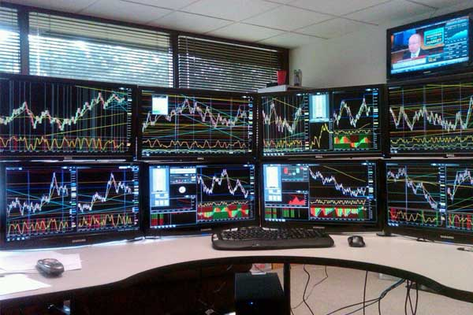

"내가 좋아하는 프로그래밍으로 주식을 하면 더 재미있지 않을까?" 라는 생각으로
시작한 개인 프로젝트([QWebview-plus](https://github.com/sculove/QWebview-plus))가 생각 외로 스타수가 붙었다.

따로 홍보도 하지 않았는데 몇몇 사람들이 사용하고 있는 것 같다.
작년 3월 정도에 뚝딱 만들었던 프로젝트였는데 지금까지 버려진 채로 놓여진게 개발자로서 조금 미안한 생각마저 든다.

사실 처음에는 프로그래밍으로 system-trading을 하면 수익을 올릴 수 있을 것 같은 막연한 생각이 들어 만들기 시작했다.
그래서 시작한 프로젝트가 [xing-api](https://github.com/sculove/xing-plus)이다. 처음에는 열심히 만들어서 실제 매매도 해보려고 준비까지 했었다.

하지만, 결국은 나보다 더 잘 할수 있는 분(cheesev4@gmail.com)에게 xing-api 프로젝트를 넘겨 주었다.

그렇게 한 이유는

- 첫째. python으로 하다 보니 내 주력 언어가 아니어서 언어외 로 배워야할 게 많아서 좀 버거운 면이 있었다.
- 둘째. 내 주력언어인 JavaScript로 가능한 방법을 찾게 되었다.
- 셋째. 주 증권사가 키움인데, 이베스트 증권사를 사용하는게 번거로웠다.
- 넷째. 키움 오픈 API가 내 기준으로는 더 좋은 인터페이스로 보였다. 특히, 실시간 처리에 대해서는 더 사용하기 편했다.

하지만 정작 지금까지 QWebview-plus는 방치하고 있다.

이 프로젝트를 해보면서 개인적으로 느낀 점은 크게 3가지이다.

## 첫째. 오픈소스에 대한 경험?

개인적으로 오픈소스를 몇개 해봤지만 대중적이지 못했다. 더불어, 열정적으로 개발도 해보지 못했다. 오히려 오픈소스를 하기 위한 프로젝트를 하려고 찾다보니 잘 안되었던 것 같다.
지금까지 내가 진행한 주식 관련한 프로젝트는 성공한 오픈소스는 아니다.
하지만, 홍보도 안했고, 대중적인 수요도 굉장히 적은 분야에서 여러 개발자들과 커뮤니케이션을 해봤던 경험은 개인적으로 나를 설레게하는데 충분했다고 생각한다.
상투적인 경험일지 모르지만, 그냥 하고 싶은 걸 해보는 게 정답인 것 같다.

## 둘째. 주식에 대한 나의 경험?

난 프로그래밍을 통한 매매를 하면 남들보다 많은 장점이 있고, 이를 이용하면 유리한 고지에서 많은 수익을 이룰수 있을거라고 생각했다. 하지만 몇가지 간과하지 못한 점이 있다. 우선, 내가 주식을 잘 못한다.
주식을 한지는 오래됐지만 정작 고민해보고 분석해본 적이 몇번 없었던 것 같다. 그냥 막연히 오르겠지. 또는 그냥 감으로, 소문으로 주식을 매매했던것 같다. 원칙도 없는데 프로그래밍을 해서 무엇하리?
아마 개발에서도 마찬가지인 것 같다. 기술적인 성숙도가 높다고 하더라도 그 비즈니스를 완벽하게 이해하지 못한 개발자는 훌륭한 개발자가 되지 못한다. 이 부분에서 난 크게 착각하고 있었던 것 같다.
좋은 연장이 결코 좋은 작품을 만들지는 안듯 프로그래밍을 좀 한다고 주식 프로그래밍을 잘 만들수 있는 것은 아닌것 같다.

## 셋째. 시스템 트레이닝을 하기전에 해야할 일?

주식 데이터는 단순히 데이터를 보고 바로 유추할 수 있는 형태의 데이터가 아닌 걸 확인했다. 딥러닝과 같은 복잡한 개념을 이야기 하지 않더라도 데이터가 의미하는 바를 해석하고 분석하는 능력이 선행되어야 전략이나 원칙을 세울수 있는 것을 경험했다.
이건 어떻게 보면 내가 주식에 대한 이해가 부족한 것도 영향이 있지만, 실제 나오는 데이터가 의미하는 바를 명확하게 나타내는 작업이 선행되어야 한다는 것을 알았다. 그래야 매매라는 것도 시작해 볼 수 있을 것 같다.

## 그래서 앞으로 어떻게 할지에 대한 내 결론은 이렇다.

- 첫째. 현재 투자하는 모든 금액을 회수하고, 가능성이 있을 경우 투자하기로 했다.
- 둘째. 주식 공부를 먼저 할 필요가 있을 것 같다. 좀 체계적으로 해봐야겠다. 아직 방법은 잘 모르겠지만. 이 부분에 대해서는 별도로 생각해봐야겠다.
- 셋째. 버려진 QWebview-plus를 매매용이 아닌 `분석의 목적`으로 활용하고 발전시킬 필요가 있을 것 같다. 이건 개인적으로 관심있는 기술 스택으로 만드면서 접근해 볼 수 있을 것 같다.

주식이 본업이 아닌 이상. 취미생활로 긴 호흡으로 즐기면서 해봐야겠다.
