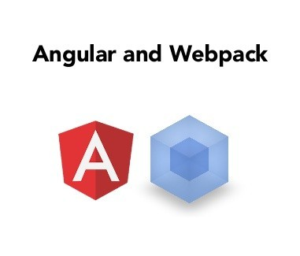

## Webpack을 사용하는 이유

1. dependency를 관리할 필요가 없다.
2. loader만 변경하면, es6, typescript등 transcompile이 쉽게 적용된다.
3. cache와 multi thread를 이용하여 transcompile이 빠르다.
4. npm모듈을 기본적으로 require할 수 있다. (별도 지정할 필요가 없다)
   별도로 지정이 필요한 경우, resolve-alias를 지정한다.
   http://stackoverflow.com/questions/34123358/webpack-cannot-find-node-module-bootstrap-multiselect
5. develop, production 옵션을 제공하여 기본적으로 map, uglify를 쉽게 적용할 수 있다.
6. node기반이므로 코딩이 가능하고, grunt나 gulp와 같은 툴이 필요하다면 손쉽게 적용할 수 있다. (하지만, 적용할 필요가 없을 정도로 깔끔하다)

## Angular module

- ui.router
- angular-validation

## Webpack module

### preLoader

- jscs-loader
- jshint-loader

### Loader

- css-loader
- less-loader
- url-loader
- expose-loader
- file-loader
- style-loader

### Plugin

- clean-webpack-plugin
- extract-text-webpack-plugin
- html-webpack-lugin

## Webpack 환경 설정 파일 예시

```js
var webpack = require('webpack');
var path = require('path');
var nodeModules = path.resolve(__dirname, 'node_modules');

var ExtractTextPlugin = require('extract-text-webpack-plugin');
var HtmlPlugin = require('html-webpack-plugin');
var CleanPlugin = require('clean-webpack-plugin');
var isRelease = (process.env.NODE_ENV || 'dev') === 'release';

var config = {
  entry: {
    app: ['./scripts/app.js', './less/sellshop.less'],
    // And other vendors
    vendors: [
      'jquery',
      'bootstrap',
      'toastr',
      'moment',
      'angular',
      'angular-animate',
      'angular-ui-router',
      'angular-resource',
      'angular-ui-grid',
      'bootstrap-datepicker',
      'bootstrap-datepicker.ko',
      'angular-auto-validate',
    ],
  },
  output: {
    path: path.resolve(__dirname, 'dist'),
    publicPath: '',
    filename: '[name].js',
  },
  resolve: {
    alias: {
      'angular-ui-grid': 'angular-ui-grid/ui-grid',
      'bootstrap-datepicker.ko':
        'bootstrap-datepicker/dist/locales/bootstrap-datepicker.ko.min',
      'angular-auto-validate': 'angular-auto-validate/dist/jcs-auto-validate',
    },
  },
  module: {
    preLoaders: [
      {
        test: /\.js$/, // include .js files
        include: [path.join(__dirname, 'scripts')],
        loader: 'jshint-loader',
      },
      {
        test: /\.js$/, // include .js files
        include: [path.join(__dirname, 'scripts')],
        loader: 'jscs-loader',
      },
    ],
    loaders: [
      {
        test: require.resolve('jquery'),
        loader: 'expose?$!expose?jQuery',
      },
      {
        test: require.resolve('angular'),
        loader: 'expose?angular',
      },
      {
        test: require.resolve('toastr'),
        loader: 'expose?toastr',
      },
      {
        test: require.resolve('moment'),
        loader: 'expose?moment',
      },
      {
        test: /\.css$/,
        include: [path.resolve(__dirname, 'less')],
        loader: ExtractTextPlugin.extract('style-loader', 'css-loader'),
      },
      {
        test: /\.less$/,
        include: [path.resolve(__dirname, 'less')],
        loader: ExtractTextPlugin.extract(
          'style-loader',
          'css-loader!less-loader'
        ),
      },
      // the url-loader uses DataUrls.
      // the file-loader emits files.
      {
        test: /\.eot(\?v=\d+\.\d+\.\d+)?$/,
        include: [nodeModules + '/bootstrap', nodeModules + '/angular-ui-grid'],
        loader: 'file-loader',
      },
      {
        test: /\.(woff|woff2)(\?v=\d+\.\d+\.\d+)?$/,
        include: [nodeModules + '/bootstrap', nodeModules + '/angular-ui-grid'],
        loader: 'file-loader',
      },
      {
        test: /\.ttf(\?v=\d+\.\d+\.\d+)?$/,
        include: [nodeModules + '/bootstrap', nodeModules + '/angular-ui-grid'],
        loader: 'file-loader',
      },
      {
        test: /\.svg(\?v=\d+\.\d+\.\d+)?$/,
        include: [nodeModules + '/bootstrap', nodeModules + '/angular-ui-grid'],
        loader: 'file-loader',
        // loader: "url?limit=1000&mimetype=image/svg+xml"
      },
    ],
  },
  plugins: [
    new CleanPlugin(path.resolve(__dirname, 'dist')),
    new webpack.DefinePlugin({
      ___DEV___: !isRelease,
    }),
    new webpack.optimize.CommonsChunkPlugin('vendors', 'vendors.js', Infinity),
    new ExtractTextPlugin('[name].css', {
      allChunks: true,
    }),
  ],
};
var htmlConfig = {
  inject: false,
  filename: '../index.html',
  template: './views/layout/layout.html',
};
if (isRelease) {
  config.plugins.push(
    new webpack.optimize.UglifyJsPlugin({
      compress: {
        warnings: false,
      },
    })
  );
  htmlConfig.hash = true;
}
config.plugins.push(new HtmlPlugin(htmlConfig));

module.exports = config;
```

## 참조 문서

- Angular 스타일 가이드 : https://github.com/johnpapa/angular-styleguide
- Using Angular 1.x With ES6 and Webpack : http://angular-tips.com/blog/2015/06/using-angular-1-dot-x-with-es6-and-webpack/
- Angular-webpack cookbook : http://dmachat.github.io/angular-webpack-cookbook/
- How to Webpack : https://github.com/petehunt/webpack-howto
  Webpack-bootstrap 예제 : http://bline.github.io/bootstrap-webpack-example/
- An Angular JS Starter (NG6) : https://github.com/AngularClass/NG6-starter
