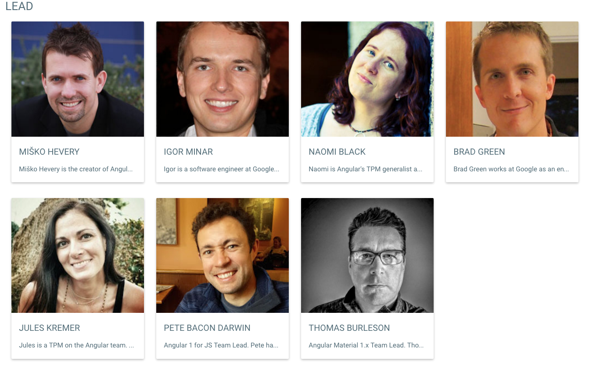
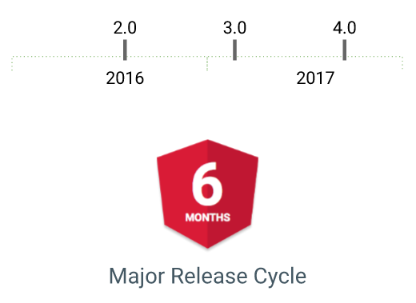
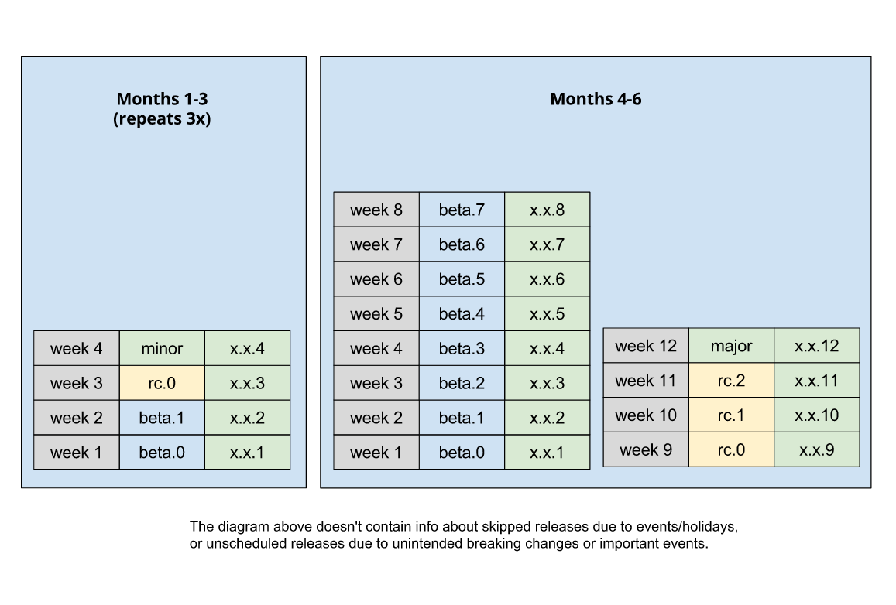

오늘은 Angular2 정식릴리즈 이후, 지금까지 어떻게 변해 왔고, 앞으로 어떻게 변할지에 대해 간단히 살펴보자.

## Release

Angular2는 2016년 9월 14일 이후, 지금까지 꾸준한 업데이트로 빠르게 변해가고 있다. 총 4번의 patch가 이루어졌으며, 1번의 minor 버전이 업데이트 되었다. 현재는 2번째 minor 업데이트가 진행 중에 있다.

- 2.0.0 릴리즈 (2016.09.14)
- 2.0.1 릴리즈 (2016.09.23)
- 2.0.2 릴리즈 (2016.10.05)
- 2.1.0 릴리즈 (2016.10.12)
- 2.1.1 릴리즈, 2.2.0-beta.0 (2016.10.20)
- 2.1.2 릴리즈, 2.2.0-beta.1 (2016.10.27)
- 2.2.0-rc0 (2016.11.02)

이렇게 Angular2가 빠르게 발전해 나가고 있는 이유 중에 하나는 중소기업에 버금가는 막대한 인력이 이 프로젝트를 진행하고 있기 때문이다.

Angular의 창시자 Miško Hevery 외에 6명의 리더가 존재하고, 25명의 구글러가 개발자로 있다. 더불어, 30명의 커뮤니티 인력이 주요 개발자로 포진해 있다. 그 외에도 300여명의 Contributer가 github 상에 존재한다.
https://angular.io/about/

이를 경제적인 가치(?)로 환산한다면, 어마어마한 금액이 될 것으로 보인다.
돈도 될 것 같지 않은 FE 프레임워크에 왜 구글은 이렇게 막대한 자원을 투입하고 있을까? 구글입장에서는 푼돈인 건가? 아니면, 무슨 심오한 뜻이 있지 않을까?

Android OS와 같은 플랫폼 전쟁을 FE에서도 하려는 것인가?
우매한 나로서는 당췌 모르겠다. ㅠㅠ

하지만, 푼돈이 아니라면...아마 구글이 Angular2에 기대하는 바는 굉장히 클 것으로 보인다.
실제 그 꿈은 실로 원대하다.

## Release 정책

Angular는 정식 버전을 공개하면서, 프레임워크 운영 정책에 대한 이야기도 함께 공개를 했다.
http://angularjs.blogspot.kr/2016/10/versioning-and-releasing-angular.html?view=classic

우선, Angular2의 버전 규칙을 기본적으로 Semantic Versioning(`MAJOR.MINOR.PATCH`)을 사용하기로 하였다. 더불어, 6개월 단위로 Major 업그레이드를 한다고 공개했다.
이 말은, 6개월 마다 Angular3, Angular4, Angular5를 내놓겠다는 이야기이다.

아 갑자기 머리가 아프다.

**Angular1에서 Angular2로 왔더니 다시, 3,4,5,...을 내 놓겠다고?**

하지만, 그렇게 걱정하지 않아도 된다. React는 0.14.0에서 15.0.0으로 바꾸지 않았던가? Angular2도 3,4,5의 연장선에 있기 때문에 새로운 것이 아니다.

또한, 릴리즈도 정말 쉬지 않고 계속한다. 매주 patch 릴리즈를 하고, 3개월 동안 3번의 minor 릴리즈를 하고, 이후 2달 간은 1개의 major 릴리즈를 한다.

## 앞으로의 방향성

앞으로 Angular는 다음 작업들에 집중한다고 공개했다.
http://angularjs.blogspot.kr/2016/09/angular2-final.html?view=classic

- 안전성 향상, 가이드와 예제 보강,
- Angular : Animation 작업 진행,
- WebWorker Experimental API를 Stable화 하는 작업
- Angular Material2, Angular Universal에 대한 개발 진행
- 성능 향상, 모듈 경량화
  > 최근 Angular3에 대한 기사에서는 강력한 IDE 지원과 25% 감소된 템플릿 코드를 생산한다고 이야기 하고 있다.
  > http://www.infoworld.com/article/3139891/javascript/angular-3-is-hot-on-the-heels-of-angular-2.html

**그래서...**

현재 구글의 행보로 앞으로를 추측해 본다면, Angular2의 갈길은 아직 멀어 보인다. 또한, 그 앞날을 예측하기는 더더구나 어려워 보인다.

하지만, Angular1과 같이 자사 서비스에 쓰지 않는 프레임워크를 만들고 있는 것 같지는 않다. 이번에는 꼭! 구글에서 쓰는 프레임워크를 만들려는 확고한 의지가 보인다.
