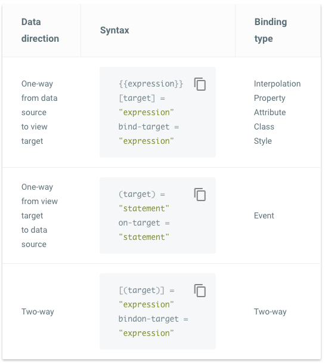

## Angular2가 낯선 이유

TypeScript를 기본으로 개발하는 Angular2가 생소하게 느껴지는 것은 당연한 일 일지도 모른다. 하지만, 그것보다 Angular2가 더 낯설게 느껴지는 이유는 Angular2에서만 사용하는 이상한 기호들(`[], (), [()], *, #`) 때문이다.

## Binding

angular1의 장점이 Two-way binding이자, 단점 또한 Two-way binding이다. Two-way binding으로 사용성은 증가했지만, 이로 인해, 성능의 단점이 생기게 된 것이다.
Angular2에서는 이러한 단점을 줄이고자, 이상한 기호들(`[],(),[()]`)을 이용하여 다양한 binding을 제공한다.



### One-way binding

- model에서 view로의 One-way binding은 `{ {} }, [], bind-target`을 사용한다.
- view에서 model로의 One-way binding은 `(), on-target`을 사용한다. 주로 이벤트가 그 대상이다.

### Two-way binding

- model과 view의 Two-way binding은 `[()], bindon-target`을 사용한다.

> 참고URL : https://angular.io/docs/ts/latest/guide/template-syntax.html#!#binding-syntax

## \* (star)

Angular 예제에서 처음 접하게되는 `*ngFor`의 예는 그냥 쓰이기에는 쉬운 것 같지만, 왜 `*`를 붙이지라고 생각해보면 꽤 이상하다는 것을 느낄 수 있다.
angular에서는 데이터를 순환하여 화면에 표현하고자 한다면 다음과 같이 작성한다.

```html
<div *ngFor="let hero of heroes">{{hero.fullName}}</div>
```

`*`는 사용하기 쉽게 쓰기 위한, sugar code이다. ngFor, ngIf, ngSwitch와 같이 DOM 변경이 필요한 디렉티브인 경우에는 `template` 디렉티브를 사용 한다. 즉 위의 코드는 다음과 같이 사용한다.

```html
<!-- template 디렉티브 property 로 값을 전달 -->
<div template="ngFor:let hero of heroes">{{hero.fullName}}</div>
```

또는

```html
<!-- template 디렉티브에 직접 값을 전달 -->
<template [ngFor]="let hero of heroes">
  <div>{{hero.fullName}}</div>
</template>
```

하지만, `*`를 사용하면 다음과 같이 간단히 사용할 수 있다.

```html
<div *ngFor="let hero of heroes">{{hero.fullName}}</div>
```

> 참고URL : https://angular.io/docs/ts/latest/guide/template-syntax.html#!#star-template

## # (sharp)

Angular2에서 보는 다음 코드역시 낯설다.

```html
<input #box (keyup)="0" />
```

우선 여기서 #은 CSS Selector에 익숙한 사용자라면, 아이디를 지정하는 것인가? 라고 생각할 수 있겠지만, 실제 이 `#`의 의미는 다르다.

`#box`는 `템플릿 내에서 사용하는 input 엘리먼트 인스턴스 자신을 가리키는 변수이다`. 즉, `Template reference variables` 이다.

```html
<p>{{box.value}}</p>
```

따라서, 위와 같이 사용하면, input 엘리먼트. 즉, [HTMLInputElement](https://developer.mozilla.org/en-US/docs/Web/API/HTMLInputElement)의 value를 가리킨다.

다만, 여기서 주의할 것은 Template reference variables는 바인드가 되어 있지 않으면, 사용할 수 없다.
따라서, 위의 코드 처럼 keyup 이벤트에 가장 간단한 표현인 `"0"`을 의도적으로 바인딩 시킨다.

실제 템플릿 코드는 다음과 같이 사용할 수 있다.

```html
<input #box (keyup)="0" />
<p>{{box.value}}</p>
```
