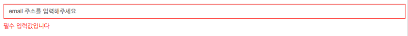

Angularjs 1.x Validation Angular는 기본적으로 client validataion을 제공 (required, email, minlength, maxlength, pattern, …) 하고 있다.

https://docs.angularjs.org/guide/forms



하지만, angular의 validation은 생산성이 좋다고 이야기하는 angular의 장점에 비해, 상당히 번거로운 작업을 요구한다.

다음은 input 필드에 대한 email validation을 처리하기 위한 방법이다.

```html
<form name="userForm" novalidate>
  <!-- 2. validation 상태에 따라 에러여부를 표현하기 위한 작업 -->
  <div
    class="form-group"
    ng-class="{ 'has-error': userForm.email.$touched && userForm.email.$invalid }"
  >
    <input
      type="email"
      name="email"
      class="form-control"
      placeholder="email 주소를 입력해주세요"
      ng-model="vm.email"
      required
    />
    <!-- 1. validation 상태에 따른 에러별 메시지 처리 작업 -->
    <div ng-messages="userForm.email.$error" ng-show="userForm.email.$touched">
      <p class="text-danger" ng-message="maxlength">
        100자 이내로 입력해주세요
      </p>
      <p class="text-danger" ng-message="required">필수 입력값입니다</p>
      <p class="text-danger" ng-message="email">
        유효한 이메일 주소를 입력해주세요
      </p>
    </div>
  </div>
</form>
```

입력 필드 영역을 제외하고도, validation을 체크하기 위해서는
에러 메시지를 에러 유형에 따라 처리해야한다.
validation 여부에 따라, ng-class를 이용하여 필드의 클래스를 지정해줘야한다.
꽤 간단한 작업이지만, 꽤 반복적이고, 꽤 버그가 유발되기 쉬운 작업을 해야한다.
이를 위해서 이미 검증(?)된 모듈을 기준으로 적합한 오픈소스 3개 (angular-validation, angular-validator, angular-auto-validate)를 찾아 보았다. 대부분 1) 에러 메시지 처리, 2) ng-class에 대한 클래스 처리를 자동으로 지원한다.

## angular-validation (github star:535)

https://github.com/huei90/angular-validation

github star 수가 가장 많은 angular-validation 은 사람들의 선호도와 같이, 많은 기능이 내장되어 있다.
기본적으로 url, email, number와 같은 validation rule이 포함 되어 있으며, 손쉽게, 다른 validation rule을 작성하여 추가할 수 있다.
반면, angular에서 지원하는 validation형식이 아닌, validator, validation-submit, validation-reset과 같은 directive 를 지원하여, 또다른 학습 비용이 필요하다.

```html
<form name="userForm" novalidate>
  <div class="form-group">
    <input
      type="email"
      name="email"
      class="form-control"
      placeholder="email 주소를 입력해주세요"
      ng-model="vm.email"
      validator="required, maxlength, email"
    />
  </div>
</form>
```

## angular-validator (github star:159)

https://github.com/turinggroup/angular-validator
3개 오픈소스 중 github star 수가 가장 작지만, 딱 필요한 기능만 작성해 놓은 validator이다.
angular의 required 속성과 같은 인터페이스를 이용할 수 있고, validate-on, validator, invalid-message, required-message 와 같은 추가 directive도 지원한다.
angular-validation에 비해 가볍지만, 마찬가지로, 별도의 학습 비용이 필요하다. 또한, 에러 메세지 처리를 일괄적으로 관리할 수 없는 단점이 있다.

```html
<form name="userForm" novalidate angular-validator-submit="submitMyForm()">
  <div class="form-group">
    <input
      type="email"
      name="email"
      ng-model="vm.email"
      validator="vm.myValidationFunction(vm.email) === true"
      invalid-message="vm.myValidationFunction(vm.email)"
      required-message="vm.myValidationFunction(vm.email)"
      required
    />
  </div>
</form>
```

## angular-auto-validate (github star:265)

http://jonsamwell.github.io/angular-auto-validate/

angular-validation과 같이 많은 기능을 제공하지만, angular의 인터페이스를 그대로 쓸수 있다. 따라서, 별도의 학습비용이 발생하지 않는다.
따라서, 추가적인 custom validation은 angular 인터페이스와 같이 필요하다면 별도의 directive를 구성해야만 한다. angular-auto-validate은 이에 따른 에러메시지만 추가적으로 일괄 관리한다.
상세 구현 방법은 공식페이지의 데모를 참조한다.

```html
<form name="userForm" novalidate>
  <div class="form-group">
    <input
      type="email"
      name="email"
      class="form-control"
      placeholder="email 주소를 입력해주세요"
      ng-model="vm.email"
      required
    />
  </div>
</form>
```

## 결론

| 기능                        | angular-validation | angular-validate   | angular-auto-validate    |
| --------------------------- | ------------------ | ------------------ | ------------------------ |
| 에레메시지 관리             | 일괄관리가능       | X                  | 일괄관리가능             |
| angular 인터페이스사용 여부 | X                  | 부분사용           | O                        |
| async validation            | O                  | X                  | O                        |
| custom validator            | O(자체 정의)       | 함수형태 정의 가능 | angular의 directive 사용 |

> angular의 validation을 사용하고자 한다면, angular-validation과 angular-auto-validate 중 선택하라.

Custom validator를 많이 관리해야한다면, angular-validation이 더 사용하기 편하고, angular의 인터페이스를 그대로 사용하고, 에러 메시지에 대한 처리를 좀 더 손쉽게 이용하고자 한다면, angular-auto-validate을 사용하기를 권한다.
