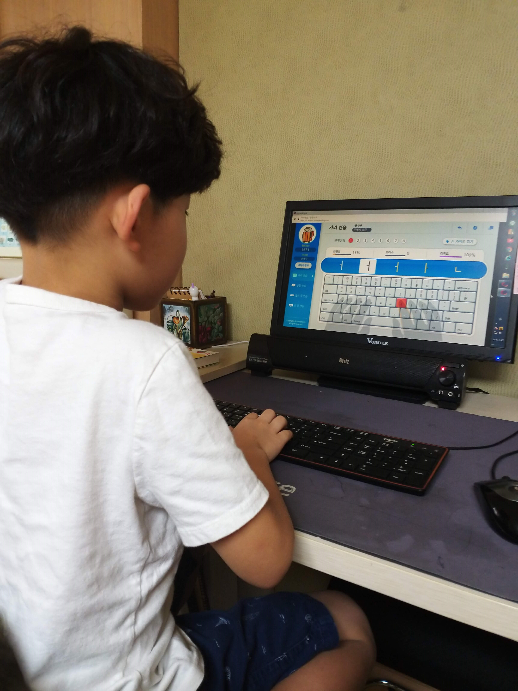
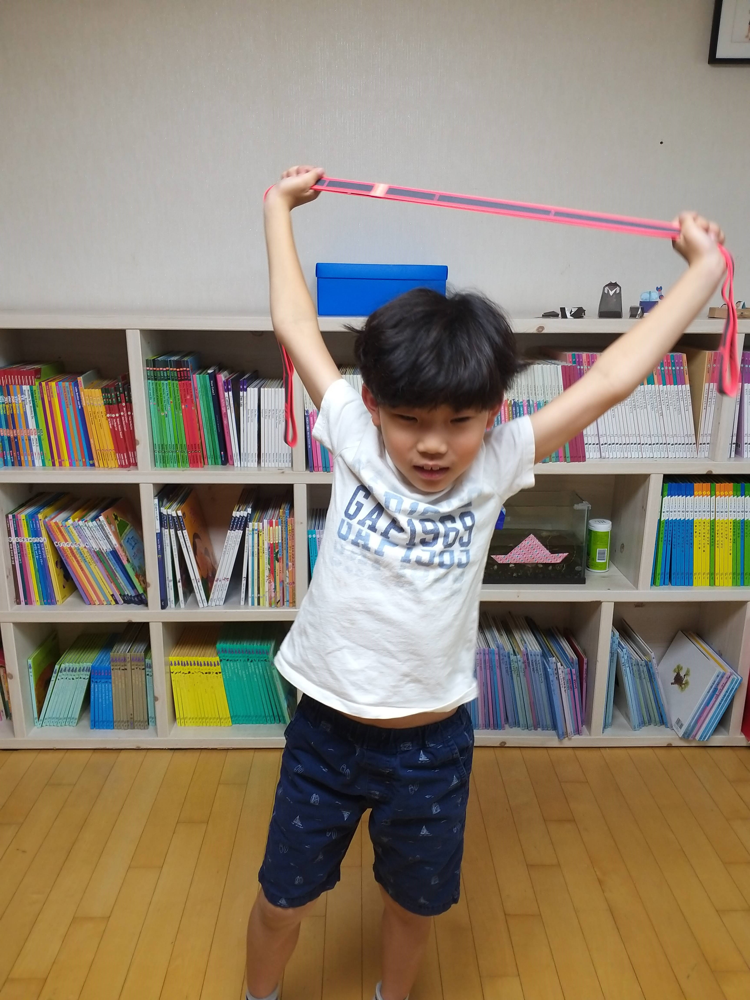

## 사부와 제자

무술 영화를 보면 사부가 취하는 전형적인 모습이 몇가지 있다.

그 첫번째로 `제자를 고르는 사부의 안목`이다.

사부는 하나를 알려주면 열을 깨우치는 `재능이 있는 사람`을 제자로 두지 않는다. 오히려 재능은 조금 떨어지더라도 `심성이 착하고 이타적인 우직한 사람`을 제자로 삼는다. 그때 당시영화를 볼 때에는 권선징악과 같은 교훈적인 면을 다루기 위한 설정이라고만 생각했었다.

하지만 나도 경험이 쌓이고 사람들을 보다보니 왜 그런 사람을 제자로 선택하는지는 조금은 알 것 같다.

> 뭐니뭐니 해도 `인성과 태도`이다.

두번째로는 `제자의 수련 과정`이다. 사부는 제자에게 처음부터 무술을 가르치지 않는다. 물동이 기르는 일만 몇 년을 시키거나 집안 일부터 궂은 일만 계속 시킨다.

결과적으로 사부의 이런 수련과정을 통해 제자는 무술을 배우기 위한 `기초 체력`을 기른 것 뿐만아니라 `인성과 함께 인내심`도 성장하게 된다.

<!-- more -->

## 유아코딩

왜 이렇게 서두가 길었냐하면?

요즘은 초등학교때부터 코딩 수업을 학교에서 한다고 한다. 요즘 아이들은 똑똑해서 잘 할수 있을지 모르겠지만 어렸을때 코딩을 해본 경험에 비추어 봤을때 이게 정말 맞는 건가? 라는 생각이 든다.

난 어렸을때 빌게이츠 같은 프로그래머가 될거라는 꿈을 나도 모르게 꾸었다. 아쉽게도 내 주위 사람들은 이쪽 분야에 대해 알고 있는 분들이 없었기에 난 책을 통해 그 세계를 조금이나마 엿볼수 있었다.

그런데 그때 정말 어려웠다. 내가 머리가 나빴던 것도 한 몫했겠지만...

프로그래밍이라는게 기계적인 면은 익히기 쉽지만. `추상화`라는 개념이 뒷받침이 되지 않으면 다음 단계를 나갈 수가 없다.

`추상화`라는 개념에 대한 이해가 명확해야 `깨달음(?) 같은 것`을 얻게된다.

그런데 그 때 당시 나는 정말 뭔소리인지 몰랐다. 그냥 책에서 나온 것을 따라하는게 전부였다.

요즘 아이들이 똑똑하다고 하더라도...

오조봇, 스크래치와 같은 것을 익히면서 프로그래밍을 잘 배울수 있을까?

사실 나도 우리 아이에게 안가르쳐 봐서 잘 모르겠다.

그래서 한번 가르쳐 보려고 한다.

왜?

코딩 열풍에 참여하기 위해서?

아니 `아이와 아빠와의 시간을 가져보기 위해서`이다.

회사일이 바쁘다고 예전과 같이 놀아주지 못하는 아빠로서 미안하기도 하고 아이 교육에 신경쓰고 있는 와이프에게도 조금은 도움을 주고 싶은 생각으로 시간이 날때마다 쪼금씩 가르쳐보려고 한다.

### 아빠와 아들

내가 어렸을 때 프로그래머가 되고 싶었던 이유는 게임을 좋아하다보니, 게임을 만들고 싶다는 생각이 강해서 였다.

내가 만들면 더 잘 만들것 같고, 그런 일들이 재미있을 것 같았다.

다행인지 모르겠지만 우리아이가 게임을 좋아한다. 안타까운건 와이프는 게임을 극도로 싫어하는 것이 우리아이에게는 불행한 운명(?)이지만...

뭐 그래도 아빠가 프로그래머니 위안을 삼아보자. ㅋ

무술영화에서처럼 제자를 고를 수는 없으니 바로 두번째 단계인 기초 체력 부터 기르는 연습을 하기로 했다.

이름하여 **타자연습!**

> 연장에 익숙해야 뭘해도 잘한다.

작은 것 하나라도 잘하면 흥미가 생기고 자신감이 생기고 그 자신감을 가지고 더 힘든 다음 단계를 넘어 갈 수 있다.

이런 작은 것들이 모여서 **긍정적인 시각**을 만들고 더 앞으로 나가게 된다.

어렸을때 했던 한컴타자연습이 아직까지도 있었다. 더군다나 웹으로 회원 가입만 하면 꽁짜로 제공했다.

안쓸 이유가 없다 ㅋ

https://typing.malangmalang.com/

자리 연습 1~6단계까지 30분정도 걸렸다.

열심히 했으니 오십견 방지를 위한 스트레칭도 가르치고.

동기 부여를 위해

**브롤스타즈**도 30분 함께 했다. ㅋ

다음에는 shift가 있는 자리 연습 7~8 까지 완료하고 계속 반복학습하기!
