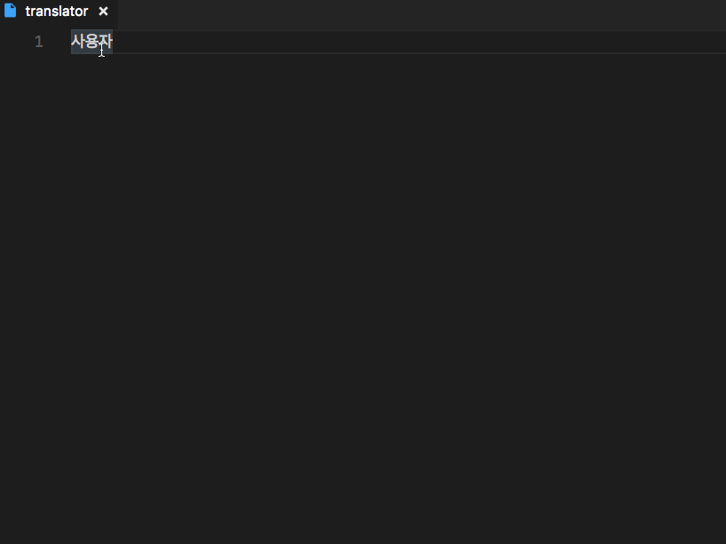
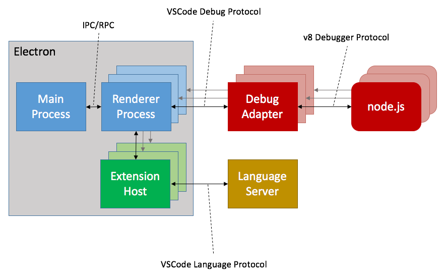
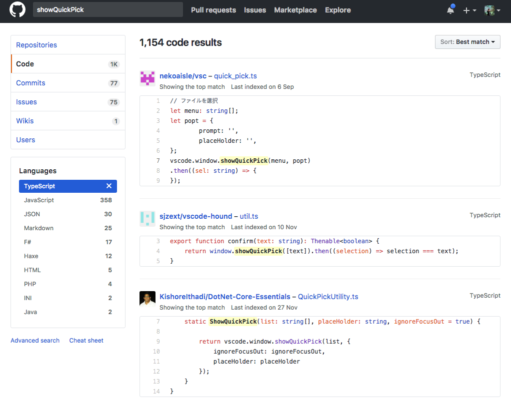
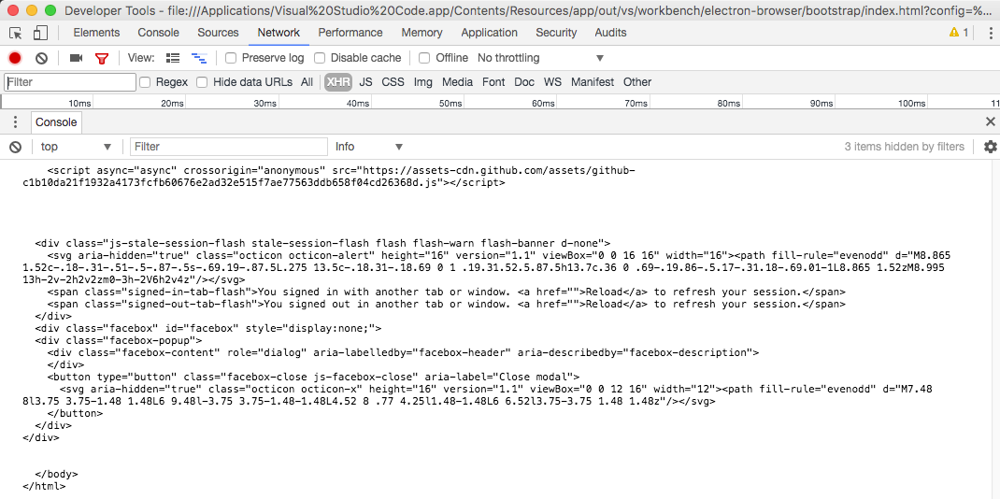

MS에 기여한게 없어서 뭔가 해봐야겠다는 생각에
그동안 만들고 싶었던 vscode extentions을 만들어 봤다.


https://marketplace.visualstudio.com/items?itemName=sculove.translator

한글을 번역할 때는 번역된 텍스트에 적용할 수 있는 접두사가 적용된 메서드의 이름을 보여주는 기능도 넣었다.



## 왜 만들었나?

김지한(laziel)군과 윤종문(문)군이 이런거 있으면 좋겠다고 이야기해서 만들기 시작하긴 했는데...
따지고 보니 내가 더 필요한 것 같았다.

우리가 개발할 때 항상 켜놓고 보는게 사전과 번역기다.
change와 update, alter등 우리말로는 다 `변화하다`라는 의미인데 실제 영어는 각각이 의미하는 바가 다르다. 따라서 매번 변수명, 메소드명 짓는데 시간을 낭비한다.
그때 기분에 따라 또는 떠오르는 것에 따라 정하다보니 나중에 코드를 보면 의미가 불명확해서 내가 봐도 헷갈리게 된다.
더군다나 같이 개발하는 사람들또한 헷갈리다보니 나중에 가서는 더.더.더. 헷갈린다.

그래서 사전을 보거나 번역을 하는데. 이게 의외로 시간이 좀 걸린다.

## VSCode Extention 구조에 대한 회고

사실 만든 코드는 많지 않지만, 우선은 vscode extentions에 대한 학습이 필요했기에 틈틈히 관련 내용을 살펴봤었다.

MS가 문서화 하나는 정말 잘해 놓은것 같아서 사실 보기에는 꽤 편했다.
내가 참조한 문서는 여기 [overview](https://code.visualstudio.com/docs/extensions/overview) 문서를 시작으로 [vsdoe namespace API](https://code.visualstudio.com/docs/extensionAPI/vscode-api) 문서까지 봤다.
예상대로 vscode의 extension은 command 패턴으로 되어 있어서 커멘트 단위로 짜서 등록을 하고 쓰는 식이 었다.

약간 특이한 점은 [contribute points](https://code.visualstudio.com/docs/extensionAPI/extension-points)가 있어서 `템플릿 메타 프로그래밍`이 가능하다. 정의된 항목에 정의된 정보를 입력하면 코딩이 된다. 이것도 MS가 예전부터 지향했던 방식 중의 하나라 개발하기에는 편했다. 개인적으로는 메타 프로그래밍과 의 적정한 수준을 유지한게 좋았다.

다음으로 특이한점은 Language Server가 있었다.
처음에는 Language Server라 길래 언어작업을 할때 쓰는 것인가로 생각했는데 알고보니 `비용이 많이 발생하는 작업을 서버에서 처리 후 VSCode Language Protocol로 전달하는 형태`였다.
이건 좀 괜찮은 방식인것 같다. 내가 만들 extention과는 관련이 없지만 나중에 좀 복잡한 것 만들때는 한번 만들어봐야겠다.


## 만들면서 내가 한 삽질은?

### 아쉬운 점은 API문서가 좀 빈약했다.

아마도 typescript를 이용해서 타입 정의와 설명 정도를 뽑았던것 같다.
사실 이 정도도 훌륭하지만 간단한 예제코드가 있었으면 더 좋았을것 같다.
결국 직접 코딩을 해보면서 확인해 보거나, 그것이 안된다면 github 검색을 이용해서 찾아봤다.
github가 의외로 좋은 코드조각들을 보여줬다.



### vscode는... 노드입니다.

vscode가 electron에서 돌다보니 우선 기본적으로 node 환경이다.
브라우저 개발에 익숙하다보니 그냥 브라우저인가 보다 하고 작업하다가 나중에 깨닫게(?) 되서 약간 어이가 없는 삽질을 했다. (Document를 너무 설렁 설렁봤다 ㅠㅠ)
사실 이렇게 헷갈린 이유는 extentions이 돌아가는 곳에서 devTool를 볼수 있기 때문이다.



암튼 이로 인해 브라우저 환경으로 착각하고 fetch API를 써봤지만 안되서 삽질을 좀 했다.
devtool에서는 분명 fetch API를 사용할 수 있는데 정작 코드에서는 에러가 나서 난감했다.

환경이 node라는 것을 알았으나, 처음에 fetch를 사용하고자 했던 마음을 접을 수가 없어서 결국 [isomorphic-fetch](https://github.com/matthew-andrews/isomorphic-fetch)을 사용했다.
나중에 알게된 거지만 [electron-fetch](https://www.npmjs.com/package/electron-fetch)를 썼으면 더 좋았을 뻔 했다.
[FormData](https://developer.mozilla.org/ko/docs/Web/API/FormData)도 있고 여러가지 쓸 수 있어서 좋아보였다.
담에 코드 수정할때 함 바꿔봐야겠다.

### 아~ typescript

typscript 설정에서 좀 해멨던것 같다. 어떻게 보면 이것도 node 환경을 인지못해서 난 불상사지만 아니었다고 해도 좀 헤멜수는 있다.
vscode가 만들어 주는 tsconfig.ts는 `target`이 es6이고, `lib`도 es6만 명시되어있다.

```ts
{
    "compilerOptions": {
        "module": "commonjs",
        "target": "es6",
        "outDir": "out",
        "lib": [
            "es6"
        ],
        "sourceMap": true,
        "rootDir": "src"
    },
    "exclude": [
        "node_modules",
        ".vscode-test"
    ]
}
```

이렇게 직접적으로 `lib를 지정하면 문제는 딱 지정한 그것만 포함된다.`
lib가 지정되어 있지 않으면 타겟에 따라 기본적으로 추가되는 lib가 다르다.

> https://www.typescriptlang.org/docs/handbook/compiler-options.html
>
> - target ES5인 경우 `DOM,ES5,ScriptHost`이 자동 추가
> - target ES6인 경우 `DOM,ES6,DOM.Iterable,ScriptHost`이 자동 추가

따라서 DOM 관련된 API를 사용하면 타입 에러가 난다.

그런데 문제는 fetch API를 쓰려고 DOM을 추가하면 vscode가 바로 반영이 안된다. 자꾸 타입에러가 난다.
이때 결론은 `vscode를 껐다가 다시 부르면 된다.`
아~ 이것 때문에 잘못 설정한줄 알고 삽질을 많이함 ㅠㅠ

## 소감?

개발자가 만들기에는 꽤 괜찮은 vscode extentions.  
생각보다 쉽게 만들수 있었다.
좀 아쉬운 점은 custom UI를 만들수가 없다. 그냥 간단한 view를 보여주고 싶은데 사실 관련 API를 찾지 못했다.
아마도 정형화된 UI를 제공하기 위한 포석일수도 있을것 같다.
그래고 좀 뷰만 잘되는 UI라도 하나 있으면 좋겠다.

다름에 또 아이디어가 있으면 한번 더 만들어보고 싶다.

## 참고한 예제

- https://code.visualstudio.com/docs/extensions/example-word-count
- https://github.com/Microsoft/vscode-MDTools : vscode.window.showQuickPick, QuickPickItem, TextEditor 사용 예
- https://github.com/Microsoft/vscode-extension-samples
