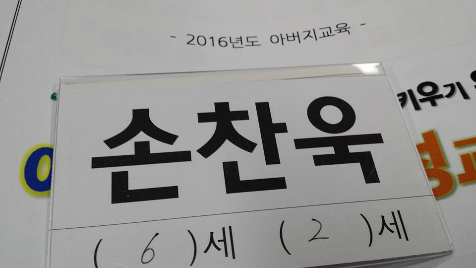
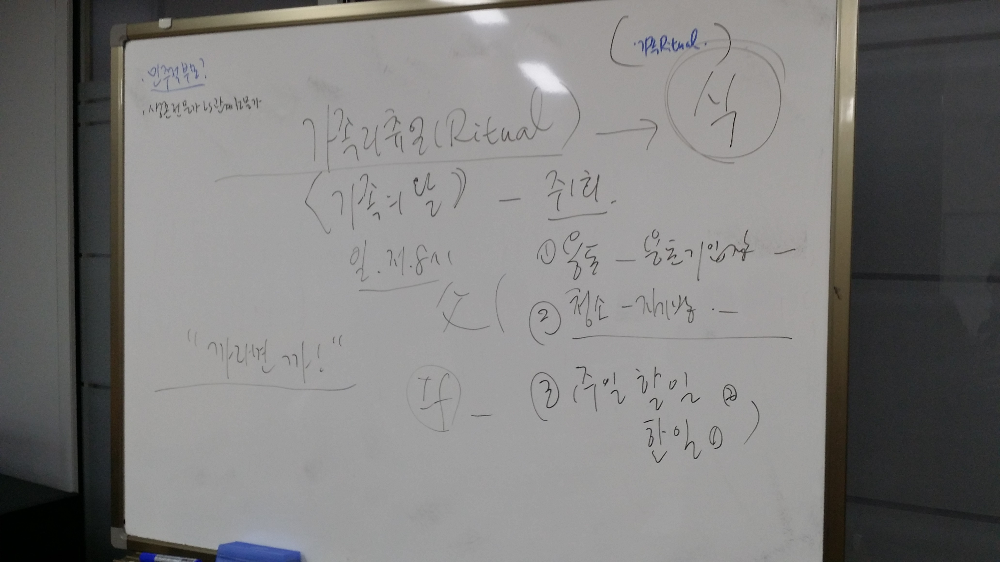

시에서 하는 아버지 교육을 다 받으면, 토요일 아들과 함께 하는 행사에 참여할수 있다고 하여, 4주간의 아버지 교육을 들으러 갔다.

강사님이 처음에는 아버지 권위에 대한 이야기를 하길래
뭐 이런 꼰대 교육을 하나 하는 생각을 했지만. 듣다보니.
현대 사회에서 가장의 권의가 얼마나 떨어졌는지.
현대 사회에서 요구되는 남편,남자의 역할이 아버지의 역할인지?
다시 한번 생각해 보는 계기가 되었다.

1. 아빠는 친절하고, 아이들과 함께 놀고, 아이들을 챙겨주는 일이 요즘 아빠들의 일인가? 어느정도는 맞다고 생각한다. 하지만, 강사님 이야기로는 이건 부수적인 아버지의 일. 즉, 엄마와 가족을 도와주는 일이라는 것이다.
   이러한 도움은 가정적인, 좀더 친화적인 가족구성에는 도움이 되지만 `진정한 아빠의 역할은 아니다`라는 것이다.

2. 가장 좋은 부모는 "Yes"와 "No"를 명확히 말하는 부모. 두번째는 "No"만 말하는 부모. 세번째는 "Yes"만 말하는 부모. 아마 난 세번째 부모에 더 가까운것 같다. 아이에게 아니라고 이야기할 수 있는 아빠가 되야할 것 같다.

3. `아이의 눈높이를 맞춰라`는 미국식 교육은 아이가 어느정도 성장한 후에 적합하다. 그 전 까지는 아이가 부모의 눈높이를 맞추도록 하는게 바람직하다. `아이에게 공감하고, 아이의 의견을 듣는 것은 바람직하나, 아이에게 전적으로 결정을 맡기는 것은 어린나이에는 적합하지 않다.`

4. 어린아이에게 보상은 물질적인 보상. 즉, A하면 B를 준다는 보상이 오히려 더 적합하다. 하지만, 아이가 성장했을 때는 물리적인 보상보다는 내적인 보상을 하는게 좋다. 어렸을 때는 심부름을 했을 때 용돈을 주고, 초등학생 정도 되면, 심부름을 했을 때, "우리 예준이는 심부름을 정말 잘하는 구나. 아빠가 예준이 덕에 많은 도움이 된다"라고 내적으로 존중받는 느낌이 드는 보상을 해주는 게 좋다.

5. 건강한 가장의 권위를 세우는 첫번째 일. `가족 리추얼 (Ritual)` 리추얼은 식. 즉, 격식. 가장의 일은 `가족의 제사장`.

- 아빠 주관하에 주 1회 가족모임을 갖는다.
- 아빠 주관하에 1주일 한일, 1주일 할일을 순서대로 이야기한다.
- 행사 전에, 아빠 주관하에 청소를 한다. 청소의 검사는 아빠가 한다.
- 아빠가 용돈을 나눠준다. 이때, 청소상태 및 한주간의 결과에 따라 아빠가 판단하여 성과를 배분한다. 만약, 하지 않을시에는 단호히 추진한다.

저녁 늦게 모인 아버지 20여분과 이런 저런 이야기를 하다 보니.
참 좋은 아빠들도 많고, 다들 비슷한 고민을 하는 구나라는 생각도 들었다.
그냥 애랑 놀기 위한 행사 참여를 위해, 나왔는데.
의외로 많은 것은 얻어갈것 같다.
다음 3주가 기대된다.
