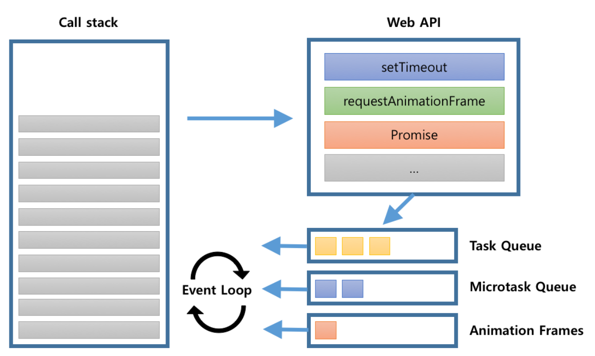
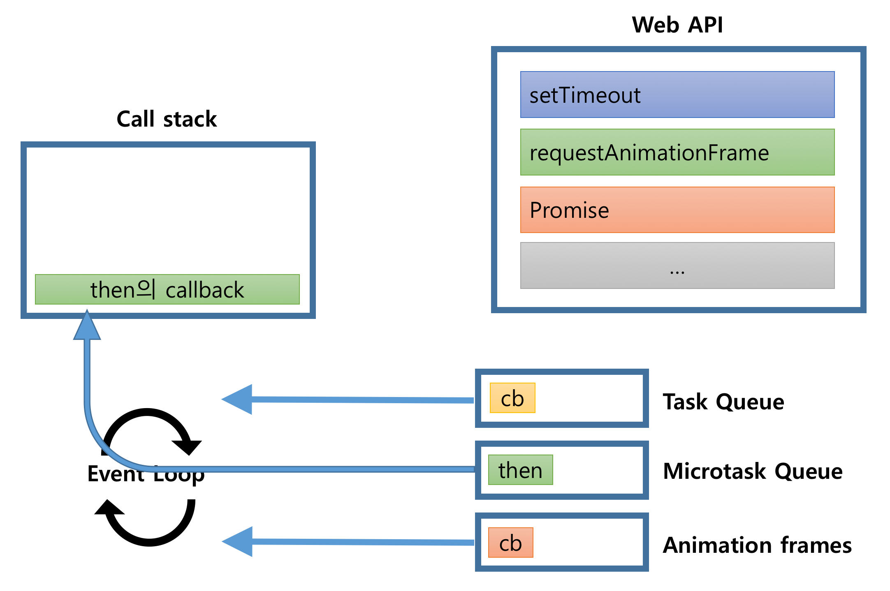
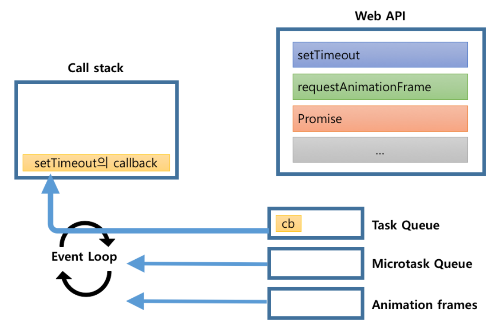

오늘 소개할 부분은 작성 중인 책의 "부록" 중 일부이다.
이 장에서는 RxJS Scheduler를 잘 사용하기 위해서 이해해야할 `자바스크립트 비동기 처리 과정`을 살펴본다.

RxJS를 모르는 사람이라도 `자바스크립트의 비동기 처리과정`을 이해하면 자바스크립트를 개발하는데 정말 많은 도움을 준다.
더 자세한 내용은 다음 URL을 참고하여 꼭! 읽어보기 바란다

**참고 URL**

- https://jakearchibald.com/2015/tasks-microtasks-queues-and-schedules/
- https://blog.sessionstack.com/how-javascript-works-event-loop-and-the-rise-of-async-programming-5-ways-to-better-coding-with-2f077c4438b5
- https://blog.risingstack.com/writing-a-javascript-framework-execution-timing-beyond-settimeout/

---

# 부록. RxJS Scheduler와 자바스크립트 비동기 처리 과정의 이해

RxJS Scheduler는 RxJS에서 자바스크립트의 비동기 작업을 효과적으로 처리할수 있도록 도와주는 역할을 한다.
따라서, RxJS Scheduler를 잘 활용하기 위해서는 기본적으로 `자바스크립트 엔진이 어떻게 비동기 작업을 처리`하는 지를 알면 RxJS Scheduler를 사용하는데 많은 도움이 된다.

이 장에서는 자바스크립트 엔진이 어떻게 비동기 작업을 처리하는 지를 살펴보고, 각 비동기 작업에 해당되는 RxJS scheduler는 어떤 것이 있는지 살펴보기로 하자.

## 자바스크립트 엔진

자바스크립트 엔진은 기본적으로 하나의 쓰레드에서 동작한다. 하나의 쓰레드를 가지고 있다는 것은 하나의 stack을 가지고 있다는 의미와 같고, 하나의 stack이 있다는 의미는 `동시에 단 하나의 작업만을 할 수 있다`는 의미이다.

자바스크립트 엔진은 하나의 코드 조각을 하나씩 실행하는 일을 하고, 비동기적으로 이벤트를 처리하거나 Ajax 통신을 하는 작업은 사실상 Web API에서 모두 처리된다.



자바스크립트가 동시에 단 하나의 작업만을 한다는데 어떻게 여러가지 작업을 비동기로 작업을 할수 있을까?  
그 비밀은 `바로 Event Loop와 Queue에 있다.`

## Event Loop 와 Queue

Event Loop에서 Loop의 사전적인 의미는 '반복. 순환'이다. Event Loop는 사전적인 의미처럼 계속 반복해서 call stack과 queue 사이의 작업들을 확인하고, call stack이 비워있는 경우 queue에서 작업을 꺼내어 call stack에 넣는다.
자바스크립트는 이 Event Loop와 Queue들을 이용하여 비동기 작업을 수행한다.
직접적인 작업은 Web API에서 처리되고, 그 작업들이 완료되면 요청시 등록했던 callback이 queue에 등록된다.  
Event Loop는 이 작업들을 Queue에서 꺼내어 처리한다.  
Event Loop는 stack에 처리할 작업이 없을 경우 우선적으로 microtask queue를 확인한다. microtask queue에 작업이 있다면 microtask에 있는 작업을 꺼내서 call stack에 넣는다. 만약 microtask의 queue가 비어서 더 이상 처리할 작업이 없으면 이때 task queue를 확인한다. task queue의 작업도 꺼내서 call stack에 넣는다.
이렇게 Event Loop와 Queue는 자바스크립트 엔진이 하나의 코드 조각을 하나씩 처리할 수 있도록 작업을 스케줄하는 동시에 이러한 이유로 우리는 자바스크립트에서 비동기 작업을 할수 있도록 해준다.

## 자바스크립트 처리 과정

다음 코드를 바탕으로 자바스크립트 처리과정을 살펴보자.

```js
console.log("script start");

setTimeout(function() {
  console.log("setTimeout");
}, 0);

Promise.resolve().then(function() {
  console.log("promise1");
}).then(function() {
  console.log("promise2");
});

requestAnimationFrame(function {
    console.log("requestAnimationFrame");
})
console.log("script end");
```

위의 코드를 실행하면 다음과 같은 결과 화면을 얻을 수 있다.

```
script start
script end
promise1
promise2
requestAnimationFrame
setTimeout
```

어떻게 이런 결과가 나왔을까?

간단해 보이는 이 코드는 실제 다음과 같이 처리된다.

1. 'script 실행 작업'이 stack에 등록된다.
2. console.log('script start')가 처리된다.
3. setTimeout 작업이 stack에 등록되고, Web API에게 setTimeout을 요청한다. 이때 setTimeout의 callback 함수를 함께 전달한다. 요청 이후 stack에 있는 setTimeout 작업은 제거된다.
   
4. Web API는 setTimeout 작업(0초 후)이 완료되면 setTimeout callback 함수를 task queue에 등록한다.
   
5. Promise 작업이 stack에 등록되고, Web API에게 Promise 작업을 요청한다. 이때 Promise.then의 callback 함수를 함께 전달한다. 요청 이후 stack에 있는 Promise 작업은 제거된다.
   
6. Web API는 Promise 작업이 완료되면 Promise.then의 callback 함수를 microtask queue에 등록한다.
   
7. requestAnimation 작업이 stack에 등록되고, Web API에게 requestAnimation을 요청한다. 이때 requestAnimation의 callback 함수를 함께 전달한다. 요청 이후 stack에 있는 requestAnimation 작업은 제거된다.
   
8. Web API는 requestAnimation의 callback 함수를 animation frame에 등록한다.
   
9. console.log('script end')가 처리된다.
10. 'script 실행 작업'이 완료되어 stack에서 제거된다.
11. stack이 비워있어서 microtask queue에 등록된 Promise.then 의 callback 함수를 stack에 등록한다.
    
12. 첫번째 Promise.then의 callback 함수가 실행되어 내부의 console.log('promise1')가 처리된다.
13. 첫번째 Promise.then 다음에 Promise.then이 있다면 다음 Promise.then의 callback 함수를 microtask queue에 등록한다.
    
14. stack 에서 첫번째 Promise.then의 callback 함수를 제거하고 microtask queue에서 첫번째 Promise.then의 callback 함수를 제거한다.
15. 두번째 Promise.then의 callback 함수를 stack에 등록한다.
    
16. 두번째 Promise.then의 callback 함수가 실행되어 내부의 console.log('promise2')가 처리된다.
17. stack 에서 두번째 Promise.then의 callback 함수를 제거한다.
18. microtask 작업이 완료되면 animation frame에 등록된 callback 함수를 꺼내 실행한다.
    
19. 이후 브라우저는 랜더링 작업을 하여 UI를 업데이트한다.
20. stack과 microtask queue가 비워있어서 task queue에 등록된 callback 함수를 꺼내 stack에 등록한다.
    
21. setTimeout의 callback가 실행되어 내부의 console.log('setTimeout')이 처리된다.
22. setTimeout의 callback 함수 실행이 완료되면 stack에서 제거된다.

> 처리 과정에 대한 자세한 사항은 다음 링크를 참조하기 바란다.  
> https://jakearchibald.com/2015/tasks-microtasks-queues-and-schedules/

꽤나 복잡한 과정이지만 꼭! 명심해야할 것이 있다.

- 첫째. 비동기 작업으로 등록되는 작업은 task와 microtask. 그리고 animationFrame 작업으로 구분된다.
- 둘째. microtask는 task보다 먼저 작업이 처리된다.
- 셋째. microtask가 처리된 이후 requestAnimationFrame이 호출되고 이후 브라우저 랜더링이 발생한다.

## RxJS Scheduler와 자바스크립트 비동기 작업의 종류

### Task

task는 비동기 작업이 순차적으로 수행될 수 있도록 보장하는 형태의 작업 유형이다. 여기서 순차적으로 보장한다는 의미는 작업이 `예약되어있는 순서를 보장한다는 의미`이다. task 다음에 바로 다음 task가 실행된다는 의미는 아니다. 위의 예처럼 task 사이에는 브라우저 랜더링과 같은 작업이 일어 날 수 있기 때문이다.
RxJS에서 task와 같은 형태의 작업을 하려면 [Rx.Scheduler.async](http://reactivex.io/rxjs/variable/index.html#static-variable-async) 스케줄러를 이용하여 구현할 수 있다.
실제 Rx.Scheduler.async는 setInterval을 이용하여 구현되어 있다.

```js
protected requestAsyncId(scheduler: AsyncScheduler, id?: any, delay: number = 0): any {
  return root.setInterval(scheduler.flush.bind(scheduler, this), delay);
}
```

### Microtask

microtask는 비동기 작업이 현재 실행되는 스크립트 바로 다음에 일어나는 작업이다. 따라서 task보다 항상 먼저 실행된다.
microtask로는 [MutationObserver](https://developer.mozilla.org/ko/docs/Web/API/MutationObserver)와 Promise가 이에 해당된다.
RxJS에서 microtask와 같은 형태의 작업을 하려면 [Rx.Scheduler.asap](http://reactivex.io/rxjs/variable/index.html#static-variable-asap) 스케줄러를 이용하여 구현할 수 있다.
실제 Rx.Scheduler.asap은 Promise로 구현되어 있다.

```js
protected requestAsyncId(scheduler: AsapScheduler, id?: any, delay: number = 0): any {
    //...
    return scheduler.scheduled || (scheduler.scheduled = Immediate.setImmediate(
      scheduler.flush.bind(scheduler, null)
    ));
  }

setImmediate(cb: () => void): number {
  // ...
  Promise.resolve().then(() => runIfPresent(handle));
}
```
