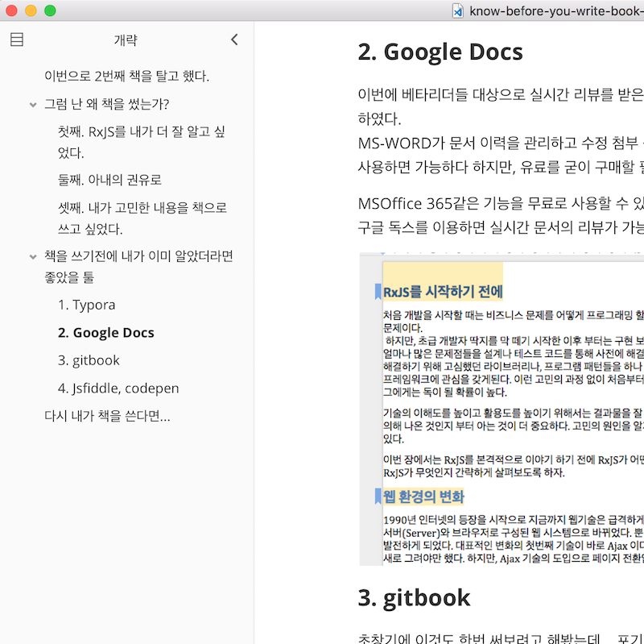
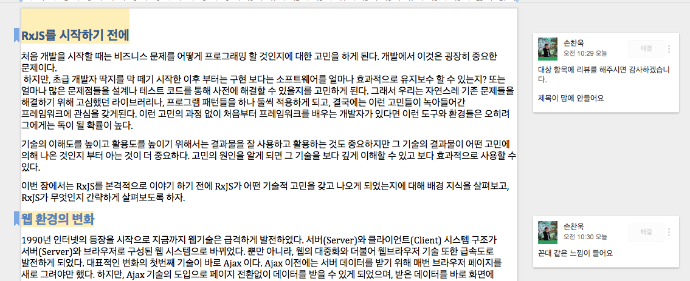
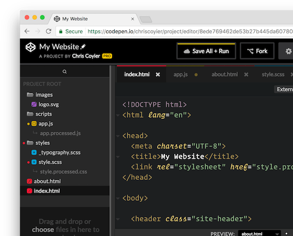

## 이번으로 2번째 책을 탈고 했다.

[첫번째 책](http://book.naver.com/bookdb/book_detail.nhn?bid=7434247)은 정말로 얼떨결에 썼던 것같다.

첫번째 책이 **'와 내가 저자가 되는거야?'** 라는 호기심과 영웅 심리(?)로 했었던 것이라면 이번 건은 진짜 써보고 싶어서 쓴 책이다. 그 만큼 시간도 많이 들어간 것 같고 열정도 많이 쏟았던 것 같다.
다만 아쉬움이 있다면. 생활고(?)에 힘들어서 책을 쓰는 기간이 너무 늘어났다는 것이다.
원래는 7개월 정도에 마무리 하려고 했지만 질질끌다보니 1년이 훌쩍 지나가 버렸다.
아마 처음 계획했던 것을 하려고했으면 아마 지금도 못 끝냈을 지도 모른다.

책을 쓰는 것은 많이 시간이 들고 집필의 압박감에 꽤나 고단하고 피곤한 작업이다.
돈을 벌수 있는 수단도 아니다.

물론, 초급자 대상의 책을 쭉쭉~ 뽑아내면 금전적으로 이득을 볼 수 있겠지만 나 같이 전문적인 기술 서적으로 돈을 번다는 것은 쉬운 일이 아니다.

특히나 RxJS와 같이 이해하고 어렵고 특수한 분야의 책으로 돈을 벌기는 더더구나 힘들다.

## 그럼 난 왜 책을 썼는가?

그러게 왜 썼을까? ㅋㅋ

우선 이 책을 쓰게 된 계기는

### 첫째. RxJS를 내가 더 잘 알고 싶었다.

강의도 마찬가지이지만 누군가에서 설명하고 가르치기 위해서는 많은 것을 확인해보고 검증해야한다. 더불어 내가 이해하지 않은 내용은 전달 자체를 할 수가 없다. 전달한다고 하더라고 듣고 있는 청자가 바로 눈치 챌 것이다. 그런데 글로 남는 책은 더더욱 그렇다. 사실 더욱 더 치밀하고 꼼꼼하게 확인해봐야한다.

### 둘째. 아내의 권유로

아내의 권유로 책을 쓰기로 마음을 먹었다. 아내 입장에서는 남편이 책을 쓴 저자라는게 꽤나 흐믓한 일인것 같았다. 아내도 책을 쓰는 시간을 도와준다고 확답(?)까지 했으니 나도 거절할 이유가 별로 없었다.

### 셋째. 내가 고민한 내용을 책으로 쓰고 싶었다.

첫번째 쓴 책은 내가 **경험한 것**을 주로 썼던 것이라면 이번 책은 **경험과 함께 고민이 함께 녹아들어간 책**이다. RxJS를 비동기 처리의 한 요소로만 바라보는 분들에게 설명을 해주고 싶었고, 내가 개발하면서 느꼈던 고귀함(?)같은 것을 전달해 주고 싶었다.

암튼 곧 출판을 곧 앞둔 이 시점에서 가장 마음에 드는 것은 이제 집에가서 책을 써야한다는 강박관념이 없어서 너무 좋다. 행복하다. 오히려 뭘해야하지? 라는 공허함도 든다.

책 쓰기 전에는 유투브를 보면서도 책을 써야한다는 생각에 앉아서 걱정하며 지냈는데 지금은 집에가면 너무 편하다.

잠시 이야기를 하다보니 내가 이 글을 쓰게된 이유를 망각했다.

이 글은 내가 책을 쓰기전에 알았더라면 더 좋았을 툴들을 몇가지 이야기해보고자 한다.

## 책을 쓰기전에 내가 이미 알았더라면 좋았을 툴

### 1. Typora

글을 쓸 때 주로 마크다운 문서로 작성을 했다. github 나 gitlab에서 MD파일 자체를 바로 불수 있었기에 꽤 편리했다. 하지만, 아쉬웠던 점은 마크다운 문서의 아웃라인이 잘 보이지 않아서 쓴 글을 몇번이고 쳐다보면서 고쳤던 경험이 있다.
아마도 [typora](https://typora.io/)라는 마크업 편집기를 사전에 썼다면 훨씬 유용했을 것 같다.
뿐만아니라 word, pdf와 같은 다양한 포맷으로 문서를 만들수 있어서 작성한 글을 다른 플랫폼으로 이전하기가 너~무 편하다.

### 2. Google Docs

이번에 베타리더들 대상으로 실시간 리뷰를 받은 적이 있는데 처음에는 github의 PR로 리뷰를 받다가 결국에는 [구글독스](https://docs.google.com/)를 이용하였다.
MS-WORD가 문서 이력을 관리하고 수정 첨부 등이 용이한 반면 온라인 기능을 바로 사용하기는 어렵다. 물론 MSOffice 365를 사용하면 가능하다 하지만, 유료를 굳이 구매할 필요가 있나싶다.

MSOffice 365같은 기능을 무료로 사용할 수 있는 툴이 있다. 바로 구글 독스이다.
구글 독스를 이용하면 실시간 문서의 리뷰가 가능하다. 베타리더의 의견을 받기에는 이것보다 좋은 것은 아직까지 못 본듯하다.

### 3. gitbook

초창기에 이것도 한번 써보려고 해봤는데... 포기.

사실 개인이 책을 쓰는 것이기 때문에 공개를 목적이 아닌 이상 gitbook은 오히려 번거로워서 사용하려다가 말았다. 만약 공개 책을 쓰거나 gitbook 유료 개정이 있다면 gitbook도 나쁘지 않은 선택인 것 같다.
지금은 초창기에 썼던 것보다 훨씬 더 괜찮아진 것 같다.

### 4. Jsfiddle, codepen

jsfiddle, codepen과 같은 온라인에서 소스 예제를 작성하기 좋은 사이트들이 있다. 처음에 나도 도입하려고 해봤는데 생각만큼 이력관리가 잘 안된다. 그리고 소스 수정하는게 꽤나 번거롭다.

암튼 이것도... 포기

## 다시 내가 책을 쓴다면...

와이프랑 아이에게 프로그래밍 가르치는 책을 한번 써보고 싶다는 생각은 있지만... 생각만 있을뿐 다음에 책을 쓸지는 모르겠다.

암튼, 만약 내가 다시 책을 쓴다면 아마 다음과 같이 작업을 할 것 같다.

1. 문서
   - 목차, 초안은 **<u>Typora</u>**로 로컬에서 마크다운 문서를 작성한다.
   - 이때 작성된 문서는 **<u>GitHub나 gitlab</u>**으로 관리한다.
   - 1차로 작성이 끝난 문서는 word형태로 변경하여 **<u>구글 독스</u>**에서 작업한다.
   - 문서 리뷰가 필요하다면 구글 독스의 공유기능을 이용하여 베타리뷰어의 리뷰를 받는다.
2. 소스
   - 온라인 소스 공유공간을 이용하지 않고 로컬에서 자유롭게 수정할수 있도록 작성한다.
   - **<u>GitHub나 gitlab</u>**을 이용하여 소스를 관리하고 PR을 통해 코드 리뷰를 받는다.

아니면...

그냥 돈을 주고 **<u>gitbook</u>**을 써볼 듯 하다. ^^;
