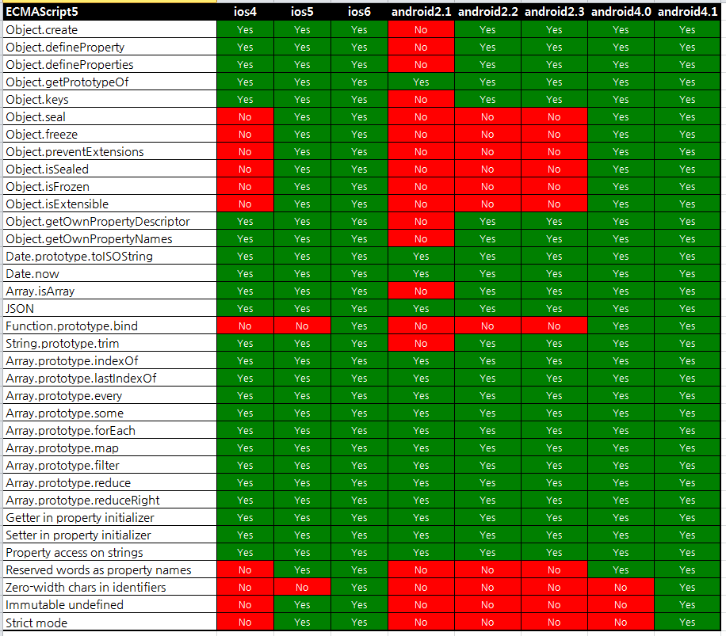

데스크탑 브라우저는 친절하게도
[http://kangax.github.io/compat-table/es5/](http://kangax.github.io/compat-table/es5/) 에 정리되어 있다.

근데.. 모바일은 상세 내역이 없어서 `실제 단말기`에서 확인하였음.

> **개. 노. 가. 대. 했음 허허허**

데스크탑과 동일한 기준으로 확인했음

> 갤노트 2.3은 특이하게 안드로이드 4.0대와 같은 ECMAScript5를 지원

---

> **결론적으로 iOS6, Android 4.1 이상에서부터는 ECMAScript 5를 맘껏 쓸수 있다~!**
