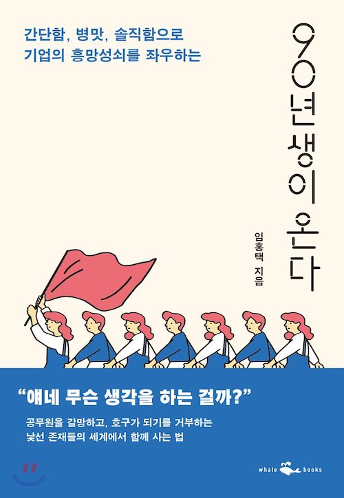
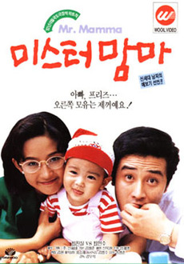
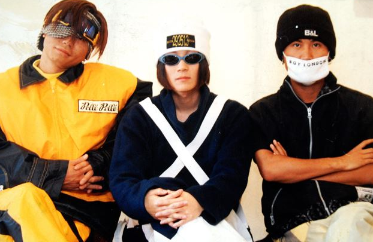

팀회식때 팀원이 나보고 '90년대생이 온다' 라는 책을 봐보란다.  
회식때 흘러들은 이야기들은 가급적이면 새겨(?)듣는 편이기에 바로 책을 사서 집에서 곰곰히 읽어봤다.  
사실 별 공감이 되지는 않았다.  
내가 이 책을 보면서 느낌 감정은 2가지 였다.  
첫째, 우선 내가 공감하지 못하는 것을 안 순간부터 아 `나 진짜 꼰대였구나.`라는 생각이 들었다.  
둘째, `아 이렇게 행동하고 생각하는게 90년대생들에게는 정상이구나` 라는 생각의 이해 정도.

<!-- more -->

그 순간 갑자기 몇일 전에 러닝머신을 달리면서 느낀 감정들이 함께 생각이 났다.  
러닝머신을 달리면서 티비를 보는데 `미스터 맘마`라는 옛날 영화가 나왔다.

고 최진실이 나오기도 하고 해서 반가운 마음에 계속보고 있는데 지금 생각하면 납득이 안되는 장면들이 그 시대에는 당연한 모습으로 표현되고 있었다.

간단히 설명하면.  
최민수가 아이를 홀로 키우고 있다.  
최민수가 직장후배인 최진실에서 애를 봐달라고 부탁한다. 그리고선 자기는 회식을 가지.  
이것도 어이가 없지만... 민수형이 밤새 연락도 없이 회식에서 술을 먹는동안,  
아이가 아파서 진실누나가 밤새 애를 본다.  
이때 보니 우리 애기 아팠을때 나랑 와이프가 애타게 보던게 생각나면서 셋째는 두번 다시는 안가져야지.  
내가 저걸 다 어떻게 했을까?  
지금 해라면 절대 못한다.  
등등등 정말 많은 생각들이 주마간산처럼 지나갔다.  
암튼, 진실 누나는 결국 아이를 병원 응급실로 데러간다.

진실누나는 그때까지도 애를 보고 있는 상황도 납득이 안가지만.  
더 가관은 최민수가 병원으로 와서는 다짜고짜 최진실 빰을 때린다.  
세상에나  
이게 가당키나 한 상황인가?

그때 볼때는 정말 아무렇지도 않았는데 시간이 흐르고 이 영화를 다시보니 이렇게 시대적인 충격을 받는게 신기했다.  
내가 아무렇지도 않게 느낀 시대가 변한 것에 놀랐고, 나도 모르게 나이가 먹은 나에게 다시 한번 놀랐다.

난 아직도 서태지 형 노래를 따라부르는 청년이라고 생각했는데  
생각하고 보니  
어렸을때 무심코 따라 불렀던 서태지 형아 노래가 이제는  
어렸을때 보았던 가요무대에서나 들릴 법한 노래가 되었다.  
'운동하는 사람은 빨리 죽는다'며 궁색한 변명을 늘어놓으면서 비아냥 거리던 시기는 지나고  
이제는 운동을 안하면 몸이 아픈 나이가 되었다.  
힘들어도 아이와 노는것이 신났던 아빠는 없고, 아이에게 궁색한 변명만 늘어놓는 중년의 아빠가 되었다.  
개발이 잼있어서 집에가라고 해도 남아서 개발하고  
집에 와서도 짜투리 시간에 개발하였던 내 열정도  
이제는 일이 많아서 일만하는 꼰대가 되었다.  
된장!

태지 형.  
형말 아직 유효한거죠?

> 우린 아직 젊기에  
> 괜찮은 미래가 있기에  
> 자 이제 그 차가운 눈물은 닦고  
> COME BACK HOME  
> YOU MUST COME BACK

