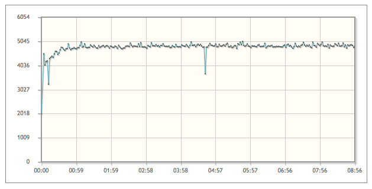
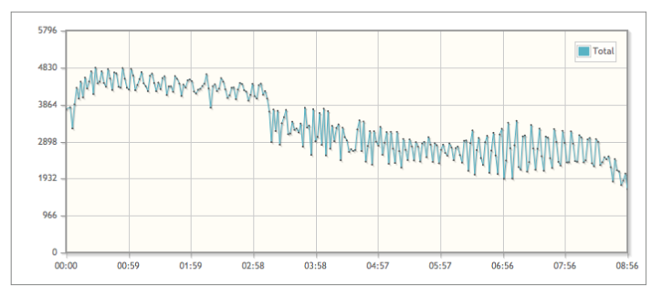
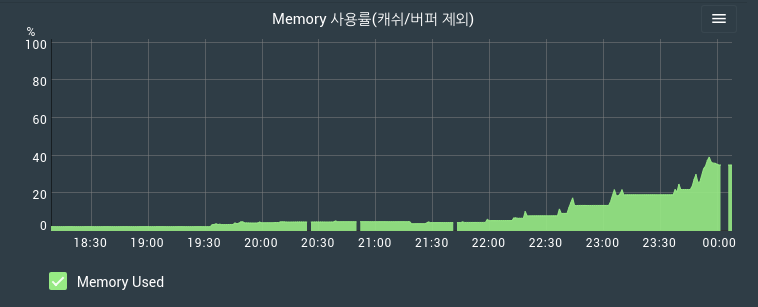
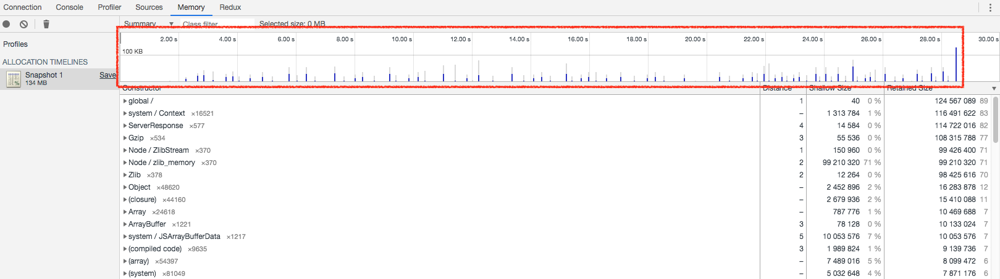
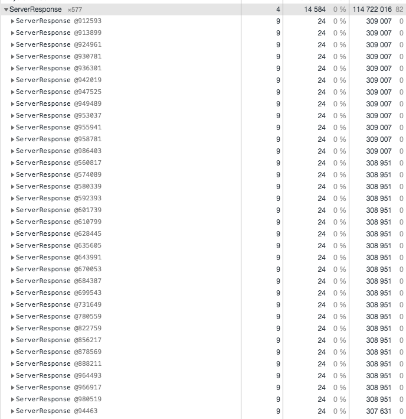
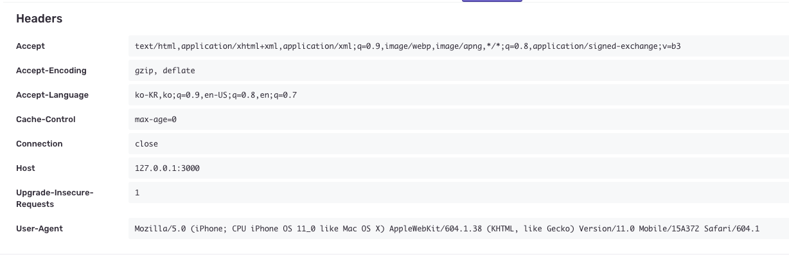

**Node 기반의 SSR(Server Side Rendering) 랜더링** 을 서비스에 도입하다 Memory Leak 이슈를 맞이했다.
Java 환경의 성능테스트를 준비하면 간혹 겪게되는 이슈이긴 한데. Node.js 도입 시작부터 memory leak 이슈가 튀어나와서 사실 당황스럽긴했다.

## Memory Leak 현상 감지하기

트래픽이 중요한 서비스다 보니 성능검증을 하지 않을 수 없었다.
보통 서버에 부하를 주게되면 최고 TPS를 찍은 후 유지된다. 요렇게.

그런데, 실제 부하테스트를 해보니 다음과 같은 TPS 그래프가 나왔다.

<!-- more -->

**시간이 지날수록 TPS는 떨어지고,**



**node instance가 사용하는 메모리도 점점 차올랐다.**



## 힙 메모리 프로파일하기

전형적인 `Memory Leak` 패턴이었다. 그래서 Profile을 해봤다.
**"Allocation instrumentation on timeline"** 을 이용하면 실시간으로 메모리가 릴리즈 되지 못하고 누적되는 것을 손쉽게 확인할 수 있다.


> Memory Leak을 찾는 방법에 대해서는 전에 작성한 다음의 발표자료를 참고해라.  
> <a href="../memory">Chrome Devtools를 이용한 Web Application Memory 분석법</a>

Profile의 상세 내역을 보면 클라이언트 요청시마다 생성되는 `ServerResponse` 객체가 누적되고 있는 것을 확인해 볼 수 있다.

찾았다. 요놈 ㅋㅋㅋ

## Memory Leak 제거하기

문제가 된 코드는 단 한줄의 코드였다.

```js
// The request handler must be the first middleware on the app
app.use(handlers.requestHandler());
```

> Sentry Express 적용 가이드 https://docs.sentry.io/platforms/node/express/

**express의 에러감지를 위해 적용해 놓은 sentry의 Sentry.Handlers.requestHandler 에서 Memory Leak이 발생**한 것이었다.

Sentry 코드의 내용을 확인해보면 Node.js의 domain 객체를 사용하는 간단한 코드로 구성되어 있다.

```js
export function requestHandler(options) {
  // ...
  const local = domain.create();
  local.add(req);
  local.add(res);
  local.on('error', next);
  local.run(() => {
    // ...
  });
}
```

> https://github.com/getsentry/sentry-javascript/blob/master/packages/node/src/handlers.ts#L233-L255

Node.js의 domain 객체에서 **Memory Leak**을 유발하는 코드가 있어서 위와 같은 문제가 발생한다.
[Node.js 11.10.0 릴리즈 노트](https://github.com/nodejs/node/pull/26098)를 확인하시면 [domain](https://nodejs.org/api/domain.html#domain_domain)의 Memory Leak 이슈가 해결된 커멘트를 확인해 볼 수 있다.

> [[60c5099f4b](https://github.com/nodejs/node/commit/60c5099f4b)] - domain: avoid circular memory references (Anna Henningsen) [#25993](https://github.com/nodejs/node/pull/25993)

> **Node.js 11.10.0에서는 domain 객체의 Memory Leak 문제가 해결되었으나 <br>아직 Node.js 의 LTS 버전은 10.x.x 이기에 사실상 서비스에서는 Sentry.Handlers.requestHandler를 사용할 수 없었다.**

결과적으로는 Request Header 정보는 서비스 오류, 장애 대응에 크게 문제가 되지 않기에 Express의 Sentry 탐침 코드를 제거하였다.

> 참고로 Sentry.Handlers.requestHandler를 적용하지 않으면 아래와 같은 Request Header 정보를 Sentry에서 확인 할 수 없다.
> 

## 결론

### 1. Sentry를 사용한다면...

- `Node.js 11.10.0 미만`에서는 Sentry.Handlers.requestHandler를 사용하지 않는다.
- `Node.js 11.10.0 이상`에서는 Sentry.Handlers.requestHandler를 사용한다.

### 2. `node.js 11.10.0 미만` 버전에서 domain 객체를 사용하지 않는다.

> 참고로 Node.js의 domain 객체는 node.js 10.x.x에서 deprecated 되었다.
