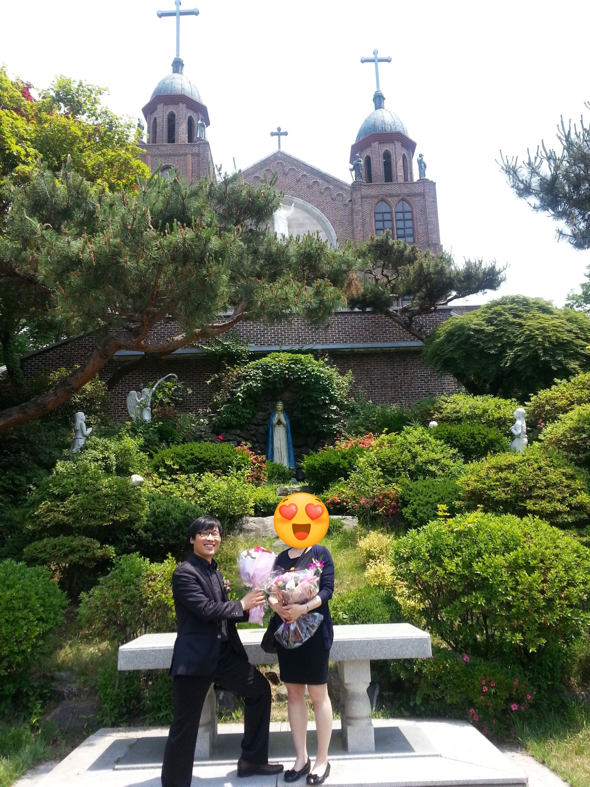
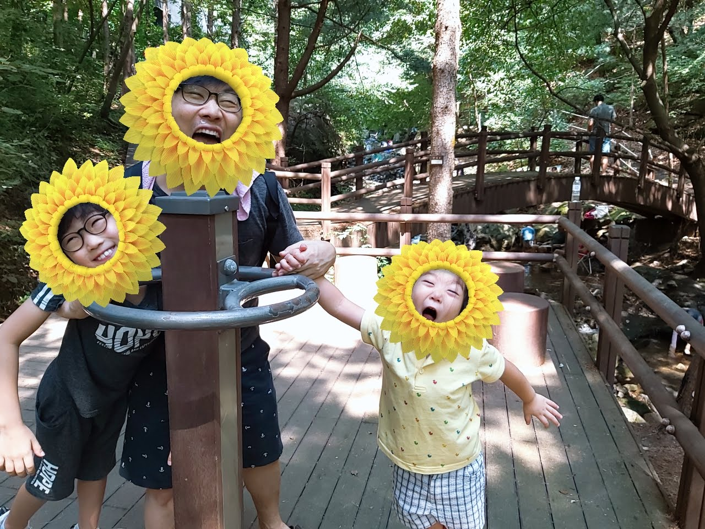

오늘 집 근처의 청계사를 오랫만에 방문했다. 아이들과 계곡 물에서 발도 담그고 숲속 산책길에서 산책도 했다.

원래는 강화도를 가려고 했는데... 멀리가면 뭐하나? 고생만하지 ㅋ

아직은 어린아이들과의 나들이다보니 `어디를 가는 것`보다 `누구랑 어떻게` 보내느냐가 더 중요하다. (엄마아빠들은 알꺼야 후훗!)

날씨도 좋고 여유도 있어서 절 처마 밑에서 애들과 앉아 아침에 보았던 "아이언맨"에 대한 이야기도 나누고, 저녁에는 통닭시켜먹자 등 쓸데없는 이야기를 나누고 있었다. 반면 우리와는 대조적으로 주변분들은 대부분 간절한 마음으로 절을 하고 계셨다.

그 모습을 보니 나도 살면서 많이는 아니지만 종교활동을 했던 것이 기억났다.
오늘은 추억팔이를 좀 해보려고한다.

## 생의 첫 종교 생활

내 생의 첫 종교생활은 초등학교 시절이었다.

일요일 아침에 눈비비고 일어나서 TV에서 나오는 좋아하는 만화를 보는 게 좋았던 시절임에도 불구하고 내가 일요일 아침부터 교회를 다닌 이유는

**내가 동경하는 동네 형이 다니는 교회가 궁금하기도 했거니와**
**가끔 교회때 내라고 받은 헌금으로 오락실에 들려 나름 신나는(?) 일요일을 보내 것도**

즐거웠기 때문이다.

참고로, 내가 살던 초등학생 시절에는 오락실이 금지공간이었다. 학교 선도부들이 돌아다니면서 오락실에 다니는 아이들을 잡아(?) 가곤했다. 나 또한 잡혀가기도 했고 잡아오기도 했다.

그동안 잊고 있던 교회를 다시 찾게 된 것은 고등학교를 다니면서이다. 중학교에는 바뻐서 자주 못 만났던 동경하는 동네형과 같은 고등학교를 다니게 되면서 다시 교회에 다니게 되었다.

물론, 처음 시작은 순순한 마음과 열정으로 교회를 다니게 되었지만. 교회를 그만 다니게 되었을 때는 꽤나 불순한(?) 마음으로 교회를 그만두게 되었다.

내 첫사랑을 교회에서 만났으니 고등학교 시절에는 거의 범죄나 다름없는 불순함으로 끝을 맺게 되었다.
물론, 종종 그때 사귄 친구들과의 인연으로 교회를 아주 가끔 가게 되기도 했지만 이미 마음은 콩밭에 있었기에 다녔다고 하기에는 어렵다.

## 두번째 종교 생활

내가 종교라는 것에 발을 다시 들이게 된 계기는 아이와 와이프 때문에 다시 종교생활을 하게 되었다.

우리 와이프는 참고로 무신론자이다. 절에 가면 절을 하고 성당에 가면 기도를 한다. 하지만 와이프의 외가 친척분들이 성당에 지극정성으로 다니신다. 이런 영향이 었을까?

나와 와이프는 첫 아이의 유치원을 물색 도중 성당 내의 유치원이 좋다는 소식을 들었다. 그래서 작정(?)하고 일년 전부터 정말 절실히 성당을 다녔다. 이 때 느낀게 성당은 `정말 아무나 받지는 않는구나`라는 생각이 들었다. 교육도 한참 받아야했고, 세례의식도 철저하게 받았다. 나와 우리와이프는 세례명도 정식으로 받았다. 나도 바쁜 생활임에도 불구하고 가족의 평화(?)를 위해 나름 열심히 다녔다.

종교활동에 빨간불이 켜지기 시작한 때는 아이의 유치원이 떨어진 때부터이다. 이때까지만 해도 와이프는 성당을 좋아했고 목사님의 말씀을 잼있게 들었다. 뭐 사실 이때까지는 크게 문제 되진 않았다.
연이어 성당의 목사님이 바뀌고 애들 키우다보니 생활의 여유로움이 더 없어지는 것이 문제였다. 특히나 와이프는 바뀐 성당의 목사님에게 고해성사하는 것이 싫다고 했다.

나도 `고해성사` 란 것을 한번 해봤는데 사실 이거 좀 곤혹스럽다. **영화에서처럼 내 마음의 짐을 덜어내고 깨달음을 얻지는 못할찌라도 이걸 하는 것의 의미를 느끼지 못했다.**

개인적으로는 고해성사할 만큼 나쁘게 삶을 살아가고 있지 않을 뿐만 아니라 나보다 한참 어린 목사님에게 나의 고민을 이야기하고 공감을 얻는다는게 현실적으로 불가능하다고 느꼈기 때문이다.

암튼 나와 와이프는 종교생활은 나이들면 하자라는 공동의 합의를 이뤘다.

## 교회, 성당, 절

교회에 가면 즐거움과 젊음이 느껴진다. 사람들은 친절하고 많은 사람들은 행복해 보인다. 도시의 세련된 면도 느껴지고 삶의 활력도 느껴진다.

성당에 가면 경견함이 느껴진다. 정숙함이 느껴지고 고결함이 느껴진다. 사람들은 자애롭고 평화로워 보인다.

절에 가면 차분해져서 마음이 편안해진다. 절은 대다수 숲 속에 있어서 그런지 모르겠지만 자연이 주는 아름다움과 여유를 느낄수 있다. 향냄새가 좋고, 들려오는 목탁소리도 내 마음을 정결케 하는 것 같다.

지금도 우리와이프는 `나이들면 성당에 다닐까?` 라는 말을 가끔 한다. 하지만 내가 나이가 들면 성당에 갈까?

**내가 느낀 교회는 사교적이면서 쾌활하다. 반면 성당은 사교적이면서 경건하다.**

난 좋게 말하면 긍정적이고 활력있는 사람이지만 반면 침착과 평온과는 사실 거리가 먼 사람이다. 내가 나이가 든다고 해도 이런 경향은 쉽게 변하지 않을 것 같다. 성당은 내 기준으로 지나치게 경건하다. 오히려 내 성격면에서는 교회가 나을 듯 하다.

반면 절은 비사교적인 면은 오히려 좋으나 종교의 교리면에서는 별로 공감이 안간다. 종교활동보다는 오히려 인터넷 잘 터지는 절같은 곳에서 살면 좋겠다는 생각을 간혹한다. 나무 사이로 비치는 햇살이 좋고, 절의 풍경소리 그리고 무엇보다도 가족과 함께 찾는 여유로움이 좋기에 좋은 인상이 있다.

지금은 잘 모르겠지만 지금보다 나이가 더 들면 와이프와 함께 종교활동을 하는 것도 좋을 것 같다라는 막연한 생각은 있다.

교회든 성당이든 절이든 모르겠지만... ㅋㅋ
