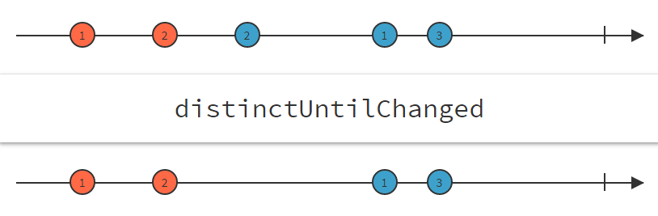

RxJS를 협업 아닌 협업에서 조금씩 쓰고 있다.
오버엔지니어링이라는 생각을 떨쳐버릴 수 없지만, 또 한편으로는 꽤 괜찮다라는 느낌 또한 든다.

> 현실적인 활용도와 이상적인 개념 사이에서 줄다리기를 하고 있는 느낌이다.

지금은 RxJS의 활용도를 직접 검증도 해보고 싶은 마음도 있고,
간만에 느끼는 개발의 재미도 맛볼 수 있는 영역이라 그 끈을 놓지 않고 있다.

## distinctUntilChanged 너는 누구냐?

RxJS의 operator중에 흔하게 쓰이는 `distinctUntilChanged` 메소드에 대한 약간의 소감을 적어보려고 한다.

http://rxmarbles.com/#distinctUntilChanged

우선 이 함수는 우리가 프로그래밍을 할때 항상 고민하는 일.
중복호출? 중복 전달 등에 대한 문제를 아주 손쉽게 해결해 준다.

distinctUntilChanged 함수는 기본적으로 distinctUntilChanged()를 호출해서 사용 할 수 있다.

```js
Rx.Observable.of(10, 30, 30, 30)
  .distinctUntilChanged()
  .subscribe((x) => console.log(x));
```

결과는 예상했던 것처럼, `10, 30` 만 나온다. 좋다. 쉽다!

## Rxjs 버전마다 달라요~

하지만, 다음과 같은 코드인 경우, rxjs의 버전에 따라 다르게 동작한다.

```js
Rx.Observable.of({ value: 10 }, { value: 30 }, { value: 30 }, { value: 30 })
  .distinctUntilChanged()
  .subscribe((x) => console.log(x));
```

위의 코드는 rxjs4에서는 정상 동작하지만, rxjs5에서는 primitive 타입이 아닌 경우에는 정상적으로 동작하지 않는다. 된장!

## 이렇게 되는 이유는 rxjs의 기본 compare 함수가 rxjs4와 rxjs5가 다르기 때문이다.

rxjs4의 기본 compare함수는 다음과 같다.

> https://github.com/Reactive-Extensions/RxJS/blob/master/dist/rx.all.js#L554-L562

```js
function baseIsEqual(value, other, ...) {
  if (value === other) {
    return true;
  }
  if (value == null || other == null || (!isObject(value) && !isObjectLike(other))) {
    return value !== value && other !== other;
  }
  return baseIsEqualDeep(value, other, baseIsEqual, ...);
}
```

기본적으로 값이나 reference 값을 비교하고, 만약, reference 값이 같다면, 깊은 탐색을 한다.

반면, rxjs5의 기본 compare 함수는 다음과 같다.

> https://github.com/ReactiveX/rxjs/blob/master/src/operator/distinctUntilChanged.ts#L53-L55

```js
private compare(x: any, y: any): boolean {
    return x === y;
}
```

값이나 reference 값을 비교하는 간단한 함수이다.

이렇게 한 이유는 rxjs5가 추구하는 `Better performance`를 위한 조치로 보인다. 하지만.... 사용자는 헷갈린다.

그래서 rxjs5에서는 primitive 타입이 아닌 경우에는 immutable한 객체를 데이타로 활용 해야 효과적이다.

> 즉, 객체의 reference가 변경되면, 값이 변경되었고, 그렇지 않으면 변경되지 않았다는 대전제가 수반되어야한다.

객체를 매번 immutable하게 만들려고 하면 결국에는 복사라는 `불필요한 과정`을 거쳐야만 한다. 비교하고자 하는 객체가 크면 클수록 그 비용은 더 크다.
모델 자체가 간단할 때는 크게 문제가 되지 않는다. 하지만, 좀 큰 모델 객체가 변경되었을 때는 어떻게 하는게 좋을까?
물론, [immutable.js](https://facebook.github.io/immutable-js/) 같은 라이브러리를 사용해서 그 비용을 줄있 수는 있다.
하지만, 역시 비용은 비용이다.

## distinctUntilChanged를 잘 사용해보자.

rxjs5의 distinctUntilChanged는 compare함수와 keySelector 함수를 파라미터로 받아 들어서 보다 효과적으로 처리할 수 있다. 물론, rxjs4도 가능하다. 다만, 파라미터의 순서가 다르다.

```js
// rxjs4
distinctUntilChanged(keySelector: function, comparer: function);

// rxjs5
distinctUntilChanged(compare?: (x: K, y: K) => boolean, keySelector?: (x: T) => K)
```

compare 함수는 `이전 키와 이후 키를 비교 하는 함수`이고,
keySelector 함수는 `비교할 키가 무엇인지를 명시하는 함수`이다.
rxjs5에서는 다음과 같이 작성하면 이러한 문제를 손쉽게 해결 할 수 있다.

```js
Rx.Observable.of({ value: 10 }, { value: 30 }, { value: 30 }, { value: 30 })
  .distinctUntilChanged(
    (p, n) => p === n,
    (x) => x.value
  )
  .subscribe((x) => console.log(x));
```

결과는 예상했던 것처럼, `{value:10}, {value:30}` 만 나온다. 역시나, 좋다.

### keySelector를 이용한 꽁수

위와 같이 키(value)가 명확하다면, 문제가 되지 않지만, 만약, 키로 정할 값이 명확하지 않고, 모델의 구조가 복잡하다면, keySelector 함수를 구현하기가 어렵다.

이런 경우는 개발 꽁수 이지만, 키를 자체적으로 만들어서 사용하는 방법이 있다.

예를 들어, 여러 셀들을 포함하는 spreadsheet 모델이 다음과 같고, rows안의 특정 cell의 값(value)이나, cell의 개수만 변경되는 경우라면, 사용자 고유키를 만들수 있다.

```js
spreadsheet = {
  rows: [
    { row: 0, col: 0, value: 'A' },
    { row: 0, col: 1, value: 'B' },
    { row: 0, col: 2, value: 'C' },
  ],
};
```

다음과 같이 row의 length와 cell의 값(value)으로 임의의 고유키를 만들수 있다.

```js
function(x) {
    return x.rows.length + "_" + x.rows.reduce( (acc, v) => {
        acc.push(v.value);
        return acc;
    }, []).join("_");
}
```

immutable을 사용하는 것도 좋은 방법이지만, 이런 개발 꽁수를 이용하면, `복사라는 비용없이` 객체의 변경여부를 확인할 수 있다.

실제 생성된 코드는 다음과 같다.

```js
Rx.Observable.of(
  {
    rows: [
      { row: 0, col: 0, value: 'A' },
      { row: 0, col: 1, value: 'B' },
      { row: 0, col: 2, value: 'C' },
    ],
  },
  {
    rows: [
      { row: 0, col: 0, value: 'A' },
      { row: 0, col: 1, value: 'B' },
      { row: 0, col: 2, value: 'C' },
    ],
  },
  {
    rows: [
      { row: 0, col: 0, value: 'A' },
      { row: 0, col: 1, value: 'B_changed' },
      { row: 0, col: 2, value: 'C' },
    ],
  }
)
  .distinctUntilChanged(null, (x) => {
    return (
      x.rows.length +
      '_' +
      x.rows
        .reduce((acc, v) => {
          acc.push(v.value);
          return acc;
        }, [])
        .join('_')
    );
  })
  .subscribe((x) => console.log(x));
```

https://jsbin.com/soluwozoji/edit?js,console
