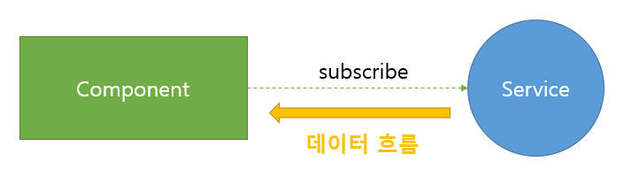
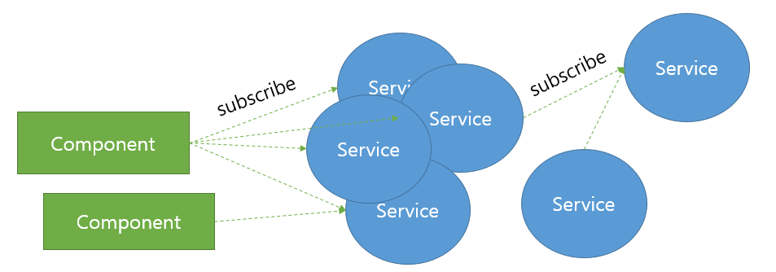

Deview2016 [Angular2 VS React, React VS Angular2](https://deview.kr/2016/schedule#session/137) 발표에서도
RxJS를 언급했지만, 지금까지도, `RxJS를 왜 Angular2가 도입했는가`에 대한 이유는 모르겠다.

이를 알아보기 위해,
Angular2 프로젝트를 하면서, RxJS를 가급적 많이 사용하고 있는데,
그 중 하나 느낀 점이 있어 몇자 끄적여 본다.

### 왜 Angular2는 RxJS를 도입했는가?

일반적으로 Angular2를 사용하게 되면, 화면에 표현되는 요소는 Component로 만들고,
실제 데이터를 가져오는 작업은 Service에서 담당한다.
이 둘의 관계를 RxJS의 Observable 객체를 통해 subscribe로 연결된다.
좀 간단히 보면, 다음 그림과 같다.



Component와 Service 간의 구조에서 RxJS는 둘 사이를 이어주는 다리가 되고,
단방향의 데이터를 가져오는데 결합도가 약하게 연결된다.

이 말을 좀 풀어서 쓰면,
Component에서는 Service를 DI(Dependency Injection)로 주입받고,
주입된 상태에서 데이터를 가져오는 것은 Observable 객체로 연결이 된다는 말이다.
이렇게 되면 Component 입장에서는 주입된 Service의 메소드(foo)만 알면 된다.

```js
@Component({})
class AppComponent extends Component {
  // DI로 service 주입
  construnctor(service: Service) {
    this.service
      .foo()
      // operator 적용
      // filter(...)
      // map(...)
      // ...
      .subscribe((x) => {
        // 데이터를 받음.
      });
  }
}

@Injectable()
class Service {
  foo(): Observable {}
}
```

또한, Service에서는 Component와의 연결을 Observable로 사용하기 위해, 메소드의 반환값을 Observable로 사용한다.
반환값이 Observable이기 때문에, RxJS의 operator를 적용하면, Service가 주는 데이터를 변경하거나, 무시하거나, 기타 등등의 작업들을 Component가 할 수 있다.

> 즉, Angular2에서 RxJS를 사용하면 Component가 갑이되고, Service가 을이 되는 것이다.

예전에는 Service가 주는 데이터만 가지고 처리했다면, 이제는 Component가 데이터의 처리를 결정할수 있게 된 것이다.
흔히 이를 `Push방식`의 장점이라고 이야기 한다.

그럼 RxJS를 사용하면, 단순히 갑과 을의 관계가 바꿔서 좋다는 말인가? 좋긴하다.
하지만, 그렇다고 이게 RxJS를 사용하는 이유라고 보기에는 납득이 안된다.
더 해봐야겠다.

## RxJS와 Typescript 의 캐미

Angular2프로젝트를 하면서 확실하게 안 사실이 있다.
바로 RxJS와 Typescript의 캐미(chemi)이다.

프로젝트를 하다보면 알겠지만, 앞에서 보여준 그림처럼 Component와 Service간의 관계가 1:1인 상황은 많지 않다.
하나의 Component에서 여러개의 Service를 사용하기도 하고, 하나의 Service와 여러개의 Component가 연결되어 있기도 하다.
또한, Service에서 다른 Service와 연결되어 있기도 한다.



Component와 Service간에는 항상 데이터들이 흐르게 되는데. 이때 전달되는 데이터를 따라가기는 쉽지 않다.
물론, 오늘 개발한 코드라면 아주 쉽게 따라 갈수 있겠지만,  
개발한 코드가 몇 달 전이거나, 내가 아닌 다른 이가 개발한 코드라면, 데이터 흐름을 따라가는 것은 쉬운일이 아니다.

하지만, 우리는 개발자이니깐 이런 것쯤은 충분히 이겨낼수 있다고 생각한다.
왜? 우린 프로니깐 ㅋㅋ

그런데 문제는 RxJS로 연결 될 경우, 이 Operator에 의해 중간 중간 전달되는 데이터가 변형이 된다는 것이다.
바로, 이런식으로...

```js
this.service
  .foo()
  .map((x) => {
    return somthingFn(x);
  })
  .subscribe((x) => {
    // 데이터를 받음.
  });
```

만약, Javascript의 역량을 최대한으로 끌어올려서 데이터를 간결하게(?) 변형(?) 시킨다면,
무슨 데이터가 왔는지 또는 넘겨진 데이터의 속성이 무었인지 확인하기가 어렵다.

하지만. RxJS와 Typescript가 만나면 상황은 좀 달라진다.

```ts
this.service
  .foo()
  .map((x: Student) => {
    return somthingFn(x);
  })
  .subscribe((x: SmartStudent) => {
    // 데이터를 받음.
  });
```

Student 데이터를 받아서, SmartStudent 데이터로 변경했다는 것을 알 수 있다.
한 눈에 데이터가 어떻게 변했는지바로 확인 가능하다.
만약, vscode와 같은 훌륭한 IDE툴이 있다면.데이터의 속성이 또 어떤 것인지 바로 파악할수 있다.

> 그래서 만약, RxJS를 사용한다면, 꼭! Typescript와 함께하는 걸 추천한다.

Angular2가 RxJS를 왜 도입했는지에 대해서는 아직도 잘 모르겠다.
하지만, Typescript와 RxJS의 캐미가 정말 짱 좋다는 사실은 확인했다.

분명, RxJS와 Angular2의 캐미도 확인할 수 있으니라 본다.ㅋㅋ
