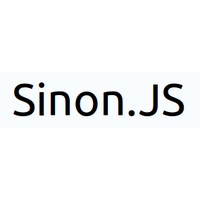

예전 [JavaScript](http://sculove.github.io/blog/2016/05/17/JavascriptTest/) 테스트 라는 글을 쓴적이 있는데, 그때 더 살펴봐야겠다라고 생각한 라이브러리가 Sinon.js이다.

최근에는 Jasmine 테스트 프레임워크가 괜찮아 보여 등안시 하다가, 기회가 되서 Sinon.js를 쓰게 되었다.  


Jasmine에서 Ajax를 mocking 하려면 `stubRequest`를 만들고 `andReturn`이라는 메소드를 이용하여 직관적으로 테스트 할 수 있다.

```js
jasmine.Ajax.stubRequest('/another/url').andReturn({
  responseText: 'immediate response',
});
```

sinon도 있지 않을까 하는 마음으로 찾다가 결국 `yieldsTo` 라는 메소드를 찾았다.  
원래는 jQuery ajax mocking 정도는 [useFakeXMLHttpRequest](http://sinonjs.org/docs/#server) 메소드를 이용하면 되지만,
[JSONP인 경우](http://sinonjs.org/docs/#json-p)는 호출 방식이 다르기 때문에, useFakeXMLHttpRequest으로는 mocking이 어렵다.

**Sinon.js로 JSONP를 테스트 하려면...**

stub에게 callback을 호출하도록 시키는 `yieldsTo` 메소드를 이용하여, mocking 해야만 한다.
물론, `fakeServer` 를 이용하여 mocking 할수 있지만,  
`yieldsTo`가 훨~~~씬 간편하다.

코드는 다음과 같다.

```js
// beforeEach
let stub = sinon.stub(jQuery, "ajax");

// Given
stub.yieldsTo("success", { param: "데이터", data: "bla bla" });

// When
jQuery.ajax(
    url: "http://sculove.github.io",
    success: function() { console.log("callback") },
    dataType: "jsonp",
);

// Then
expect...

// afterEach
stub.restore();
```

주의할 것은 ajax를 실행하기 전에 이미 yieldsTo에 대한 정보를 미리 설정해놓아야 한다.

- Sinon.js API : http://sinonjs.org/docs/
- 관련 이슈 : https://github.com/sinonjs/sinon/issues/41
