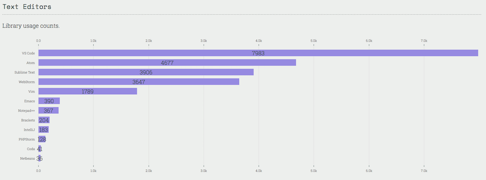
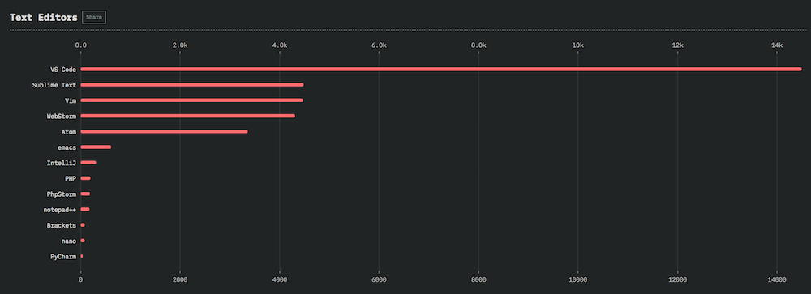
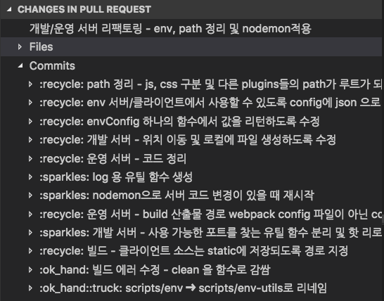
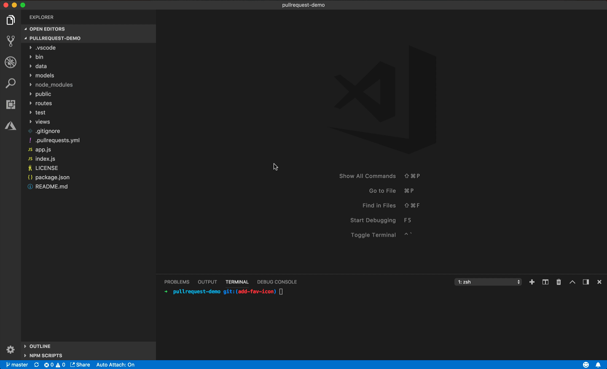
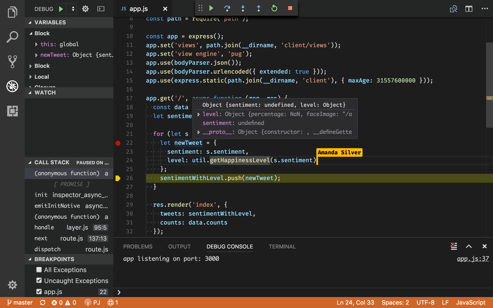
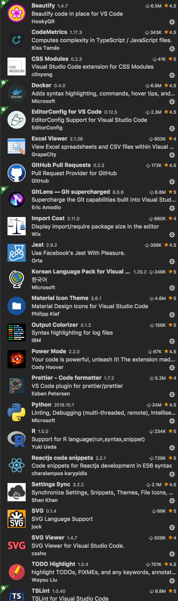

저만 알고 오래오래 쓰고 싶었는데요.
제 개발툴 경험 및 노하우를 적어 봅니다. ㅋ (참고로 전 JavaScript 개발자입니다)

## SublimeText…WebStorm을 거쳐

저는 JavaScript 개발자라면 다 써본다는 SublimeText를 선호하는 개발자였습니다.
SublimeText가 가볍기도 하거니와 다양한 플러그인이 있어서 열심히 찾고 다니기만 한다면 자기가 원하는 환경을 만들수 있습니다. 하지만 SublimeText가 생각보다 설정해야 할 것이 많이 있습니다.
더불어 컴퓨터 바뀔 때마다 플러그인을 매번 설치하는 것도 까다로웠죠. 더군다나 플러그인 자체가 ruby로 되어 있어서 답답한 면이 있었습니다.

이런 불편함 쯤이야…
잘~ 견대내었는데요.

이거 바꿔야겠다고 생각한게 **좀 큰 파일 (번들링된 파일을 열어서 수정하는 경우, 파일이 많은 프로젝트를 열어서 수정하는 경우...)… 버버버벅 됩니다.**
특히 다양한 플로그인을 설치해놓은 상태에서는 상태가 더 심각합니다.

그래서 선택 한게 SublimeText보다 더 비싼 WebStorm입니다. (역시 돈이 최고얏!)
**오~ 이거 메모리만 빠방한다면 쓸만합니다. 좋아요~**
하지만… **정말 메모리를 엄청 늘려야해요. 기본적으로 JVM 에서 돌아가기 때문에 heap만 몇기가를 잡아야해요.**
파일이 좀 많은 프로젝트를 열어서 엔터만 치면 차한잔 마시고 와야할 정도 였죠.
전 아직도 6년 전 구시대 iMac을 쓰고 있기에 이런 단점을 몸소 체험했었습니다.

## VSCODE

그래서 제가 선택한게 바로 [VSCODE](https://code.visualstudio.com/) 입니다.
무료 오픈소스인데 이게 생각보다 엄청납니다.
MS의 자랑 중 하나였던 Visual Studio의 명성을 그대로 이어 받은 정말 잘 만든 에디터입니다.

### 1. 모두가 선택한 IDE

JavaScript 계열에서의 IDE도 춘추 전국시대가 있었습니다.
제가 SublimeText를 써 왔던 것처럼 많은 이들이 다양한 에디터를 써왔습니다.
어떤 이는 SublimeText를 쓰고, 어떤 이는 Atom을 쓰기도 했죠. 몇몇 장인들은 에디터 플러스를 쓰기도 했습니다.
서로 자기가 최강의 에디터라고 군림하던때였습니다. 이런 춘추전국시대를 통일한 IDE가 바로 WebStorm이었죠.
WebStrom은 정말 좋은 툴이지만. 몇가진 단점이 있었습니다.

- 첫째. 비싸요
- 둘째. JVM 환경하에 동작하기 때문에 느렸죠 ㅠㅠ
  이런 단점들을 커버하고 등장한게 바로 VSCODE입니다.

VSCODE가 유료툴 보다 좋다? 사실 분명하게 말하기는 어렵습니다. 하지만. 많은 사람들이 VSCODE를 선택하고 있다는 것은 명백한 사실입니다.
대표적으로 Stackoverflow에서 공개한 JavaScript TextEditor 자료를 보면 VSCODE의 위엄을 확인 할수 있습니다.
stackoverflow 자료에서는 2017년 두각을 나타내기 시작해서 2018년에는 거의 압도적으로 많은 사람들이 사용하는 IDE툴이 되었습니다. 캬~

[2017년 Text Editors](https://2017.stateofjs.com/2017/other-tools/)

[2018년 Text Editors](https://2018.stateofjs.com/other-tools/)

### 2. VSCODE가 정말 빠릅니다.

초기 에디터 띄우는 데 시간이 약간 걸리지만, 그 이후 부터는 완전 쾌적해요.
WebStrom이나 IntelliJ와 같이 Java JVM 에서 동작하지 않고 V8기반의 Electron에서 동작하기 때문에 정말 가볍고 빠릅니다.
이게 최고의 장점입니다.

### 3. 개발자에게 꼭 필요한 다양한 플로그인

SublimeText 처럼 인터넷을 살펴보시면 VSCODE의 추천 플러그인들은 차고 넘쳐납니다.
언어에 국한되지 않고 차고 넘쳐나요. 더군다나 플러그인 자체가 js이기에 간단한 플러그인도 필요에 따라 직접 만들수 있습니다.
(저도 간단히 [Translator라는 플러그인](http://sculove.github.io/blog/2017/12/27/createvsextension/)이라는 것을 만들어봤었습니다. 하하하)

정말 좋은 플러그인이 많은데요.
그 중에 좀 특이하지만 유용한것 몇가지만 소개해 드릴께요.

#### [GithubPull Requests](https://marketplace.visualstudio.com/items?itemName=GitHub.VSCODE-pull-request-github)

이 플러그인은 VSCODE 내에서 코드리뷰를 쉽게 할 수 있게 도와줘요. 리뷰 할때 해당 브랜치 내용을 확인하기 위해서 checkout 받는 경우가 종종 있죠?
checkout 받아서 커밋별, 파일별 파일 변경사항을 볼수 있고 리뷰 커멘트를 바로 적을수 있습니다.

코드 리뷰가 훨씬 편해요.

#### [Settings Sync](https://marketplace.visualstudio.com/items?itemName=Shan.code-settings-sync)

전 구형 iMac으로 개발하고 최신 MacBook Pro로 개발을합니다.
동일한 개발환경을 항상 유지하고 싶은 경우가 많은데요.
이때 마다 환경 맞추는 작업을 했었습니다. 쓰던 플러그인도 다시 깔고, 필요없다고 생각했던 플러그인도 지우고, 환경 설정도 매번 맞추는 작업을 했습니다. ㅠㅠ
하지만, VS Code의 Settings Sync를 이용하면 명령어 하나로 환경을 동기화할 수 있습니다.
이거 완전 편합니다.
집에서도 회사처럼 열심히 일할수 있어요 ㅡㅡ;;

### [VS Live Share](https://marketplace.visualstudio.com/items?itemName=MS-vsliveshare.vsliveshare)

라이브 코딩이 됩니다. 페어프로그래밍할때 유용하게 할수 있겠죠?
저희 팀은 아직 이 단계까지는 프로세스로 못잡아서 시험만 해봤습니다. 구글독스의 동시편집같이 되요. 로컬이다보니 버벅임도 없이 정말 잘됩니다.
커서에 사용자 아이디가 보입니다. 요런식으로 ㅋ

자세한 것은 여기 링크를 봐보세요.
https://code.visualstudio.com/blogs/2017/11/15/live-share

## FrontEnd 개발자라면...

저는 VSCODE를 사용하면 개발 생산성을 높이는데 많은 도움이 되었습니다.
저와 마찬가지로 몇몇 개발자는 이미 WebStorm에서 VSCODE로 옮겼던 경험들을 공유하기도 했습니다.

- https://medium.com/@jawache/from-webstorm-to-vs-code-bd01ccc92aaf
- https://blog.buddyweb.fr/my-way-from-webstorm-to-vs-code-and-other-things-in-a-developers-life-fe71f0d07c59
- https://medium.com/linagora-engineering/from-webstorm-to-VSCODE-road-to-the-freedom-743eda17164a
- https://rationaldev.com/webstorm-vs-visual-studio-code/

만약 JavaScript/TypeScript/HTML/CSS/node.js 등을 다루는 개발자라면 VSCODE로 IDE를 바꿔보시는 것도 좋은 선택이 될것 같습니다.
마지막으로 제가 쓰고 있는 VSCODE 플러그인을 공개합니다. 짜잔~!

