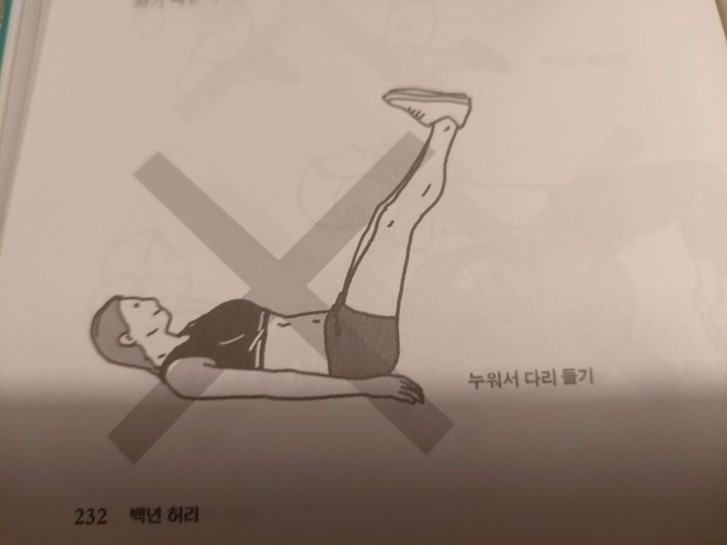
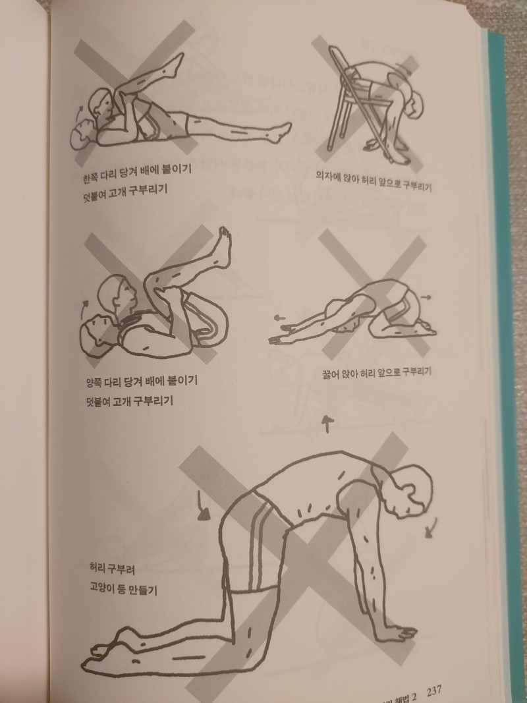
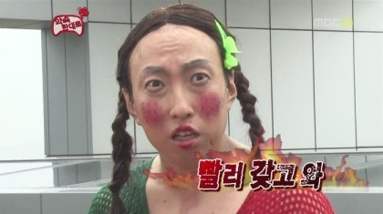

그동안 허리가 좀 아팠는데 좀 지나면 났겠지라는 심정으로 지내다가  
허리 아프다고 툴툴대는 남편이 싫었는지.  
좀 제대로 치료받아봐라는 아내의 권유로 병원을 다니기 시작했다.

물리치료 받아도 별 소용이 없어서 어제 MRI 찍어 본 결과
**"디스크 탈출증"**  
디스크가 탈출해서 신경을 눌러서 그런지 왼발이 저리고 그랬는데요. 설마 이럴 줄이야.  
MRI도 찍고 CT도 찍고 엑스레이도 찍고 피도 뽑은 후에 신경치료라는 주사도 맞았다.

이런 과정에서 한국의료 시스템에 대해 좀 느낀 게 있는데 이 **"디스크 탈출증"**이라는 진단명도 내가 수소문 끝에 알게 된 것이다.

의사들도 그들 나름의 사정이 있겠지만. **한 마디로 좀 재수 없다.**  
도무지 설명을 잘 안 해준다.

© christnerfurt, 출처 Unsplash

그냥 물리치료 좀 받고 소염제 약 먹으면서 경과를 지켜보자는 말만 계속 되풀이한다.  
왜 아픈지? 왜 경과를 지켜보자는 것에 대한 설명이 없다.  
MRI를 찍고 나서도 수술할 정도는 아니고 약 먹고 물리치료 받고 경과를 지켜봐란다.

모르는 사람이 약자라고 나도 질문 몇 개를 던져봐도 동일한 대답만 하는 사람을 보자니... 짜증이 나서 허리 시술을 하고 정신 차리자마자 전에 팀원이 봐라고 선물한 책이 생각나서 맘잡고 꺼내 들었다.

​
이번 주는 원래 OKR 책을 좀 보려고 했는데 그 계획은 뒤로하고 "백년 허리"라는 책을 집어 들었다.

[백년 허리 - 정선근](https://book.naver.com/bookdb/book_detail.nhn?bid=10052052)

전에 읽은 때는 수술하지 말라는 소리구만으로 읽고 말았는데 내가 막상 겪고 나니 글귀 하나하나가 머릿속에 팍팍 박혔다.  
몇 가지 안 사실은 현재 나의 상태인 "디스크 탈출"이 왜 발생했는지와 어떻게 치료하면 되겠다는 확신이 들었다.

## 나는 왜 디스크 탈출증을 갖게 되었나?

나 같은 경우의 디스크 탈출증은 잘못된 자세에서 나온 것 같은데 두 가지 경우인 것 같다.

<u>하나는 기존의 잘못된 태도. 의자에 앉거나 평소 생활하던 태도이고</u>  
<u>다른 하나는 허리가 아파서 고쳐보겠다고 했던 스트레칭.</u>

햄스트링을 늘려서 허리를 보호하겠다던 소리에 내 스스로 허리를 망가뜨리고 있었나 보다.  
허리가 뻐근할 때면 주로 했다.  
할 때는 아팠는데, 하고 나면 그래도 좀 시원하다는 느낌이 들어서 꾸준히(?) 했다.

근데 이게 팔로 당기고 있어야 해서 귀찮은 생각에 다음과 같이 벽에 다리를 올리고 버티는 동작을 주말에 한 30~40분 정도 꾸준히(?) 했다.

여기 운동들도 간혹 했는데....

이게 내 약한 디스크를 더 탈출 시켰으리라 본다. 주르륵

## 내 디스크 탈출증은 어떻게 극복해야 하나?

우선 디스크 탈출증은 다음과 같이 디스크가 돌출된 상태를 나타낸다.

이게 돌출이 되면서 뒤쪽 신경을 눌러서 다리가 저리고 엉덩이가 저리고 그러는 것이라 한다.

### 근데 왜 아프냐고?

신경을 눌러 아픈 경우도 있지만 대다수는 디스크 탈출로 신경뿌리에 염증이 생겨서 아프다는 것이다. 왜 염증이 생기지?

바로 디스크에서 나온 수액 속의 세포들이 죽을 때 그 세포벽에서 흘러나오는 물질에 의해 염증 반응이 시작되어서 그 부위가 아프다는 것이다.

그래서 염증 나아라고 소염 진통제를 그렇게도 많이 처방해 준다는 것이다. (의사가 한 달 치를 뭉텡이로 줌)

병원에서 맞은 그 신경 주사도 스테로이드 주사 (근육짱 커지는 ㅋㅋ) 인데 이게 이런 염증을 두 달 정도는 거뜬히 없애 준단다. 그래서 주사 효과가 떨어지는 순간에는 다시 아프단다.

그럼 다시 두 달 후에는 주사를 맞아야 하나고?

아니.

웃긴 것은 이게 시간이 지나면 세포벽 염증이 가라앉게 되고 세포가 다 죽고 나면 세포벽에서 흘러나온 염증 유도 물질이 없어지기 때문에 신경뿌리의 상태가 다시 원상 복귀된단다.

문제는 그게 회복되기 전에 디스크를 유발하는 자세를 지속(?)적으로 함으로서 다시 염증이 생기고 아프다는 것이다.

즉, 디스크를 유발하는 자세는 하지 말고, 디스크에 좋은 운동을 해주면 그럴 필요가 없단다.

### 사실 이것도 궁금했는데 그렇다면 저 툭! 튀어나온 디스크는 어떻게 되나?

너무 많이 나왔으면 고통스러우니깐 수술을 해서 자르는데... 그 정도면 그전에 병원에 갔겠지..

이 책에서는 그냥 놔두면 사라진단다.  
물론 책에서 나온 운동을 하면 더 빨리 없어진다는데...

그럼 의사들이 운동을 가르쳐 주든가.  
이놈의 의사 놈은 왜 케 비싼 물리치료와 도수치료를 시킨 거야?

보험이 되서 망정이지... 참...

## 막말

암튼 이 책 읽었더니 내 궁금증이 다 풀렸다.  
시X. 의사가 이런 걸 알려줘야 하는데 그냥 약만 먹어라 한다.

왜 디스크가 생기냐고 물어봤더니 **선천적으로 약해서 그렇단다.**

에잇! 씨X 그게 말이냐!

선천적으로 **"넌 못생겨서 넌 평생 그렇게 살아"** 라고 이야기하는 것처럼 들렸다.  
더 물어봤다가는 내 자존감이 더 무너질까 봐 한번 쳐다보고 그냥 나왔다.

와이프가 "의사가 뭐래?"라고 묻길래  
말도 못 하고 멍하게. 성의 없게. 대답했더니 나한테 제대로 설명도 못하냐고 엄청 구박을 했다.

아~! 이제 제대로 알았으니깐.  
담 주 외래 진료 때 물리치료 받아라 하면 이거나(ㅗㅗ) 먹으라고 한번 날려주고  
그냥 닥치고 **소염진통제**나 더 내놔라고 해야겠다.

암튼 두 달간은 허리에 안 좋은 자세도 안 하고 이 책에서 알려주는 운동(컬업, 사이드 브릿지, 버그도그)과 스트레칭을 꾸준히 해야겠다.

**그 의사 놈 얼굴 자주 안 보려면... ㅋㅋ**
