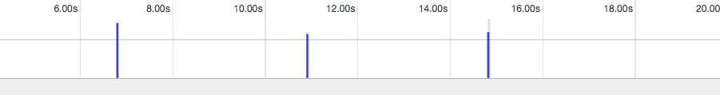
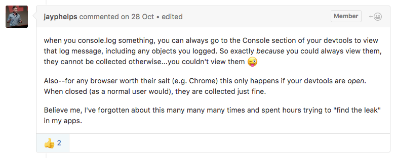
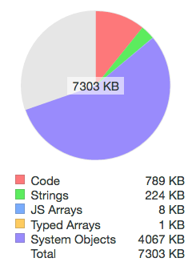

서비스 개발시에, 테스트용으로 console.log를 찍으시나요?
실수로 또는 의도적으로 실서비스에서도 이런 로그가 찍힐 수도 있는데요.

**테스트나 디버깅용으로 쓰는 이런 로그로 인해, 실서비스에서는 메모리 릭이 발생할 수 있습니다.**

저도 우연히 개발 중에 알게되었답니다...

아래는 Observable 코드를 1000개 만드는 코드입니다.

```js
function makeObservable() {
  return Rx.Observable.generate(
    performance.now(),
    (x) => x <= startTime + duration,
    (x) => performance.now(),
    (x) => (x - startTime) / duration,
    Rx.Scheduler.animationFrame
  );
}
function onMemory() {
  for (let i = 0; i < 1000; i++) {
    console.log('create observable', i, makeObservable());
  }
}
```

demo link : http://jsbin.com/hohoxifipu/1

makeObservable()을 통해 instance를 반환하고, onMemory에서 1000번 반복합니다.
코드 상으로는 instance 변수가 사용되지 않기 때문에, `메모리가 정상적으로 릴리즈 되어야합니다.`

하지만, 결과는 다음과 같이 메모리 릭이 발생합니다.




보시는 바와 같이 System Object가 굉장히 많이 증가하는 것을 보실 수 있습니다.

**이유는 바로 console.log 때문입니다.**

저도 이슈 문의했다가 알게된 사항입니다.

[](https://github.com/ReactiveX/rxjs/issues/2090#issuecomment-256844948)

> Chrome Devtool에서 정보를 표현하기 위해,
> console.log를 사용할때 내부적으로 reference를 저장하게 된답니다.
> 그래서, 결국은 메모리가 해제되지 않고. 메모리 릭이 발생하게 됩니다.

실제로 console.log만 지워보았습니다.

짜잔~!


메모리가 정상적으로 릴리즈되는 것을 확인 할수 있습니다.

> **우리 모두 서비스에서 찍는 console.log.... 꼭! 지웁시다~ ^^**
